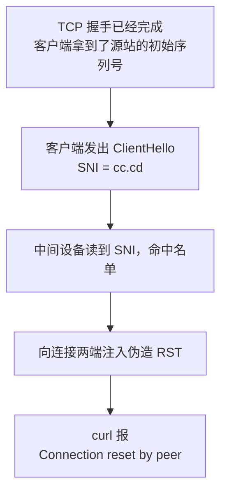

2026 年 9 月 30 日凌晨，我订阅里的 10 个优选 IP 节点在同一分钟全部失效。我没有动过任何配置。

接下来六个小时，我把"优选 IP"这个圈子里几乎所有的常识都验证成了错的。

先把结论放在这儿，省得你往下翻：

> **什么都没坏。** IP 是健康的，源站是健康的，Cloudflare 也是健康的。
> 是链路中间有人读 TLS 握手里的域名做字符串匹配，命中就掐断连接。
> **换 IP 救不了，换服务器也救不了，唯一的办法是换域名。**

下面的内容按"你可能正需要什么"排列：先给你 30 秒自检，再讲为什么，再给修复清单，最后才是我怎么查出来的。

> 文中的域名和 IP 都按 RFC 2606 / RFC 5737 换成了文档保留段（`.example`、`203.0.113.x`），命令可以直接照抄。出现的 `198.41.x.x`、`104.x.x.x` 是 Cloudflare 的公开 anycast 地址，不是秘密。

## 30 秒判断你是不是同一个病

先把几个变量定好，后面所有命令复制过去就能跑：

```bash
DOMAIN=cdn.your-domain.com      # 出问题的那个域名
EDGE_IP=198.41.209.164          # 任意一个 Cloudflare anycast 边缘 IP
```

然后拿**同一个边缘 IP**，分别打两个域名：

```bash
# [诊断] 打一个已知正常的域名，确认这个 IP 本身是活的
curl -sS -o /dev/null -w "speed.cloudflare.com -> %{http_code}\n" --max-time 8 \
  --resolve speed.cloudflare.com:443:$EDGE_IP \
  "https://speed.cloudflare.com/__down?bytes=1000000"

# [诊断] 打你自己的域名，看它是怎么死的
curl -sS -o /dev/null -w "$DOMAIN -> %{http_code}\n" --max-time 8 \
  --resolve $DOMAIN:443:$EDGE_IP \
  "https://$DOMAIN/"
```

两次结果只有三种组合，对应完全不同的病因：

| 第 1 条 | 第 2 条 | 现象 | 结论 |
|---|---|---|---|
| `200` | `200` | 两边都通 | 节点没问题，去看订阅、配置或客户端 |
| `200` | `000` | 同一个 IP，换个域名就活了 | **就是这个病**：域名被掐，跟 IP 无关 |
| `000` | `000` | 两边都不通 | 这个边缘 IP 本身不通，换一个再测 |

注意第二个结果是 `000`，不是 `403`、`404` 之类的 HTTP 码。**`000` 意味着 curl 连 HTTP 状态码都没拿到，连接在 TLS 握手完成之前就死了。** 这个细节很重要，它把"服务器回了你一个错误"和"连接被外部掐断"区分开了。

如果确认是第二种，可以直接跳到 [怎么修](#fix)。

## 先说人话：SNI 是什么，为什么它能被掐

你访问 `https://example.com`，浏览器得先告诉服务器"我要连的是 example.com"。这句话写在 TLS 握手的第一个包（ClientHello）里，字段名就叫 SNI（Server Name Indication）。

它存在的理由很实际：一个 IP 上可能挂着几万个网站，服务器不看到域名就不知道该拿哪张证书出来。

问题在于：**SNI 是明文的。** 加密要等握手谈完才开始，而 SNI 必须在这之前发出去。所以链路上任何一个设备都能看到你要连哪个域名，不需要解密，读字符串就行。

于是拦截变得极其廉价：拿一张域名名单，做子串匹配，命中就对连接动手。这次命中的是 `cc.cd` 这五个字符，就这么简单粗暴。

**这里有个容易搞错的地方**：很多人以为"要读 SNI 就得先看到完整的 TLS 会话"，进而以为拦截发生在 SYN 阶段。实际上读 SNI 只需要 TCP 握手完成、ClientHello 发出来就够了。所以真正发生的不是"丢掉你的 SYN"，而是"放你进来，读到你连的是谁，再把连接杀掉"。这个区别决定了你该往哪个方向查（见 [我是怎么确认的](#evidence)）。

## 三个"看起来很对"的办法，为什么全都没用

如果你已经试过下面这些，别怀疑自己的操作，它们本来就无效：

| 你会想 | 为什么不行 |
|---|---|
| 换一个优选 IP | 优选 IP 换的是 IP，域名一个字没变。SNI 里还是那串字符，照样命中 |
| 换台 VPS / 换服务商 | 同上。我在另一家、另一个地区的机器上测，RST 一模一样。变量从来不在服务器 |
| 开 TLS 分片（`fragment`） | 分片是把 ClientHello 拆成几个 TCP 段，但中间设备把段拼起来是件很便宜的事。我开着分片测，reset 照来 |
| 等 Cloudflare"解除封禁" | Cloudflare 什么都没封。同一个 IP 换别的域名访问就是 200 |

一句话：**只要你还在用这个域名，链路中间那道匹配就一直有效。**

有个旁证很能说明问题：同一台服务器、同一批端口上，借用 `www.nvidia.com` 当 SNI 的 REALITY 节点从头到尾没坏过，因为它的 ClientHello 里根本没有可匹配的东西。拦截发生在客户端到边缘这一跳，跟你的服务器没关系。

## 怎么修：换域名，一共 5 处 {#fix}

在"Cloudflare 橙云反代 + VLESS"这套结构里，域名是**每一层都硬编码**的。所以"换个域名"不是改一个地方，是改五处。

**前置条件**：你能改 DNS（Cloudflare 后台）、能 SSH 上源站、能重签源站证书。客户端（软路由 / mihomo / 各种 GUI）也要能改订阅地址。

按下面的顺序改，改完统一验收。

### ① DNS（Cloudflare 后台）

```
A   new.your-domain.com   →   <你的源站 IP>   proxied = true（橙云打开）
```

API Token 只需要 **Zone → DNS → Edit** 一项权限，别的都不用给。

### ② 源站证书（把新域名加进去）

证书要重签，新旧域名都放进 SAN，这样旧域名还能用、方便回滚：

```
DNS:old.your-domain.com, DNS:new.your-domain.com, DNS:*.new.your-domain.com
```

> **坑 1：证书和私钥是两个文件。** 只换证书不换私钥，握手会报 `sslv3 alert handshake failure`。这个报错长得特别像 Cloudflare 那边出问题，很容易查错方向。**必须成对替换。**
>
> **坑 2：Cloudflare 的加密模式要用 `full`，不能用 `strict`。** 自签的源站证书过不了 strict 校验。

### ③ nginx

443 的 server 块里把新域名加进 `server_name`，**旧域名保留**：

```nginx
server_name old.your-domain.com old-cdn.your-domain.com new.your-domain.com;
```

### ④ xray / 3x-ui 入站（这次最耗时的一处）

WS 入站里原本硬校验了 `host = 旧域名`，新域名打进来一律 404。

这里是全文最大的坑：**3x-ui 把入站配置存在 SQLite 里，每次重启都从数据库重新生成 `config.json`。你手改 `config.json` 会被静默回滚，而且不报错。**

正确顺序：

1. 改 `/etc/x-ui/x-ui.db` 里 `inbounds` 表的 `stream_settings`，把 `wsSettings.host` 去掉（多域名交给 nginx 按 `$host` 分流）；
2. 重启面板；
3. **杀掉还占着 10086 端口的残留 xray 进程**。不杀的话旧进程抱着端口，配置根本不生效。

三步缺一不可，而且前两步失败**都不会有任何报错**。改完没反应，八成就是这里。

### ⑤ 订阅生成器 + 消费端

生成 VLESS 链接时写进 `sni` / `host` 的参数：

```bash
# cron 必须带上环境变量，否则某次定时任务会把订阅静默覆盖回旧域名
5 0,6 * * * VLESS_SNI=new.your-domain.com VLESS_HOST=new.your-domain.com /usr/bin/python3 subgen.py
```

下游（比如软路由上的 mihomo）拉订阅的地址也要换成新域名。

### 改完怎么验

```bash
# [验收] 真实的 WebSocket 升级，返回 101 才算通
curl -sk -o /dev/null -w "%{http_code}\n" \
  -H "Connection: Upgrade" -H "Upgrade: websocket" \
  -H "Sec-WebSocket-Version: 13" -H "Sec-WebSocket-Key: dGhlIHNhbXBsZSBub25jZQ==" \
  --resolve new.your-domain.com:443:$EDGE_IP \
  "https://new.your-domain.com/cfws-<你的路径>"
```

我改完的实际结果：新旧域名都返回 `101`，订阅拉到 14 个节点全部可用，代理出口实测 0.40s，直连延迟从"全部失败"变成 67~133ms。

## 我是怎么确认的 {#evidence}

上面那套结论不是猜的，但这一节的方法可能比结论更值钱。下次遇到"一批东西同时挂掉"，可以照这个顺序走。

### 1. 先把"服务器死了"排除掉

正常人的第一反应。我直接绕过 CDN 打源站 IP，还是 RST。但源站本身好着呢：同一时间从源站本机经 Cloudflare 边缘访问同一域名，返回 `HTTP/1.1 101 Switching Protocols`，nginx 活着、443 在听、ufw 放行、日志干净。

**一个服务是"拒绝了你"还是"根本没收到"，症状完全不同**，这是后面真正破案的关键。

### 2. 固定 IP，只换域名（决定性的一步）

这一步是整个排查的转折点。同一个边缘 IP，只换 ClientHello 里的域名：

| ClientHello 里的 SNI | 结果 | 怎么读 |
|---|---|---|
| `speed.cloudflare.com` | `200 OK` | 没被干预 |
| `de5.net` / `cwu.cc` / `bbroot.com` / `i.cd` / `us.ci` / `bot.cd` / `kz.ci` | TLS alert | 包到了 Cloudflare，是 Cloudflare 正常拒绝的 |
| `cc.cd` | **Connection reset** | 被外部掐断 |

**两种失败模式必须分清：**

- **TLS alert** = Cloudflare 回的包。说明请求到达了边缘并被正常处理，没人干预。
- **干净 RST** = 握手中途被外部杀死。有干预。

### 3. 把规则锁定到字符串

再补两个探测，就能确定匹配的粒度：

```bash
# .cd 但不是 cc.cd  →  存活
curl --resolve abc123def.cd:443:$EDGE_IP https://abc123def.cd/

# cc.cd，但这个域名根本不存在（随手编的）  →  reset
curl --resolve randxyz.cc.cd:443:$EDGE_IP https://randxyz.cc.cd/
```

结论：**命中的就是 `cc.cd` 这五个字面字符。** 不是 `.cd` 这个后缀，不是我具体的主机名，不是 IP，也不是端口：443、8443，甚至 80 端口纯 HTTP 的 `Host` 头，都会中。

### 4. 源站抓包：这里我自己犯了个错

这个错值得单独说，因为它差点把我带到沟里。

我最初用的过滤器是：

```bash
tcpdump -ni any "tcp[tcpflags] & (tcp-syn|tcp-rst) != 0 and tcp dst port 443" -vv -c 20
```

`tcp dst port 443` 只能看到"发给源站的包"。而**源站的回包是源端口 443、目的端口是客户端的临时端口，永远匹配不上这条规则**。所以我一度得出"源站一个包都没回"，其实是我的过滤器看不见，不是源站没回。

正确的写法：

```bash
sudo tcpdump -ni any port 443 -vv -c 20
```

实际抓到的两个包（时间戳相对化）：

```
[S]   ← 客户端 → 源站的 SYN，正常到达
[R.]  ← 283ms 后，源地址显示是客户端自己
```

### 5. 正确的因果链



几个关键点：

- 那个 RST 里带着 `ack = 486385868`。**这个序列号只可能是客户端从源站的 SYN-ACK 里学来的**。换句话说，TCP 握手确实完成了，SYN-ACK 真的回来了。
- 所以"SYN 被丢弃、源站从未被联系上"这个说法**站不住**。想读到 SNI，前提就是握手已经完成、ClientHello 已经发出。
- 283ms ≈ 一个 RTT。触发得这么快，不像超时（超时要等满 1 秒，见下面第 6 点）。
- 那个"来自客户端的 RST"很可能是**中间设备伪造的**。双向注入 RST 是这类设备的标准手法。这一点我没法百分百证实（伪造包的源地址看起来就是客户端本身），但它是唯一能同时解释所有观测的假设。

**诚实的结论：现象确凿，命中 `cc.cd` 就掐断；机制是"读到 SNI 后注入 RST"，不是"丢弃 SYN"。** 如果你的环境能复现，用 `sudo tcpdump -ni any port 443 -vv` 从两端同时抓，就能直接看到 RST 是从哪一侧、什么时候进来的。

### 6. 顺手踩到的另一个坑（已单独成文）

排查过程中我做过 5 次连续采样，第 3 次是 1.26s，其余都是 0.23s 左右，差了 5 倍。

这跟 SNI 没关系，是 Linux 内核的一个固定行为：**首次 SYN 重传超时 `TCP_TIMEOUT_INIT` = 1.0 秒**。首包丢一次，你就得干等满 1 秒。`1.26s = 1.0s 等待 + 0.23s 真实 RTT`，对得上。

它坑人的地方在于**均值掩盖最坏值**：任何"多次握手、只对成功的那几次取平均"的测速工具，都会把一个 25% 丢包的节点报成"健康的 230ms"。

这一条我拆成了单独一篇：**[单次测量骗了你 5 倍：Linux 的 1 秒 SYN 重传陷阱 →](/zh/2026/10/01/syn-rto-measurement-trap/)**

## 我踩过的坑

1. 在源站找防火墙规则，白花了一小时。 症状指向"服务端拒绝了我"（`Connection reset by peer` 听起来就像服务端在拒绝），我就真的去找服务端的拒绝。**这句话在"问题出在哪"上撒了谎。** 打破循环的是停下来想了一件事：10 个同时挂掉的节点，共享什么？它们不共享 IP、商家、端口、配置文件，它们只共享 ClientHello 里那个域名。**当一堆相似的东西同时坏掉，原因通常就是它们共享的那个东西。**
2. 改了 `config.json` 却毫无反应。 3x-ui 从 SQLite 重新生成，静默回滚。改错文件不会有任何提示。
3. 只换了证书没换私钥，得到 `sslv3 alert handshake failure`，看起来像 Cloudflare 挂了。
4. 把两个不可比的测量值直接对比，得出"测速工具不可信"的错误结论。两次测量相隔 4 分钟、方法也不同（多次平均 vs 单次），本来就不该放在一起比。
5. 只用一次测量下判断。 见上面第 6 点。

## 附录：命令速查

```bash
# ---- 变量 ----
DOMAIN=cdn.your-domain.com
EDGE_IP=198.41.209.164

# ---- [诊断] 同 IP 换域名，判断是不是被掐 ----
curl -sS -o /dev/null -w "speed.cloudflare.com -> %{http_code}\n" --max-time 8 \
  --resolve speed.cloudflare.com:443:$EDGE_IP \
  "https://speed.cloudflare.com/__down?bytes=1000000"
curl -sS -o /dev/null -w "$DOMAIN -> %{http_code}\n" --max-time 8 \
  --resolve $DOMAIN:443:$EDGE_IP "https://$DOMAIN/"

# ---- [诊断] 源站侧抓包（注意不要加 dst port 443）----
sudo tcpdump -ni any port 443 -vv -c 20

# ---- [验收] WebSocket 升级，要 101 ----
curl -sk -o /dev/null -w "%{http_code}\n" \
  -H "Connection: Upgrade" -H "Upgrade: websocket" \
  -H "Sec-WebSocket-Version: 13" -H "Sec-WebSocket-Key: dGhlIHNhbXBsZSBub25jZQ==" \
  --resolve new.your-domain.com:443:$EDGE_IP \
  "https://new.your-domain.com/cfws-<你的路径>"
```

## 给 AI / 自动化脚本的速查

如果你是把这篇文章喂给一个 agent 让它复现，下面这段是给它的：

```text
症状判据
  同一边缘 IP + 不同 SNI：
    speed.cloudflare.com -> 200 且 你的域名 -> 000(reset)  ⇒ 域名被 SNI 字符串匹配掐断
  只要出现这一组合，不要再往下查 IP / 服务器 / Cloudflare。

必做动作（按顺序）
  1. 换域名，在 Cloudflare 加一条 proxied=true 的 A 记录
  2. 重签源站证书，SAN 含新域名；证书与私钥必须成对替换；CF 加密模式 = full
  3. nginx 443 server_name 追加新域名（保留旧域名，方便回滚）
  4. 改 /etc/x-ui/x-ui.db 的 inbounds.stream_settings，移除 wsSettings.host；
     重启面板；杀掉仍占用 10086 端口的残留 xray
  5. subgen.py 的 VLESS_SNI / VLESS_HOST（cron 也要带环境变量）
  6. 下游订阅地址改为新域名

不要做（已验证无效）
  换优选 IP / 换 VPS / 换商家 / 开 TLS fragment / 等 Cloudflare 解封
  在源站查防火墙规则

易错点
  - tcpdump 加 tcp dst port 443 会漏掉源站的回包，会误导出"源站没回包"的错误结论
  - 3x-ui 手改 config.json 会被静默回滚，真实来源是 SQLite
  - 证书与私钥不成对 ⇒ sslv3 alert handshake failure
  - 机制是"读到 ClientHello 的 SNI 后注入 RST"，不是"丢弃 SYN"；
    能读到 SNI 就说明 TCP 握手已经完成
```

## 参考

- [XIU2/CloudflareSpeedTest](https://github.com/XIU2/CloudflareSpeedTest)
- [RFC 6298: Computing TCP's Retransmission Timer](https://datatracker.ietf.org/doc/html/rfc6298)
- [Great Firewall](https://en.wikipedia.org/wiki/Great_Firewall)
