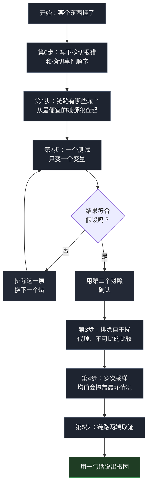

# 五步法：查那些不肯解释自己的网络故障

2026 年 9 月 30 日，我订阅里 10 个节点一夜之间全挂，我没动过任何配置。接下来六小时的过程是这样的：提出一个假设，推翻；再提一个，再推翻；最后在一次两行包的抓包里找到了答案，而那次抓包本该在第一个十分钟就跑。

故障的原因跟我所有假设都不一样。**什么都没坏。** IP 健康，服务器健康，CDN 健康。是 TLS 握手里某个五字符的字符串在让连接被杀，而我之前追的每一个假设都在错误的层。

下面是找到它的方法，也是我下次会用的顺序。

> 文中域名和 IP 都是占位符，替换为 RFC 5737 文档保留段和 `.example` 域名，命令可以放心粘贴。Cloudflare 的地址是公开 anycast 基础设施。

## 第 0 步：先把你真正观察到的东西写下来

形成任何假设之前，先记下确切的报错和确切的事件顺序。不是"节点不能用"，而是原样输出：

```bash
$ curl -v https://cdn.mydomain.example/
*   Trying 104.21.25.249:443...
* Connected to cdn.mydomain.example (104.21.25.249) port 443
*   Recv failure: Connection reset by peer
* OpenSSL SSL_connect: Connection reset by peer in connection to cdn.mydomain.example:443
```

这四行里有两个事实，它们决定了后面所有事：

1. **TCP 连上了。** 三次握手完成。
2. **RST 在 TLS 握手完成之前就到了。**

这个组合本身就是诊断信息。服务器真挂了不会让你 TCP 连上。TLS 完了才拒绝你的请求，会返回一个 HTTP 状态码。"连上了，握手前被重置"是另一类故障，它在你跑第一条命令之前就把搜索空间缩小了。

## 第 1 步：定位故障域

本能反应是先查自己的服务器，因为那里日志最多、工具最全。我也这么做了。而且这恰恰是最容易浪费时间的地方，因为 "connection reset" 听起来像是服务器在拒绝你。

避免这个陷阱的动作是问自己：**这条链路上到底有哪些域？** 我把路径写成一行：

```
客户端 → [ ISP 出口 ] → [ CDN 边缘 ] → [ 源站 ] → 返回
```

然后对每一跳问："它能解释一个 TCP 连上之后才来的 RST 吗？"然后从**能解释的最便宜那一跳**开始查。

我从源站查起，因为它离我只有一个 SSH。

## 第 2 步：单变量对照

有了假设之后，设计一个**只变一个变量**的测试。这里是绝大多数排障失败的地方，因为人们一次改三样东西，然后无法归因。

**假设一：源站挂了。**

```bash
$ curl --resolve cdn.mydomain.example:443:203.0.113.10 https://cdn.mydomain.example/
curl: (35) Recv failure: Connection reset by peer
```

RST。但源站好着呢。同一时间从源站自己走 CDN 访问同一个主机名，返回 `101 Switching Protocols`。nginx 活着，端口开着，日志里什么都没有。

**假设二：CDN 封了优选 IP。**

那年社区里全是 Cloudflare 要严打优选 IP 的说法。可测。同一个 IP，换 SNI：

```bash
$ curl --resolve speed.cloudflare.com:443:198.41.209.164 \
    "https://speed.cloudflare.com/__down?bytes=5000000"
HTTP/1.1 200 OK

$ curl --resolve proxy.mydomain.example:443:198.41.209.164 \
    https://proxy.mydomain.example/
curl: (35) Recv failure: Connection reset by peer
```

一个 IP，两个主机名，相反的结果。IP 没死，Cloudflare 也没封。

**假设三：换台服务器就好了。**

我有第二台，不同商家、不同地区。真是源站的问题，换机就能解决：

```bash
$ curl --resolve alt-server.example.org:443:198.51.100.20 https://alt-server.example.org/
curl: (35) Recv failure: Connection reset by peer
```

同样的失败，跟那台机器无关。

三个假设，三次干净的证伪。**比任何单个假设更有价值的是它们的共性**：每一次都只改一个变量，所以每次证伪只排除一层，不牵连别的东西。

## 第 3 步：排除自干扰

在怪网络之前，先查那两件会让你自己的环境骗你的事。

**有没有代理在吃你的流量？** 任何本地代理、任何透明重定向、任何 DNS 劫持，都会让一个完全健康的目标看起来像坏了。查环境变量：

```bash
env | grep -i proxy
```

我这里是空的。而且我机器上的透明规则只处理局域网转发流量，不处理本机发起的连接。这一点值得确认而不是假设，因为"我自己的代理在骗我"和"链路被干扰"在客户端看起来完全一样。

**你比较的是不是不同时刻的测量值？** 这条让我真的浪费了时间。我有一个工具报某个节点 236ms，而我自己的 `curl` 对同一个 IP 测出 1.27 秒，我为此困惑了很久。但这两个数字差了四分钟，测法也不同，我把它们当成了矛盾。它们不可比，所以它们不矛盾。

**一次测量只是一个数据点。** 一个结论需要同一种方法、在足够接近的时间点上、针对同一件事的重复测量。

## 第 4 步：多次采样

如果你确实要测时间，就多测几次。链路不是常数，单次采样早晚会给你一个要么是谎、要么是巧合的数字。

后来我让一个子代理在备用机上测，这条立刻就派上用场了：

```
connect=0.234766s
connect=0.221261s
connect=1.260345s
connect=0.232439s
connect=0.239106s
```

四次数落在 230ms 左右，一次 1.26 秒。

**那个离群值不是噪声。** Linux 内核的首次 SYN 重传超时是 1.0 秒，一个 SYN 丢包，客户端就实打实坐满这一秒才重传。物理 RTT 230ms，应用看到 1.26s。同一条健康的链路，5 倍的数字。

这也解释了为什么平均值会掩盖坏节点。一个工具测四次握手、只对成功的那几次取平均，那么一个四次挂一次的节点会被报成"健康的"230ms。节点不健康，是平均值让它看起来健康。

**所以某个数字重要的时候，看最坏情况和丢包率，不只看均值。**



## 第 5 步：链路两端双向取证

我前四个假设里有三个是在客户端这边证伪的，这是真实的方法论限制。客户端能证明"请求失败了"，但证明不了"在哪里失败的"。而且 `Connection reset by peer` 这句话讲的是客户端自己的 socket，不是任何人的决定。

所以我从另一端看。在源站上：

```bash
sudo timeout 30 tcpdump -ni any \
  "tcp[tcpflags] & (tcp-syn|tcp-rst) != 0 and tcp dst port 443" -c 20
```

趁它在跑，客户端发了一次请求。到的包就两个：

```
14:51:28.175281 ens3 In  IP 198.51.100.77.17652 > 203.0.113.10.443: Flags [S]
14:51:28.458155 ens3 In  IP 198.51.100.77.17652 > 203.0.113.10.443: Flags [R.]
```

看源地址。那个 RST 来自 `198.51.100.77`，也就是客户端自己，而且它的 ack 是服务端从没发过的序列号。源站一个包都没回。发出去 283 毫秒之后，客户端放弃，自己把连接重置了。

**源站没拒绝任何东西，它压根没被联系上。** 那个 SYN 在我 ISP 出口和服务器之间消失了。

我接着花了一个小时，在一台**一个包都没收到**的机器上找防火墙规则，因为那句报错把我指到了那里，而我没有任何办法知道它在撒谎。

**十秒的抓包能省掉那一小时。** 而它花掉九十分钟的唯一原因是：第 1 到第 4 步全都发生在一台机器上，而那台正在骗你的机器，恰好是我唯一在测的机器。

## 方法找到的东西

把故障域缩小到"客户端和服务器之间、服务器还没被触达"之后，第 2 步那个单变量测试就变成了决定性的。固定 IP，只变主机名：

| ClientHello 里的 SNI | 结果 |
|---|---|
| `speed.cloudflare.com` | **200 OK** |
| `i.cd`、`us.ci`、`bot.cd`、`de5.net`、`cwu.cc`、`bbroot.com`、`kz.ci`、`xyz.ci`、`pc.ci` | TLS alert（包到了 Cloudflare） |
| `cc.cd` | **Connection reset** |

两种失败模式，它们的区别就是结论。TLS alert 是 Cloudflare 回的，说明包到了、没人干预。干净的 RST 说明连接在握手中途被杀。

两个探测把规则钉死：

```bash
# .cd，但不是 cc.cd  →  存活
curl --resolve abc123def.cd:443:198.41.209.164 https://abc123def.cd/

# cc.cd，但这个域名根本不存在  →  reset
curl --resolve randxyz.cc.cd:443:198.41.209.164 https://randxyz.cc.cd/
```

**命中的是 `cc.cd` 这个字面子串。** 不是 TLD，不是我的主机名，不是 IP，不是端口。就是 SNI 字段里那五个字符，而且我 10 个节点里发的是哪个都一样。

两个细节值得留着：

**不是端口级。** 443、8443、以及 80 端口纯 HTTP 的 Host 头上，同样的 reset。

**分片救不了。** 所有 VLESS 客户端都能把 ClientHello 拆到多个 TCP 段里，让任何单个包都不含主机名。我早就开着了，reset 照来。对中间盒来说重组是小儿科，跨分片匹配一样。

**而那些一直好用的节点，自己解释了自己。** 同一台服务器、同样端口上的 REALITY 节点，借用 `www.nvidia.com` 这样的 SNI，它们的 ClientHello 里没有任何东西匹配。规则一旦明确，这个预测是白送的，也顺便验证了规则是对的。


## 修复是五处改动，其中两处是静默失败

域名在 CDN 代理的节点里是每一层都硬编码的，所以"换域名"意味着换五个地方。

**面板会回滚配置文件。** 我在磁盘上改了入站配置然后重载，新主机名又变回 404。那个面板把入站设置存进 SQLite，每次重启都从数据库重新生成配置文件，于是我的每次修改都被静默丢弃。必须改数据库，然后还要杀掉一个仍占着端口的残留进程才生效。

**证书是两个文件。** 我把加了新主机名的源站证书生成好装上去，拿到一个看起来像 CDN 问题的握手失败。那个 web server 是把证书和私钥当两个独立文件加载的，只换其中一个握手就崩。

两个失败的形状一模一样：**工具报告成功，系统安静地做了相反的事。**

两处都修完之后，新主机名返回了预期的升级响应，订阅 14 个节点，客户端请求 0.4 秒返回。

## 这套方法里你可以直接拿走的部分

如果只带走一样，带走第 2 步那个单变量测试。当网络故障拒绝解释时，找一个你能固定住的请求，然后只变一个字段：

```bash
# 同一个 IP，两个 SNI 值。第一个通、第二个不通，
# 那 IP 就不是问题，有东西在读握手。
curl -sS -o /dev/null -w "%{http_code}\n" --max-time 8 \
  --resolve speed.cloudflare.com:443:198.41.209.164 \
  "https://speed.cloudflare.com/__down?bytes=5000000"

curl -sS -o /dev/null -w "%{http_code}\n" --max-time 8 \
  --resolve your.domain.here:443:198.41.209.164 \
  https://your.domain.here/
```

而当单变量测试还不够的时候，**在动下一个配置文件之前，先从另一端看链路。** 十秒钟，能终结读多少日志都吵不赢的争论。

## 延伸阅读

- [CloudflareSpeedTest](https://github.com/XIU2/CloudflareSpeedTest) 是个好工具，这次的问题从来不在工具
- [RFC 6298](https://datatracker.ietf.org/doc/html/rfc6298)：那个一秒断崖背后的重传计时器行为
- [Great Firewall](https://en.wikipedia.org/wiki/Great_Firewall)：握手检查的背景
