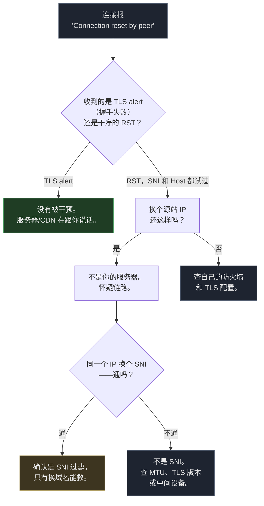

# CF 优选 IP 全部失效：问题从来不在 IP，在你的域名

2026 年 9 月 30 日，我那套跑了三个月的 Cloudflare 优选 IP 订阅，一夜之间从"19/20 可用"变成"全军覆没"。我没动过任何配置。

接下来六个小时，我把优选 IP 领域里几乎所有"常识"都验证成了错的。

结论先说：**IP 没问题，VPS 没问题，Cloudflare 也没封你。是 GFW 在按 SNI 里的字符串掐断连接——你的域名里那串字符被匹配到了。换任何 IP 都没用，只有一个办法：换域名。**

> 文中的域名和 IP 都是占位符。真实信息已替换为 RFC 5737 文档保留段（`203.0.113.0/24`、`198.51.100.0/24`）和 `.example` 域名，命令可以放心复制粘贴。文中的 Cloudflare 优选 IP（`198.41.x.x` 等）是 Cloudflare 官方 anycast 段，公开基础设施，不涉及隐私。

## 故障长什么样

订阅里 10 个节点，全部刚生成、分布在移动和联通两个优化源上，齐刷刷连不上：

```bash
$ curl -v https://cdn.mydomain.example/
*   Trying 104.21.25.249:443...
* Connected to cdn.mydomain.example (104.21.25.249) port 443
*   Recv failure: Connection reset by peer
* OpenSSL SSL_connect: Connection reset by peer
curl: (35) Recv failure: Connection reset by peer
```

注意细节：**TCP 连上了，然后对方在 TLS 握手完成之前直接 RST**。

这个模式——"连接成功、握手前立刻被重置"——就是 SNI 干预的指纹，不是服务器挂了。

## 我先怀疑的三件事（全错了）

在想到封锁之前，我按标准排障流程走了一遍。每一步看起来都很合理，每一步都走进死胡同。

**怀疑一：源站挂了。** 最基本的验证，换条解析路径、换个端口：

```bash
$ curl --resolve cdn.mydomain.example:443:203.0.113.10 https://cdn.mydomain.example/
curl: (35) Recv failure: Connection reset by peer
```

还是 RST。但服务器好着呢——同一时间我自己的 Cloudflare 边缘 IP 用同一个域名访问，返回的是 `HTTP/1.1 101 Switching Protocols`。

**怀疑二：Cloudflare 封了优选 IP。** 合理怀疑，因为那年社区里确实在传 CF 要严打优选 IP。测法：同一个优选 IP，换 SNI。

```bash
$ curl --resolve speed.cloudflare.com:443:198.41.209.164 \
    "https://speed.cloudflare.com/__down?bytes=5000000"
HTTP/1.1 200 OK        # 200 —— IP 活得好好的

$ curl --resolve proxy.mydomain.example:443:198.41.209.164 \
    https://proxy.mydomain.example/
curl: (35) Recv failure: Connection reset by peer
```

一个 IP，两个域名，结果完全相反。Cloudflare 没封任何东西。

**怀疑三：换台 VPS 就好了。** 我有第二台机器，不同商家、不同地区。真是源站的问题，换机就能解决：

```bash
$ curl --resolve alt-server.example.org:443:198.51.100.20 https://alt-server.example.org/
curl: (35) Recv failure: Connection reset by peer     # 换机器，一样的 RST
```

同样的失败，跟那台机器毫无关系。变量从来不在服务器。

## 决定性的一行 tcpdump

猜来猜去绕了太多圈，我直接在源站上抓包，同时让客户端发一次请求：

```bash
# 源站 VPS 上执行
sudo tcpdump -ni any "tcp[tcpflags] & (tcp-syn|tcp-rst) != 0 and tcp dst port 443" -vv
```

客户端那边只发了一次请求。相关的包就两个：

```
14:51:28.175281 ens3 In  IP 198.51.100.77.17652 > 203.0.113.10.443: Flags [S]
14:51:28.458155 ens3 In  IP 198.51.100.77.17652 > 203.0.113.10.443: Flags [R.]
```

再读一遍。SYN 到了。283 毫秒后，一个 RST 到了——**而且源地址是客户端自己**（`198.51.100.77`，还带着 `ack 486385868` 这个服务端从没发过的序列号）。源站一个包都没回。

客户端等 SYN-ACK 等不到，超时了，于是自己把连接重置了。

**源站没有拒绝任何东西，它压根没被联系上。** 那个 SYN 在我 ISP 的出口到我的 VPS 之间被吞掉了。

到这里故障模式已经很清楚了：链路中间有东西在检查 TLS ClientHello，看到 SNI 字段里某串字符不喜欢，于是让握手根本无法完成。

```mermaid
flowchart LR
    A[客户端发出 SYN] --> B["SYN-ACK 始终不返回<br/>源站从未收到任何包"]
    B --> C[客户端超时<br/>自己发 RST]
    C --> D[curl 报<br/>"Connection reset by peer"]

    style A fill:#1e2430,stroke:#4a5568,color:#e6e6e6
    style B fill:#3d1f1f,stroke:#a45050,color:#e6e6e6
    style C fill:#3d1f1f,stroke:#a45050,color:#e6e6e6
    style D fill:#3d1f1f,stroke:#a45050,color:#e6e6e6
```

"Connection reset by peer" 这句话是客户端自己的挫败，不是服务端的拒绝。

这个误读让我花了很久在一台**一个包都没收到**的服务器上找防火墙规则。

## 证明它拦的是字符串，不是域名

一旦怀疑是 SNI 过滤，测试设计就变得很简单了：**固定 IP，只变主机名**。同一个 IP 对某个 SNI 通、对另一个不通，那 IP 就洗清了，字符串有罪。

我用同一个 Cloudflare 边缘 IP、同一个客户端，跑了 11 个主机名：

| ClientHello 里的 SNI / Host | 结果 |
|---|---|
| `speed.cloudflare.com` | **200 OK** |
| `i.cd` | 握手失败（包到了 CF） |
| `us.ci` | 握手失败（包到了 CF） |
| `bot.cd` | 握手失败（包到了 CF） |
| `de5.net` | 握手失败（包到了 CF） |
| `cwu.cc` | 握手失败（包到了 CF） |
| `bbroot.com` | 握手失败（包到了 CF） |
| `kz.ci` | 握手失败（包到了 CF） |
| `xyz.ci` | 握手失败（包到了 CF） |
| `pc.ci` | 握手失败（包到了 CF） |
| `cc.cd` | **Connection reset** |

两种截然不同的失败模式，而这个区别就是整个调查的结论：

- **握手失败（handshake failure）** 意味着 TLS alert 是 Cloudflare 返的。包到了 CF 边缘，CF 不喜欢我的证书或这个 SNI 不在我的 zone 里，于是礼貌地告诉我。**连接没有被干预。**
- **Connection reset** 意味着连接在握手中途被杀掉。**这就是干预。**

只有一种主机名触发了 reset。而锁定匹配规则的那两个测试最有价值：

```bash
# .cd，但不是 cc.cd  →  存活（Cloudflare 正常返回 TLS alert）
curl --resolve abc123def.cd:443:198.41.209.164 https://abc123def.cd/

# cc.cd，但一个根本不存在的编造域名  →  reset
curl --resolve randxyz.cc.cd:443:198.41.209.164 https://randxyz.cc.cd/
```

**匹配的是 `cc.cd` 这个字面子串本身。**

不是 `.cd` 这个 TLD，不是我的具体主机名，不是 IP，不是端口，不是目标服务器。就是 SNI 字段里那五个字符。

我又验证了它和端口无关——同样的 reset 在 `443` 和 `8443` 上都出现，在 80 端口的纯 HTTP Host 头里也一样。

**这也解释了为什么 REALITY 节点一直好好的**：REALITY 借用 `www.nvidia.com` 这样的 SNI，ClientHello 里根本没有可匹配的东西。



## 为什么 TLS 分片救不了

既然是读 SNI，那最直接的对策就是藏 SNI。所有 VLESS 客户端都有 `fragment` 参数，它把 ClientHello 拆成多个 TCP 段发出去，让任何一个包都不含完整域名。

我的 mihomo 配置里**早就开了这个参数**。盒子自己的日志：

```
[TCP] dial 下载节点[DL|CF-CMCC-1] error: 162.159.133.16:443 connect error:
  read tcp 192.168.1.50:2738->162.159.133.16:443: connection reset by peer
```

分片开着，reset 照来。过滤方不是只看一个包——重组对它们来说是小儿科，跨分片匹配同样 trivial。

**TLS 分片能提高一点成本，但改变不了结果。**

## 解法：换一个不在名单上的域名

域名有问题，解法就是换一个不在名单上的域名。我手头没有，所以先测候选。`us.ci` 和 `bot.cd` 没被拦，于是我把 `new.mydomain.example` 指向 Cloudflare，重建了整套东西。

改的地方一共五处——因为域名名在 CF 代理的 VLESS 节点里是**每一层都硬编码**的：

1. **DNS** — 新域名的 A 记录，在 Cloudflare 里开小黄云（proxied）
2. **源站证书** — 覆盖新域名的自签证书。Cloudflare 的 SSL 模式必须是 `full` 而不是 `strict`，因为自签证书过不了 strict 校验
3. **nginx `server_name`** — 源站得认这个新主机名
4. **xray 的 WebSocket `host` 字段** — 这条把我坑了。3x-ui 把入站配置存在 SQLite 里，每次重启都从数据库重新生成 `config.json`，我直接改 `config.json` 会被静默回滚。必须改数据库，然后**杀掉一个还占着 10086 端口的残留 xray 进程**。做完之后新旧两个主机名都返回 `101 Switching Protocols`
5. **订阅生成器** — 生成 VLESS 链接时的 `sni` 和 `host` 参数，以及**定时重跑订阅的任务**——不改的话，它会在某个晚上悄悄把订阅覆盖回旧域名

结果：订阅里 14 个节点，全部通过真实的 WebSocket 101 握手校验，客户端代理实测 0.4 秒返回 HTTP 204。

顺带一提，旧域名还能用。这个修复不需要破坏原有配置。

## 真正值得带走的

可迁移的经验不是"去买个新域名"，而是一个诊断习惯。

**当优选 IP 订阅里的所有节点同时挂掉时，故障几乎不可能是单个 IP 级的。** 同时、全面失败指向的是所有节点共享的某个东西——而它们唯一共享的就是主机名，因为主机名出现在每一个 ClientHello 里。

优选 IP 是叠在主机名之上的一层带宽优化。主机名出问题时，再多的带宽优化也够不着它。

一分钟就能定位的具体测试：

```bash
# 同一个 IP，两个 SNI 值。诊断到此为止。
curl -sS -o /dev/null -w "%{http_code}\n" --max-time 8 \
  --resolve speed.cloudflare.com:443:198.41.209.164 \
  "https://speed.cloudflare.com/__down?bytes=5000000"

curl -sS -o /dev/null -w "%{http_code}\n" --max-time 8 \
  --resolve your.domain.here:443:198.41.209.164 \
  https://your.domain.here/
```

第一个返回 200、第二个 reset —— **你的 IP 没事，你的域名有事。**

其他所有动作，换服务商、调 `-n` 和 `-dn` 参数、等 Cloudflare "解除"一个根本没下过的封禁，都是白费力气。

## 延伸阅读

- [CloudflareSpeedTest](https://github.com/XIU2/CloudflareSpeedTest) — 工具本身很好，问题从来不在工具
- [The Great Firewall](https://en.wikipedia.org/wiki/Great_Firewall) — SNI 检查如何成为标准手段的背景
- [Deep Packet Inspection of Encrypted Traffic](https://www.usenix.org/conference/usenixsecurity20/presentation/han) — 为什么分片 ClientHello 是一道减速带而不是一堵墙

## 常见问题

**Q：怎么快速确认我遇到的是 SNI 拦截，而不是服务器问题？**
用上面那条一分钟测试。同一个 IP 换 SNI，通就是域名问题。

**Q：为什么我换了几十个优选 IP 都没用？**
因为拦截发生在握手阶段，任何 IP 都会走到同一个 ClientHello。

**Q：REALITY 节点为什么不受影响？**
它借用第三方域名的 SNI，ClientHello 里没有可匹配的目标域名。

**Q：一定要换域名吗？还有别的办法吗？**
有，但都更麻烦：换到一个没被匹配的后缀（成本最低）、用 hkl2 之类的中转、或退回 REALITY 直连。换域名是最省事且最持久的。
