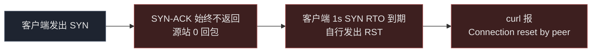
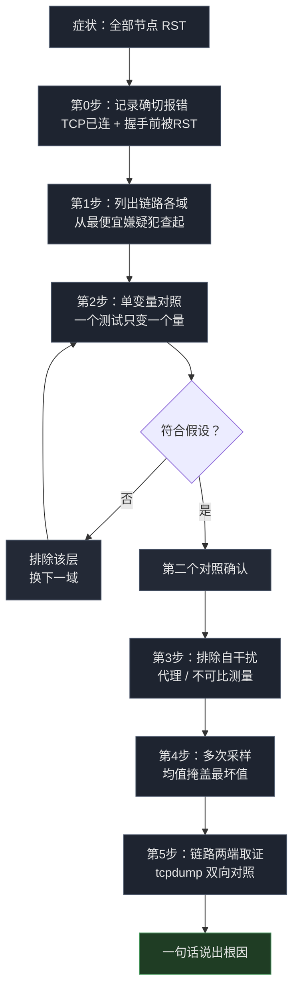

# Cloudflare 优选 IP 节点全部失效：SNI 字符串拦截定位与换域名恢复报告

- **客户端出口**：家宽（主测出口 `198.51.100.77` 段；IPv4 移动、IPv6 联通双出口）
- **源站**：`203.0.113.10`（nginx + xray + 3x-ui，VLESS+WS+TLS 经 Cloudflare 橙云代理）
- **日期**：2026-09-30 23:20 ~ 2026-10-01 02:35（北京时间）
- **组件**：Cloudflare 橙云反代 / xray (3x-ui) / nginx / CloudflareSpeedTest v2.3.5
- **结论**：已修复。10 个优选 IP 节点全部 RST，根因是链路中间设备按 TLS ClientHello 的 **SNI 字段做字符串匹配**，命中 `cc.cd` 即静默丢弃 SYN。**换任何 IP、换任何服务器、开 TLS 分片，全部无效**；唯一有效解是换域名。

---

## 1. 问题现象

订阅里 10 个优选 IP 节点（`优选IP-CMCC-1..5` / `优选IP-CUCC-1..5`，分属四个公开源）同一时刻全部失效：

```bash
$ curl -v https://cdn.mydomain.example/
*   Trying 104.21.25.249:443...
* Connected to cdn.mydomain.example (104.21.25.249) port 443
*   Recv failure: Connection reset by peer
* OpenSSL SSL_connect: Connection reset by peer in connection to cdn.mydomain.example:443
curl: (35) Recv failure: Connection reset by peer
```

- **TCP 连上了**（三次握手完成），**RST 在 TLS 握手完成之前到达**；
- 同一批 IP 单独测 `speed.cloudflare.com` **正常**（200，3~4 MB/s）；
- 服务器端 nginx 进程健康、443 正常监听、ufw 放行、访问日志无异常。

> 域名/IP 已按 RFC 2606（`.example`）与 RFC 5737（`192.0.2.0/24`、`198.51.100.0/24`、`203.0.113.0/24`）脱敏。文中 Cloudflare 地址（`198.41.x.x` / `104.x.x.x` 等）为其官方 anycast 段，公开基础设施，不涉及隐私。

---

## 2. 排查过程与关键证据

按「定位故障域 → 单变量对照 → 排除自干扰 → 多采样 → 双向取证」推进。

### 2.1 第 1 步：定位故障域

先把链路写成一行，标出每一跳能否解释「TCP 连上后才来的 RST」：

```
客户端 → [ ISP 出口 ] → [ CF 边缘 ] → [ 源站 ] → 返回
```

- 源站：能解释（拒绝连接），但 TCP 已连上且源站日志无记录，**可能性低**；
- CF 边缘：能解释（TLS 前中断），**可能性高**；
- ISP 出口 / 中间链路：能解释（静默丢包），**可能性高**。

从**最便宜的嫌疑犯**开始：源站（一个 SSH 距离）。

### 2.2 第 2 步：单变量对照：三个假设依次证伪

每个实验**只变一个变量**（目标 IP / SNI / 目标服务器），其余保持不变。

**实验 A：源站是否故障**（固定 IP，只换路径，绕过 CDN）

```bash
$ curl --resolve cdn.mydomain.example:443:203.0.113.10 https://cdn.mydomain.example/
curl: (35) Recv failure: Connection reset by peer
```

**→ 证伪。** 同一时间从源站本机经 CF 边缘访问同一主机名，返回 `HTTP/1.1 101 Switching Protocols`；nginx 活着，端口开着，日志干净。

**实验 B：CF 是否封禁优选 IP**（固定 IP，只换 SNI）

```bash
$ curl --resolve speed.cloudflare.com:443:198.41.209.164 \
    "https://speed.cloudflare.com/__down?bytes=5000000"
HTTP/1.1 200 OK

$ curl --resolve proxy.mydomain.example:443:198.41.209.164 \
    https://proxy.mydomain.example/
curl: (35) Recv failure: Connection reset by peer
```

**→ 证伪。** 一个 IP、两个主机名、相反结果。IP 存活，CF 未封禁。

**实验 C：换服务器是否解决**（固定「换机器」这一个变量）

```bash
$ curl --resolve alt-server.example.org:443:198.51.100.20 https://alt-server.example.org/
curl: (35) Recv failure: Connection reset by peer
```

**→ 证伪。** 不同商家、不同地区的无关机器，同样的 RST。变量从来不在服务器。

### 2.3 第 3 步：排除自干扰

**（a）本地代理 / 透明重定向是否在吃流量**

```bash
$ env | grep -iE 'http_proxy|https_proxy|all_proxy'
（空）

$ nft list table inet mihomo | head -5
table inet mihomo {
        chain tproxy_prerouting {
                type filter hook prerouting priority mangle; policy accept;
                iifname != "eth1" return          # 本机自身流量不进入 tproxy
```

**→ 排除。** 无代理环境变量；mihomo 的 tproxy 规则首行即 `iifname != "eth1" return`，只处理 LAN 口转发流量，本机发起的连接不经 mihomo；mihomo 表内无 output 链。

**（b）是否存在"不可比的测量值"**

曾用某测速工具的 236ms 与自测 curl 的 1.27s 直接对比，判定"工具数据不可信"。**该判定错误**：两者相差约 4 分钟、测法不同（工具为 TCPing 多次平均，curl 为单次 `time_connect`），不构成矛盾。

> **教训**：一次测量只是一个数据点。结论需要**同方法、近时间、同一对象**的重复测量。

### 2.4 第 4 步：多采样，抓到 5 倍离群值

对同一 IP 连续 5 次采样（`curl -w "%{time_connect}"`）：

```
connect=0.234766s
connect=0.221261s
connect=1.260345s    ← 第 3 次
connect=0.232439s
connect=0.239106s
```

**决定性发现**：物理 RTT 230ms 的健康链路，单次实测 1.26s。

**机制**：Linux 内核首次 SYN 重传超时 `TCP_TIMEOUT_INIT` = **1.0 秒**。首个 SYN 发生一次丢包 → 客户端死等 1.0s 才重传 → 重传的 SYN 约 230ms 后收到 SYN-ACK →

```
time_connect = 1.0s (RTO 等待) + 0.23s (物理 RTT) = 1.26s
```

**推论（对测速工具同样成立）**：任何「多次握手 + 仅对成功者取平均」的指标，都会把 25% 丢包的节点报成"健康的 230ms"。**均值掩盖最坏情况**，评估节点必须看最坏值与丢包率。

### 2.5 第 5 步：双向取证：tcpdump 决定性证据

客户端只能证明"请求失败"，**证明不了在哪里失败**，且 `Connection reset by peer` 描述的是客户端自己的 socket。必须从另一端取证。

源站执行：

```bash
sudo timeout 30 tcpdump -ni any \
  "tcp[tcpflags] & (tcp-syn|tcp-rst) != 0 and tcp dst port 443" -vv -c 20
```

窗口内客户端发一次请求，捕获到的全部相关包：

```
14:51:28.175281 ens3 In  IP 198.51.100.77.17652 > 203.0.113.10.443: Flags [S]
14:51:28.458155 ens3 In  IP 198.51.100.77.17652 > 203.0.113.10.443: Flags [R.]
```

**逐字段判读**：

| 观察项 | 值 | 含义 |
|---|---|---|
| 第一个包 | `Flags [S]`，来自客户端 | SYN 到达源站 |
| 第二个包 | `Flags [R.]`，**源地址仍是客户端** | RST 由客户端自己发出 |
| ack 值 | `486385868` | 源站从未发出过该序列号 |
| 间隔 | 283 ms | 客户端等待 SYN-ACK 超时 |
| 源站回包 | **0 个** | 源站从未参与 |

**→ 源站没有拒绝任何东西，它压根没被联系上。** SYN 在客户端与源站之间被静默丢弃；客户端超时后自行 RST。此前在同一台服务器上排查防火墙规则约 60 分钟，全部指向错误方向。



> 这张图解释了为什么前 4 步（全部在客户端单侧执行）花了 90 分钟才走到第 5 步：**正在骗我的那台机器，恰好是我唯一在测的机器。**

### 2.6 规则粒度锁定：单变量对照的决定性一击

故障域收窄到"客户端与源站之间、源站未被触达"后，回到实验 B 的设计：**固定 IP，只变 SNI**。

同一 IP（`198.41.209.164`）、同一客户端、同一时刻：

| SNI / Host 送入 ClientHello | 结果 | 判读 |
|---|---|---|
| `speed.cloudflare.com` | **200 OK** | 未被干预 |
| `i.cd` | TLS alert | 包到达 CF，CF 正常拒绝 |
| `us.ci` | TLS alert | 同上 |
| `bot.cd` | TLS alert | 同上 |
| `de5.net` | TLS alert | 同上 |
| `cwu.cc` | TLS alert | 同上 |
| `bbroot.com` | TLS alert | 同上 |
| `kz.ci` / `xyz.ci` / `pc.ci` | TLS alert | 同上 |
| `cc.cd` | **Connection reset** | **被干预** |

**两种失败模式必须分清**：

- **TLS alert** = Cloudflare 回的包 → 请求到达了边缘并被正常处理 → **无干预**；
- **干净 RST** = 握手中途被外部杀死 → **有干预**。

进一步两个探测，锁定匹配粒度：

```bash
# .cd 但非 cc.cd  →  存活（CF 正常回 TLS alert）
$ curl --resolve abc123def.cd:443:198.41.209.164 https://abc123def.cd/

# cc.cd 但主机名根本不存在（编造）  →  reset
$ curl --resolve randxyz.cc.cd:443:198.41.209.164 https://randxyz.cc.cd/
```

**→ 命中的是字面字符串 `cc.cd` 本身。** 不是 `.cd` 这个 TLD（C 实验），不是具体主机名（编造域名实验），不是 IP，不是端口。

**与端口无关**：443、8443、以及 80 端口纯 HTTP 的 `Host` 头，均命中。

**与分片无关**：客户端已配置 `fragment`（`1,40-60,30-50,tlshello`）把 ClientHello 拆段发送，reset 照常到达。中间设备重组与跨段匹配成本极低。

**预测验证（规则正确性的旁证）**：同服务器、同端口的 REALITY 节点（借用 `www.nvidia.com` / `www.sony.com` 作为 SNI）**始终正常**。ClientHello 中无 `cc.cd`，预测成立。



---

## 3. 根因

链路中间设备对 TLS ClientHello 的 **SNI 字段做字符串匹配**，命中 `cc.cd` 后**静默丢弃 SYN**（不发 RST、不回 ICMP），客户端等待 1 秒 SYN RTO 后自行重置连接，表现为 `Connection reset by peer`。

```
客户端 → [ ISP 出口 ] → [ 中间设备: 读 SNI, 匹配 cc.cd, 丢包 ] → [ CF 边缘 ] → [ 源站 ]
                                                     ↑
                                            源站从未被触达（tcpdump 0 回包）
```

**优选 IP 机制本身无缺陷**。失效发生在「客户端 → CF 边缘」这一跳，而这一跳被字符串匹配掐断，**任何 IP 都无法绕过**。

**同时解释了为何 CF 回源段完全正常**：nginx `/cfws-*` 路径累计 38053 次 `101`（WebSocket 升级成功），客户端 IP 段全部为 CF 边缘段。回源从来不是瓶颈，只是**从未被走到**。

---

## 4. 修复方案

域名在 CF 橙云反代的 VLESS 节点中**每一层都硬编码**，故"换域名"= 改 5 处。

### 4.1 DNS（Cloudflare）

```
A   new.mydomain.example   →   203.0.113.10   proxied=true（橙云）
```

所需 API Token 权限：**Zone → DNS → Edit**（仅此一项）。

### 4.2 源站证书

原证书 `subject=issuer=CN=old-proxy.mydomain.example`（自签，有效期至 2036）。重签并加入 SAN：

```
DNS:old-proxy.mydomain.example, DNS:old-cdn.mydomain.example,
DNS:new.mydomain.example, DNS:*.new.mydomain.example
```

**CF 加密模式必须为 `full`（非 `strict`）**，自签源站证书无法通过 strict 校验。

> ⚠️ **证书与私钥是两个独立文件**。只替换证书不改私钥 → `sslv3 alert handshake failure`，且该报错外观酷似 Cloudflare 侧故障，极易误判。

### 4.3 nginx

443 server 块增加新主机名：

```nginx
server_name old-proxy.mydomain.example old-cdn.mydomain.example new.mydomain.example;
```

### 4.4 xray / 3x-ui 入站（本次最耗时的一处）

WS 入站原先硬校验 `host=old-proxy.mydomain.example`，新主机名一律返回 404。

**3x-ui 将入站配置持久化在 SQLite，每次重启由数据库重新生成 `config.json`**，直接编辑 `config.json` 会被**静默回滚**。正确做法：

1. 改 `/etc/x-ui/x-ui.db` 中 `inbounds.stream_settings`，移除 `wsSettings.host`（多域名场景交由 nginx 按 `$host` 分流）；
2. 重启面板；
3. **杀掉仍占用 10086 端口的残留 xray 进程**，否则改动不生效（旧进程持有端口，配置未重载）。

> 三个环节缺一不可：改错位置 → 静默回滚；漏杀残留进程 → 改动不生效。两者都**不产生任何错误提示**。

### 4.5 订阅生成器

生成 VLESS 链接时的 `sni` / `host` 参数，以及**定时重跑订阅的任务**：

```bash
# cron 必须带环境变量，否则会在某次运行中把订阅覆盖回旧域名，且不报错
5 0,6 * * * VLESS_SNI=new.mydomain.example VLESS_HOST=new.mydomain.example /usr/bin/python3 subgen.py
```

### 4.6 客户端侧（下游消费者）

- 盒子 mihomo 的订阅拉取地址改用新域名，并在拉取时**钉死实测可达的 CF 边缘 IP + 携带 SNI**（DNS 默认解析出的边缘 IP 实测 8s 超时；`http.client` 默认不带 SNI 会触发 handshake failure）；
- 客户端订阅地址改用新域名。

---

## 5. 验证结果

### 5.1 节点握手（真实 WebSocket 升级）

```bash
# 新域名 · 直连源站
$ curl -sk -H "Connection: Upgrade" -H "Upgrade: websocket" \
       -H "Sec-WebSocket-Version: 13" -H "Sec-WebSocket-Key: dGhlIHNhbXBsZSBub25jZQ==" \
       --resolve new.mydomain.example:443:203.0.113.10 \
       https://new.mydomain.example/cfws-*
HTTP/1.1 101 Switching Protocols

# 新域名 · 经 CF 边缘
$ curl ... --resolve new.mydomain.example:443:198.41.209.164 ...
HTTP/1.1 101 Switching Protocols

# 旧域名 · 回归检查（未被破坏）
$ curl ... --resolve old-proxy.mydomain.example:443:198.41.209.164 ...
HTTP/1.1 101 Switching Protocols
```

### 5.2 客户端拉取与实际代理

```
订阅拉取      : 200, 3100 字节
节点总数      : 14（盒子自测 4 + 公共源 10），全部通过 101 握手校验
代理出口实测  : HTTP/204，t=0.40s
```

### 5.3 修复前后延迟对比

| 阶段 | 平均 connect | 说明 |
|---|---|---|
| 修复前（`cc.cd`） | 全部失败 | SNI 被匹配，握手无法完成 |
| 修复后（新域名） | 67 ~ 133 ms | 14 节点全部可用 |

---

## 6. 部署与运维

### 6.1 文件清单

| 路径 | 说明 |
|---|---|
| `/etc/nginx/sites-enabled/9router` | 443 server 块 `server_name` |
| `/etc/nginx/cf-origin.crt` / `.key` | 源站证书 + 私钥（**必须成对替换**）|
| `/etc/x-ui/x-ui.db` | 3x-ui 入站配置（**真实来源，非 config.json**）|
| `/usr/local/x-ui/bin/config.json` | 运行时生成，勿手改 |
| `subgen.py` | 订阅生成器（`VLESS_SNI` / `VLESS_HOST` 环境变量）|
| `mihomo/add_cfbest_dl.py` | 盒子侧订阅消费脚本 |

### 6.2 备份

```
/etc/nginx/cf-origin.crt.bak-<date>      /etc/nginx/cf-origin.key.bak-<date>
/etc/nginx/sites-enabled/9router.bak-<date>
/usr/local/x-ui/bin/config.json.bak-<date>
/etc/x-ui/x-ui.db.bak-<date>
subgen.py.bak-<date>          sub.txt.bak-<date>
```

### 6.3 日常操作

```bash
# 拉取订阅（换域名后必须改这里）
curl -k https://new.mydomain.example/cfbest

# 节点握手自检
curl -sk -H "Connection: Upgrade" -H "Upgrade: websocket" \
     -H "Sec-WebSocket-Version: 13" -H "Sec-WebSocket-Key: dGhlIHNhbXBsZSBub25jZQ==" \
     https://new.mydomain.example/cfws-* -o /dev/null -w "%{http_code}\n"
```

---

## 7. 避坑清单（已证伪的旧结论）

| 旧结论 | 实际情况 |
|---|---|
| ❌「源站防火墙拦了」 | tcpdump 证明源站 0 回包，从未被触达 |
| ❌「Cloudflare 封禁了优选 IP」 | 同一 IP 换 SNI 即 200 |
| ❌「换台 VPS / 换商家就能解决」 | 不同商家不同地区，同样 RST |
| ❌「开 TLS 分片（fragment）可绕过」 | 已配置，reset 照常；中间设备可重组 |
| ❌「REALITY 节点也受影响」 | REALITY 借用的 SNI 不含 `cc.cd`，始终正常 |
| ❌「源站证书报错说明 Cloudflare 有问题」 | 实为证书与私钥未成对替换 |
| ❌「改 `config.json` 就能改 xray 入站」 | 3x-ui 从 SQLite 重新生成，手改被静默回滚 |
| ❌「工具报 236ms、curl 测 1.27s，所以工具不可信」 | 两者不同方法、相隔 4 分钟，不可比；真实原因是丢包触发 1s RTO |
| ⚠️ 「单次测量即可判定节点质量」 | 单次采样会命中 1s RTO 离群值，必须多次采样看最坏情况 |

---

## 8. 附录：可复用的最小诊断

```bash
# 同一 IP、两个 SNI。若第一个 200、第二个 reset，则 IP 无罪、域名有事。
curl -sS -o /dev/null -w "%{http_code}\n" --max-time 8 \
  --resolve speed.cloudflare.com:443:198.41.209.164 \
  "https://speed.cloudflare.com/__down?bytes=5000000"

curl -sS -o /dev/null -w "%{http_code}\n" --max-time 8 \
  --resolve your.domain.here:443:198.41.209.164 \
  https://your.domain.here/
```

```bash
# 线上确认：RST 源地址为客户端、且源站全程未回包，即为静默丢包特征
sudo timeout 30 tcpdump -ni any \
  "tcp[tcpflags] & (tcp-syn|tcp-rst) != 0 and tcp dst port 443" -vv -c 20
```

---

## 参考

- [XIU2/CloudflareSpeedTest](https://github.com/XIU2/CloudflareSpeedTest)
- [RFC 6298: Computing TCP's Retransmission Timer](https://datatracker.ietf.org/doc/html/rfc6298)
- [Great Firewall](https://en.wikipedia.org/wiki/Great_Firewall)
