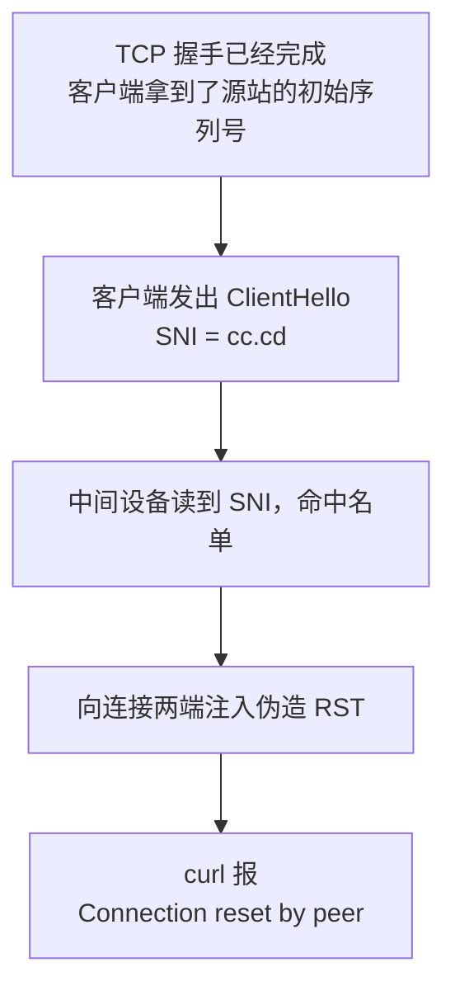

2026 年 9 月 30 日凌晨，我订阅里的 10 个 Cloudflare 优选 IP 节点在同一分钟全部断连，我没动过任何配置。查了六个小时，结果是 IP、源站、Cloudflare 都好好的，问题出在域名：链路中间有设备在读 TLS 握手里的域名，含有 `cc.cd` 就把连接掐掉。换 IP、换服务器都没用，只能换域名。

文中的域名是占位符，`198.41.x.x`、`104.x.x.x` 是 Cloudflare 公开的 anycast 地址（全球很多机房共用的同一批 IP），不是什么秘密。

## 30 秒自检：你是不是同一个问题

先设两个变量：

```bash
DOMAIN=cdn.your-domain.com      # 出问题的那个域名
EDGE_IP=198.41.209.164          # 任意一个 Cloudflare anycast 边缘 IP
```

然后用同一个边缘 IP 分别访问两个域名。`--resolve` 的作用是让 curl 不查 DNS，直接把这个域名指到你给的 IP 上：

```bash
# [诊断] 打一个已知正常的域名，确认这个 IP 本身是活的
curl -sS -o /dev/null -w "speed.cloudflare.com -> %{http_code}\n" --max-time 8 \
  --resolve speed.cloudflare.com:443:$EDGE_IP \
  "https://speed.cloudflare.com/__down?bytes=1000000"

# [诊断] 打你自己的域名，看它是怎么死的
curl -sS -o /dev/null -w "$DOMAIN -> %{http_code}\n" --max-time 8 \
  --resolve $DOMAIN:443:$EDGE_IP \
  "https://$DOMAIN/"
```

结果有三种：

| 第 1 条 | 第 2 条 | 结论 |
|---|---|---|
| `200` | `200` | 节点没问题，去查订阅、配置或客户端 |
| `200` | `000` | 就是本文的问题：同一个 IP，换个域名就通，被掐的是域名 |
| `000` | `000` | 这个边缘 IP 本身不通，换一个再测 |

`000` 的意思是 curl 连 HTTP 状态码都没拿到，连接在加密握手完成前就断了。这跟服务器回你一个 `403`、`404` 是两回事：后者是服务器收到了请求并拒绝你，前者更像是半路被人掐断。

## 为什么换 IP 没用

访问一个 HTTPS 网站时，客户端发出的第一个握手包叫 ClientHello，里面有个字段叫 SNI（Server Name Indication），写的是你要访问的域名。服务器需要它，因为一个 IP 上可能挂着成千上万个网站，不知道域名就不知道该出示哪张证书。

麻烦在于 SNI 是明文。加密要等握手谈完才开始，而 SNI 必须在那之前发出去。这就像寄信，信的内容封在信封里，但收件地址写在信封外面，路上谁都能看见。链路上的设备不用解密，读一下这串字符就知道你要去哪，拿名单做个字符串匹配，命中就动手。这次命中的就是 `cc.cd` 这五个字符。

所以下面这些常见做法都不管用：

- 换优选 IP：换的只是 IP，SNI 里的域名没变，照样命中。
- 换 VPS 或服务商：我在另一家、另一个地区的机器上测，结果一模一样，问题从来不在服务器。
- 开 TLS 分片（`fragment`，把 ClientHello 拆成几个小包发）：中间设备把包拼回去很容易，我开着分片测，照样被断。
- 等 Cloudflare 解封：Cloudflare 什么都没封，同一个 IP 换个域名就是 200。

还有个旁证：同一台服务器、同一批端口上的 REALITY 节点（一种借用别人网站域名伪装握手的协议，我借的是 `www.nvidia.com`）从头到尾没断过，因为它的握手里没有能匹配上的字符串。拦截发生在客户端到 Cloudflare 边缘这一段，跟你的服务器无关。

## 怎么修：换新域名，改 5 个地方

我的结构是 Cloudflare 橙云（开启代理，流量先经过 Cloudflare 再到源站）反代 VLESS。这套结构里域名在每一层都写死了，所以换域名要改五处。

你需要能改 Cloudflare 的 DNS、能 SSH 到源站、能重签源站证书，客户端（软路由、mihomo 或各种图形客户端）也要能改订阅地址。按顺序改，最后统一验证。

### 1. DNS

在 Cloudflare 后台加一条记录，打开橙云：

```
A   new.your-domain.com   →   <你的源站 IP>   proxied = true（橙云打开）
```

如果用 API 操作，Token 只需要 Zone → DNS → Edit 这一项权限。

### 2. 源站证书

重签证书，把新旧域名都放进 SAN（证书里列出"这张证书对哪些域名有效"的字段）。保留旧域名是为了方便回滚：

```
DNS:old.your-domain.com, DNS:new.your-domain.com, DNS:*.new.your-domain.com
```

证书和私钥是两个文件，要成对替换。只换证书不换私钥，握手会报 `sslv3 alert handshake failure`，这个错看起来特别像 Cloudflare 出了问题，很容易查偏。

另外 Cloudflare 的加密模式要选 `full`，不能选 `strict`，因为自签的源站证书过不了 strict 校验。

### 3. nginx

在 443 的 server 块里加上新域名，旧的保留：

```nginx
server_name old.your-domain.com old-cdn.your-domain.com new.your-domain.com;
```

### 4. xray / 3x-ui 入站

这一步花的时间最多。WebSocket 入站里写死了 `host = 旧域名`，新域名进来一律 404。

坑在于 3x-ui 把入站配置存在 SQLite 数据库里，每次重启都从数据库重新生成 `config.json`。手改 `config.json` 会被悄悄改回去，不报任何错。正确做法：

1. 改 `/etc/x-ui/x-ui.db` 里 `inbounds` 表的 `stream_settings`，去掉 `wsSettings.host`，多个域名交给 nginx 按 `$host` 分流；
2. 重启面板；
3. 杀掉还占着 10086 端口的旧 xray 进程，不然它一直占着端口，新配置不会生效。

前两步做错都不会有报错。改完没反应，多半是这里的问题。

### 5. 订阅生成器和下游

生成 VLESS 链接时写进 `sni` 和 `host` 的值要换成新域名。cron 里也要带上环境变量，否则某次定时任务会把订阅悄悄覆盖回旧域名：

```bash
5 0,6 * * * VLESS_SNI=new.your-domain.com VLESS_HOST=new.your-domain.com /usr/bin/python3 subgen.py
```

下游拉订阅的地址（比如软路由上的 mihomo）也要改成新域名。

### 验证

发一个真实的 WebSocket 升级请求，返回 `101`（服务器同意切换到 WebSocket）才算通：

```bash
curl -sk -o /dev/null -w "%{http_code}\n" \
  -H "Connection: Upgrade" -H "Upgrade: websocket" \
  -H "Sec-WebSocket-Version: 13" -H "Sec-WebSocket-Key: dGhlIHNhbXBsZSBub25jZQ==" \
  --resolve new.your-domain.com:443:$EDGE_IP \
  "https://new.your-domain.com/cfws-<你的路径>"
```

我改完后新旧域名都返回 `101`，订阅拉到 14 个节点全部可用，代理出口实测 0.40s，直连延迟从全部失败变成 67~133ms。

## 我是怎么查出来的 {#evidence}

### 先排除服务器

我先绕过 CDN 直连源站 IP，还是被断。但源站本身没问题：同一时间在源站本机经 Cloudflare 边缘访问同一个域名，返回 `HTTP/1.1 101 Switching Protocols`，nginx 在跑，443 在监听，ufw 放行，日志也干净。

### 固定 IP，只换域名

这是关键一步。用同一个边缘 IP，只改 ClientHello 里的域名：

- `speed.cloudflare.com` 返回 `200 OK`。
- `de5.net`、`cwu.cc`、`bbroot.com`、`i.cd`、`us.ci`、`bot.cd`、`kz.ci` 返回 TLS alert。
- `cc.cd` 直接 Connection reset。

TLS alert 和 reset 要分清。TLS alert 是 Cloudflare 回的拒绝消息，说明请求到了 Cloudflare 并被正常处理，没人干预。RST 是 TCP 里"立刻断开"的信号，在握手中途收到一个干净的 RST，说明有人在外面掐了连接。

再补两个测试，确定匹配规则有多细：

```bash
# .cd 但不是 cc.cd  →  存活
curl --resolve abc123def.cd:443:$EDGE_IP https://abc123def.cd/

# cc.cd，但这个域名根本不存在（随手编的）  →  reset
curl --resolve randxyz.cc.cd:443:$EDGE_IP https://randxyz.cc.cd/
```

所以命中的就是 `cc.cd` 这几个字符，跟 `.cd` 后缀、我的具体主机名、IP 都无关。端口也无关：443、8443 会中，80 端口明文 HTTP 的 `Host` 头里出现它也会中。

### 抓包时我用错了过滤器

我一开始在源站这样抓包：

```bash
tcpdump -ni any "tcp[tcpflags] & (tcp-syn|tcp-rst) != 0 and tcp dst port 443" -vv -c 20
```

`tcp dst port 443` 只抓目的端口是 443 的包，也就是发给源站的包。源站的回包是从 443 发往客户端的临时端口（客户端每次连接随机选的端口），永远匹配不上。我因此一度以为源站一个包都没回，其实是过滤器看不见。正确写法：

```bash
sudo tcpdump -ni any port 443 -vv -c 20
```

抓到的两个包（时间戳已换成相对值）：

```
[S]   ← 客户端 → 源站的 SYN，正常到达
[R.]  ← 283ms 后，源地址显示是客户端自己
```

### 实际发生了什么



TCP 建连要三次握手：客户端发 SYN，服务器回 SYN-ACK，客户端再确认。那个 RST 里带着 `ack = 486385868`，这个序列号只可能是从源站的 SYN-ACK 里得到的，说明握手确实完成了。这也说得通：要读到 SNI，必须先建好连接、发出 ClientHello。所以拦截方式是放你连上，读到域名后再掐断，而不是一开始就丢掉 SYN。

283ms 大约是一个 RTT（包走一个来回的时间），太快了，不可能是超时。那个看起来来自客户端的 RST，很可能是中间设备伪造的，向两端同时注入 RST 是这类设备的常见做法。这点我没法完全证实，因为伪造包的源地址看上去就是客户端，但这是唯一能解释所有现象的说法。能复现的话，在两端同时跑 `sudo tcpdump -ni any port 443 -vv`，就能看到 RST 从哪边、什么时候进来。

### 顺带发现的测速陷阱

排查时我连续测了 5 次，第 3 次 1.26s，其余都在 0.23s 左右。这跟 SNI 无关：Linux 首次 SYN 重传要等 `TCP_TIMEOUT_INIT` = 1.0 秒，第一个包丢了就得干等一秒，1.0s 加上 0.23s 的真实 RTT 正好是 1.26s。只对成功的几次取平均的测速工具，会把一个 25% 丢包的节点报成健康的 230ms。详细写在另一篇：[单次测量骗了你 5 倍：Linux 的 1 秒 SYN 重传陷阱](/zh/2026/10/01/syn-rto-measurement-trap/)。

## 我踩的坑

1. 在源站找防火墙规则，白花一小时。`Connection reset by peer` 听起来像服务器拒绝了我，其实不是。后来我换了个问法：10 个节点同时挂，它们共同的是什么？IP、商家、端口、配置文件都不一样，唯一相同的是握手里的域名。一批相似的东西同时坏掉，原因通常就在它们共享的那部分。
2. 改了 `config.json` 没反应。3x-ui 从 SQLite 重新生成它，改错文件不会有提示。
3. 只换证书没换私钥，报 `sslv3 alert handshake failure`，看着像 Cloudflare 挂了。
4. 拿两个不能比的数据做比较，错怪了测速工具。那两次测量隔了 4 分钟，方法也不一样（多次平均和单次），本来就不该放一起比。
5. 只测一次就下结论，见上面的测速陷阱。

## 参考

- [XIU2/CloudflareSpeedTest](https://github.com/XIU2/CloudflareSpeedTest)
- [RFC 6298: Computing TCP's Retransmission Timer](https://datatracker.ietf.org/doc/html/rfc6298)
- [Great Firewall](https://en.wikipedia.org/wiki/Great_Firewall)
