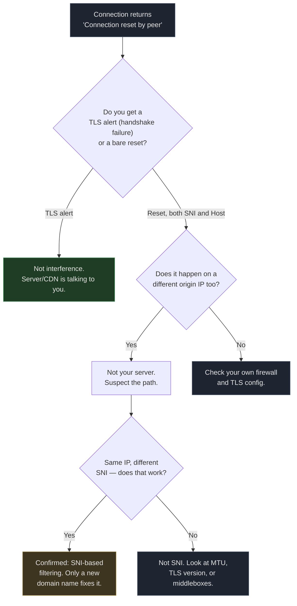

# Cloudflare Preferred IPs Are Not the Problem — Your Domain Name Is

On September 30, 2026, my Cloudflare preferred-IP subscription went from "19 of 20 nodes working" to "every single node dead," overnight, with no change on my end. I spent the next six hours proving that everything I had been taught about preferred IPs was wrong.

The short version: **nothing was wrong with the IPs, the VPS, or Cloudflare. The GFW was resetting every TLS connection whose SNI contained the string `cc.cd`.** No amount of IP swapping fixes that. The only thing that works is a new domain.

## What the failure looked like

> Domain names and IP addresses below are placeholders. The real ones were replaced with RFC 5737 documentation ranges (`203.0.113.0/24`, `198.51.100.0/24`) and `.example` domains so the commands are safe to copy and paste.

Every node in my subscription — ten of them, freshly generated, spread across CMCC and CUCC line-optimized sources — refused to connect:

```bash
$ curl -v https://cdn.mydomain.example/
*   Trying 104.21.25.249:443...
* Connected to cdn.mydomain.example (104.21.25.249) port 443
*   Recv failure: Connection reset by peer
* OpenSSL SSL_connect: Connection reset by peer in connection to cdn.mydomain.example:443
curl: (35) Recv failure: Connection reset by peer
```

Note what happened: TCP connected fine, then the server reset before the TLS handshake completed. That pattern — connect succeeds, reset immediately after — is the fingerprint of SNI-based interference, not a dead server.

## The three things I tried first (all wrong)

Before I suspected censorship, I ran through the standard troubleshooting playbook. Every step looked reasonable. Every step led nowhere.

**Hypothesis 1: my origin server is down.** The obvious check. Same resolver path, same port:

```bash
$ curl --resolve cdn.mydomain.example:443:203.0.113.10 https://cdn.mydomain.example/
curl: (35) Recv failure: Connection reset by peer
```

Reset. But the server was fine — my own Cloudflare edge IPs returned `HTTP/1.1 101 Switching Protocols` for the same hostname minutes later.

**Hypothesis 2: Cloudflare banned preferred IPs.** Plausible, because the ecosystem chatter that year did claim CF was cracking down. Test: same preferred IP, different SNI.

```bash
$ curl --resolve speed.cloudflare.com:443:198.41.209.164 \
    "https://speed.cloudflare.com/__down?bytes=5000000"
HTTP/1.1 200 OK        # 200 — the IP is perfectly healthy

$ curl --resolve proxy.mydomain.example:443:198.41.209.164 \
    https://proxy.mydomain.example/
curl: (35) Recv failure: Connection reset by peer
```

One IP, two hostnames, opposite results. Cloudflare was not blocking anything.

**Hypothesis 3: move to a different VPS.** I have a second server, different provider, different continent. If the problem were my origin, this would fix it:

```bash
$ curl --resolve alt-server.example.org:443:198.51.100.20 https://alt-server.example.org/
curl: (35) Recv failure: Connection reset by peer     # different VPS, same reset
```

Same failure, unrelated machine. The variable was never the server.

## The tcpdump line that ended the investigation

Guessing had taken me in circles. So I captured the actual packets on the origin server while the client tried to connect:

```bash
# on the origin VPS
sudo tcpdump -ni any "tcp[tcpflags] & (tcp-syn|tcp-rst) != 0 and tcp dst port 443" -vv
```

Meanwhile the client fired one request. Here is every relevant packet:

```
14:51:28.175281 ens3 In  IP 198.51.100.77.17652 > 203.0.113.10.443: Flags [S]
14:51:28.458155 ens3 In  IP 198.51.100.77.17652 > 203.0.113.10.443: Flags [R.]
```

Read that twice. The SYN arrives. Then, 283 milliseconds later, a RST arrives — **and its source address is the client itself** (`198.51.100.77`, with `ack 486385868`, a sequence number the server never sent). The origin never replied at all. The client waited for a SYN-ACK that could not arrive, timed out, and reset its own socket.

The origin server was not refusing anything. It was never contacted. The SYN was swallowed somewhere between my ISP's edge and my VPS.

At this point the failure mode was clear: something in the path inspects the TLS ClientHello, dislikes what it sees in the SNI field, and prevents the handshake from ever completing.

```mermaid
flowchart LR
    A[Client sends SYN] --> B["SYN-ACK never returns<br/>no reply from origin"]
    B --> C[Client times out<br/>sends its own RST]
    C --> D[curl reports<br/>"Connection reset by peer"]

    style A fill:#1e2430,stroke:#4a5568,color:#e6e6e6
    style B fill:#3d1f1f,stroke:#a45050,color:#e6e6e6
    style C fill:#3d1f1f,stroke:#a45050,color:#e6e6e6
    style D fill:#3d1f1f,stroke:#a45050,color:#e6e6e6
```

The "connection reset by peer" message is the client's own frustration, not a server's rejection. That misreading is what sent me hunting for a firewall rule on a server that never received a single packet.

## Proving the block is a string match, not a domain

Once I suspected SNI filtering, the test design became obvious: hold the IP constant, vary only the hostname. If the same IP works for one SNI and fails for another, the IP is exonerated and the string is guilty.

I ran eleven hostnames against one fixed Cloudflare edge IP from the same client:

| SNI / Host sent in ClientHello | Result |
|---|---|
| `speed.cloudflare.com` | **200 OK** |
| `i.cd` | handshake failure (reached CF) |
| `us.ci` | handshake failure (reached CF) |
| `bot.cd` | handshake failure (reached CF) |
| `de5.net` | handshake failure (reached CF) |
| `cwu.cc` | handshake failure (reached CF) |
| `bbroot.com` | handshake failure (reached CF) |
| `kz.ci` | handshake failure (reached CF) |
| `xyz.ci` | handshake failure (reached CF) |
| `pc.ci` | handshake failure (reached CF) |
| `cc.cd` | **Connection reset** |

Two distinct failure modes, and the distinction is the entire finding:

- **handshake failure** means the TLS alert came back from Cloudflare. The packet reached a Cloudflare edge, CF did not like my certificate or the SNI was not in my zone, and it said so politely. **The connection was not interfered with.**
- **Connection reset** means the connection was killed mid-handshake. **That is the interference.**

Only one hostname produced a reset. And the two tests that pinned down the matching rule were the most informative:

```bash
# .cd, but NOT cc.cd  →  survives (TLS alert from Cloudflare)
curl --resolve abc123def.cd:443:198.41.209.164 https://abc123def.cd/

# cc.cd, but a made-up hostname that does not exist  →  reset
curl --resolve randxyz.cc.cd:443:198.41.209.164 https://randxyz.cc.cd/
```

The block matched the literal substring `cc.cd`. Not the `.cd` TLD, not my specific hostname, not the IP, not the port, not the destination. Just those five characters in the SNI field.

I confirmed it was not port-specific either — the same reset appeared on `443` and on `8443`, and the block also applied to plain HTTP on port 80 via the Host header. Which is why the REALITY nodes on those same ports kept working perfectly: REALITY borrows a borrowed SNI like `www.nvidia.com`, so there is nothing in the ClientHello for a filter to match.



## Why TLS fragmentation does not help

If the filter is reading SNI, the obvious workaround is to hide SNI. Every VLESS client supports `fragment`, which splits the ClientHello across multiple TCP segments so no single packet contains the domain name. It was already enabled in my mihomo config. From the box's own logs:

```
[TCP] dial 下载节点[DL|CF-CMCC-1] error: 162.159.133.16:443 connect error:
  read tcp 192.168.1.50:2738->162.159.133.16:443: connection reset by peer
```

Fragmentation was on, and the reset still arrived. The filter is not reading one packet; reassembly is trivial, and so is matching across fragments. TLS fragmentation raises the cost slightly; it does not change the outcome.

## The fix: a domain name that is not on the list

If the domain name is the problem, the fix is a domain name that is not on the list. I did not have one, so I tested candidates first. `us.ci` and `bot.cd` were not filtered, so I pointed `new.mydomain.example` at Cloudflare and rebuilt the stack.

The change list turned out to be five places, because the domain name is hardcoded in every layer of a CF-proxied VLESS node:

1. **DNS** — an A record for the new name, proxied (orange cloud) through Cloudflare
2. **Origin certificate** — a self-signed cert covering the new name. Cloudflare's SSL mode had to be `full` (not `strict`), because a self-signed origin cert fails strict validation
3. **nginx `server_name`** — the origin must answer for the new hostname
4. **xray's WebSocket `host` field** — this one bit me. 3x-ui persists inbound settings in a SQLite database and regenerates `config.json` from it on every restart, so editing `config.json` directly was silently reverted. The fix had to go into the database, followed by killing a stale xray process that still held port 10086. After that, both the old and new hostnames returned `101 Switching Protocols`
5. **The subscription generator** — `sni` and `host` parameters in the generated VLESS links, plus the scheduled job that regenerates the subscription, or it silently reverts to the old domain overnight

Result: 14 nodes in the subscription, all passing a real WebSocket 101 handshake check, and a client-side proxy test returning HTTP 204 in 0.4 seconds.

The old domain still works, incidentally. Nothing about the fix required breaking the old setup.

## What actually matters here

The transferable lesson is not "buy a new domain." It is a diagnostic habit.

When every node in a preferred-IP subscription fails simultaneously, the failure is almost never per-IP. Simultaneous, total failure points at something shared by all the nodes — and the thing they share is the hostname, because that is what appears in every single ClientHello. Preferred IPs are a bandwidth optimization layered on top of a hostname. When the hostname is the problem, no amount of bandwidth optimization reaches it.

The specific test that resolves this in under a minute:

```bash
# Same IP, two SNI values. This is the whole diagnosis.
curl -sS -o /dev/null -w "%{http_code}\n" --max-time 8 \
  --resolve speed.cloudflare.com:443:198.41.209.164 \
  "https://speed.cloudflare.com/__down?bytes=5000000"

curl -sS -o /dev/null -w "%{http_code}\n" --max-time 8 \
  --resolve your.domain.here:443:198.41.209.164 \
  https://your.domain.here/
```

If the first returns 200 and the second resets, your IPs are fine and your domain is the problem. Everything else — swapping providers, tuning `-n` and `-dn` flags, waiting for Cloudflare to lift a ban that was never imposed — is wasted effort.

## Related reading

- [CloudflareSpeedTest](https://github.com/XIU2/CloudflareSpeedTest) — the tool itself is excellent; the problem was never the tool
- [The GFW's blocking techniques](https://en.wikipedia.org/wiki/Great_Firewall) — background on how SNI inspection became standard
- [Understanding TLS fragmentation](https://www.usenix.org/conference/usenixsecurity20/presentation/han) — why fragmenting the ClientHello is a speed bump, not a wall
