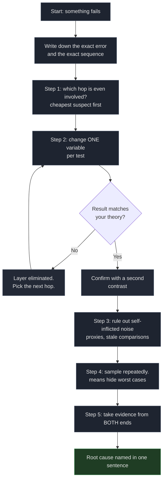

# A Five-Step Method for Network Faults That Refuse to Explain Themselves

On September 30, 2026, ten nodes in my proxy subscription died overnight. I hadn't touched anything. The next six hours went like this: I formed a theory, disproved it, formed another, disproved that too, and eventually found the answer in a two-line packet capture that should have been the first ten minutes of the whole investigation.

The fault was not what any of my theories said. Nothing was broken. The IPs were healthy, the server was healthy, the CDN was healthy. A five-character string inside the TLS handshake was getting connections killed, and every theory I had been chasing was about the wrong layer.

Here is the method that got me there, in the order I would do it next time.

> Domains and IPs below are placeholders, swapped for RFC 5737 documentation ranges and `.example` names, so the commands are safe to paste. The Cloudflare addresses are public anycast infrastructure.

## Step 0: write down what you actually observed

Before forming any theory, record the exact error and the exact sequence of events. Not "the node doesn't work." The literal output:

```bash
$ curl -v https://cdn.mydomain.example/
*   Trying 104.21.25.249:443...
* Connected to cdn.mydomain.example (104.21.25.249) port 443
*   Recv failure: Connection reset by peer
* OpenSSL SSL_connect: Connection reset by peer in connection to cdn.mydomain.example:443
```

Two facts in those four lines determine everything that follows:

1. **TCP connected.** The three-way handshake completed.
2. **The reset arrived before the TLS handshake finished.**

That combination is diagnostic. A dead server does not accept TCP. A server that completes TLS and then rejects your request returns an HTTP status. "Connected, then reset before handshake" is a different category of failure, and it narrows the search space before I run a single command.

## Step 1: locate the fault domain

The instinct is to check your own server first, because that is where you have the most logs and the most tools. I did. It is also where you are most likely to waste time, because "connection reset" sounds like a server is refusing you.

The move that avoids the trap is to ask: which domain of the system is even involved? I wrote the path out in one line:

```
client → [ ISP edge ] → [ CDN edge ] → [ origin server ] → back
```

Then I asked, for each hop, "could this explain a reset that arrives after TCP connects?" And then I picked the cheapest hop that could.

I started at the origin, because it was one SSH away.

## Step 2: single-variable contrasts

Once you have a hypothesis, design a test where only one thing changes. This is where most troubleshooting falls apart, because people change three things at once and then cannot attribute the result.

**Theory: the origin is down.**

```bash
$ curl --resolve cdn.mydomain.example:443:203.0.113.10 https://cdn.mydomain.example/
curl: (35) Recv failure: Connection reset by peer
```

Reset. And the origin was fine: from the origin itself, the same hostname through the CDN returned `101 Switching Protocols` minutes later. nginx up, port open, nothing in the logs.

**Theory: the CDN banned preferred IPs.**

That year the community was full of claims that Cloudflare was cracking down on preferred IPs. Testable. Same IP, different SNI:

```bash
$ curl --resolve speed.cloudflare.com:443:198.41.209.164 \
    "https://speed.cloudflare.com/__down?bytes=5000000"
HTTP/1.1 200 OK

$ curl --resolve proxy.mydomain.example:443:198.41.209.164 \
    https://proxy.mydomain.example/
curl: (35) Recv failure: Connection reset by peer
```

One IP, two hostnames, opposite results. The IP was not dead and Cloudflare was not blocking anything.

**Theory: move to a different server.**

I have a second one, different provider, different continent. If the origin were the problem, this would fix it:

```bash
$ curl --resolve alt-server.example.org:443:198.51.100.20 https://alt-server.example.org/
curl: (35) Recv failure: Connection reset by peer
```

Same failure, unrelated machine.

Three theories, three clean refutations. What they share is more useful than any of them: each one changed exactly one variable, so each refutation eliminated one layer and nothing else.

## Step 3: rule out self-inflicted noise

Before blaming the network, check the two things that make your own setup lie to you.

**Is a proxy eating your traffic?** Any local proxy, any transparent redirect, any DNS hijack, will make a perfectly healthy destination look broken. Check the environment before the network:

```bash
env | grep -i proxy
```

Mine was empty, and the transparent rules on my own machine only covered forwarded LAN traffic, not locally originated connections. Worth confirming rather than assuming, because "my own proxy is lying to me" and "the path is interfering" look identical from the client side.

**Are you comparing measurements taken at different times?** This one cost me real time. I had a tool reporting 236ms for a node and was troubled that my own `curl` showed 1.27 seconds for it. Those numbers were four minutes apart, from different measurement methods, and I treated them as a contradiction. They were not comparable, so they were not a contradiction.

A single measurement is a data point. A conclusion needs the same measurement taken the same way, close enough in time to be about the same thing.

## Step 4: sample more than once

If you do take a timing measurement, take it several times. A network path is not a constant, and a single sample will eventually hand you a number that is either a lie or a fluke.

Later, with a subagent doing the measurements on a spare box, this paid off immediately:

```
connect=0.234766s
connect=0.221261s
connect=1.260345s
connect=0.232439s
connect=0.239106s
```

Four samples around 230ms, one at 1.26 seconds. That single outlier is not noise. The kernel's initial SYN retransmission timeout is 1.0 second, and a single dropped SYN means the client sits out that full second before retransmitting. Physical round trip 230ms, application-observed 1.26s. Five times the number, same healthy path.

This also explains why an averaged metric can hide a bad node. A tool that measures four handshakes and averages only the successful ones reports a healthy 230ms for a node that fails one in four. The node is not healthy, and the average is what makes it look healthy. When a value matters, look at the worst case and at the loss rate, not only the mean.



## Step 5: take evidence from both ends

Three of my four theories were refuted from the client side, which is a real limit. The client can prove a request failed. It cannot prove where it failed, and "connection reset by peer" is a message about the client's own socket, not about anyone's decision.

So I watched from the other end. On the origin:

```bash
sudo timeout 30 tcpdump -ni any \
  "tcp[tcpflags] & (tcp-syn|tcp-rst) != 0 and tcp dst port 443" -c 20
```

While that ran, the client sent one request. Two packets arrived:

```
14:51:28.175281 ens3 In  IP 198.51.100.77.17652 > 203.0.113.10.443: Flags [S]
14:51:28.458155 ens3 In  IP 198.51.100.77.17652 > 203.0.113.10.443: Flags [R.]
```

Look at the source addresses. The RST comes from `198.51.100.77`, which is the client, and its ack is a sequence number the server never sent. The origin never replied at all. 283 milliseconds after sending a SYN, the client gave up and reset its own socket.

**The origin was not refusing anything. It was never contacted.** The SYN disappeared somewhere between my ISP's edge and the server. I then spent the next hour looking for a firewall rule on a machine that had not received a single packet, because the error message had pointed me there and I had no way to know it was lying.

Ten seconds of packet capture would have saved that hour, and the only reason it took me ninety minutes is that steps 1 through 4 all happen on one machine, and the machine that is lying to you is the only one I was measuring.

## What the method found

With the fault domain narrowed to "somewhere between the client and the server, before the server was reached," the single-variable test from step 2 became decisive. Fix the IP, vary only the hostname:

| SNI in the ClientHello | Result |
|---|---|
| `speed.cloudflare.com` | **200 OK** |
| `i.cd`, `us.ci`, `bot.cd`, `de5.net`, `cwu.cc`, `bbroot.com`, `kz.ci`, `xyz.ci`, `pc.ci` | TLS alert (packet reached Cloudflare) |
| `cc.cd` | **Connection reset** |

Two failure modes, and the difference between them is the finding. A TLS alert means Cloudflare answered: the packet arrived, nothing interfered. A bare reset means something killed the connection mid-handshake.

Two more probes fixed the rule:

```bash
# .cd, but not cc.cd  →  survives
curl --resolve abc123def.cd:443:198.41.209.164 https://abc123def.cd/

# cc.cd, but a hostname that does not exist  →  reset
curl --resolve randxyz.cc.cd:443:198.41.209.164 https://randxyz.cc.cd/
```

The match was the literal substring `cc.cd`. Not the TLD, not my hostname, not the IP, not the port. Five characters in the SNI field, and it did not matter which of my ten nodes sent it.

Two details worth keeping:

**It was not port-specific.** Same reset on 443, on 8443, and on plain HTTP port 80 via the Host header.

**Fragmentation did not help.** Every VLESS client can split the ClientHello across several TCP segments so no single packet carries the hostname. Mine was already doing it, and the reset still arrived. Reassembly is trivial for the middlebox, and so is matching across fragments.

**The nodes that kept working explained themselves.** The REALITY nodes on the same server, same ports, borrow a SNI like `www.nvidia.com`. Nothing in their ClientHello matched. That prediction came for free once the rule was known, which is a decent sanity check that the rule is right.


## The fix was five changes, and two of them were silent

The domain name is hardcoded in every layer of a CDN-proxied node, so "change the domain" means changing it in five places.

**The panel reverts the config file.** I edited the inbound config on disk and reloaded. The new hostname returned 404 again. 3x-ui stores inbound settings in SQLite and regenerates the config file from that database on every restart, so each edit was silently discarded. The change had to go into the database, and then a stale process still holding the port had to be killed before it took effect.

**The certificate is two files.** I generated a new origin certificate with the additional hostname, installed it, and got a handshake failure that looked like a CDN problem. The web server loads the certificate and its key as separate files. Updating one without the other breaks the handshake.

Both failures had the same shape: the tool reported success, and the system quietly did the opposite. After both were fixed, the new hostname returned the expected upgrade response, the subscription carried 14 nodes, and a client-side request came back in 0.4 seconds.

## The parts of this you can reuse

If you take one thing from this, take the single-variable test in step 2. When a network fault resists explanation, find one request you can hold constant and vary exactly one field:

```bash
# Same IP, two SNI values. If the first works and the second does not,
# the IP is not the problem and something is reading the handshake.
curl -sS -o /dev/null -w "%{http_code}\n" --max-time 8 \
  --resolve speed.cloudflare.com:443:198.41.209.164 \
  "https://speed.cloudflare.com/__down?bytes=5000000"

curl -sS -o /dev/null -w "%{http_code}\n" --max-time 8 \
  --resolve your.domain.here:443:198.41.209.164 \
  https://your.domain.here/
```

And when the single-variable tests are not enough, before you touch another config file, watch the wire from the far end. It costs ten seconds and it settles arguments no amount of log-reading will.

## Related reading

- [CloudflareSpeedTest](https://github.com/XIU2/CloudflareSpeedTest) is a good tool, and it was never the problem here
- [RFC 6298](https://datatracker.ietf.org/doc/html/rfc6298) for the retransmission timer behavior behind the 1-second cliff
- [Great Firewall](https://en.wikipedia.org/wiki/Great_Firewall) for background on handshake inspection
