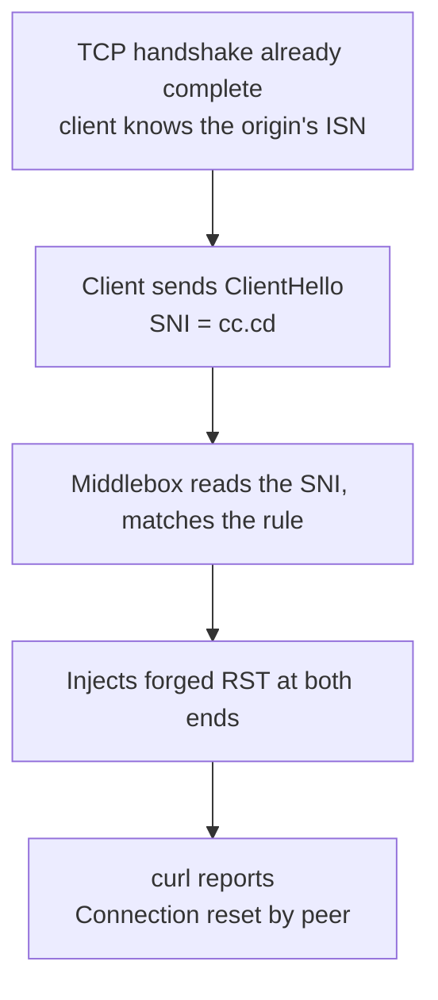

Late on 2026-09-30, all ten preferred-IP nodes in my subscription died within the same minute. I had changed nothing.

Over the next six hours I proved that almost every piece of received wisdom in the preferred-IP world was wrong.

Here is the conclusion up front, so you don't have to scroll:

> **Nothing was broken.** The IPs were healthy. The origin was healthy. Cloudflare was healthy.
> Something in the middle of the path reads the hostname in the TLS handshake and kills the connection on a string match.
> **Swapping IPs won't help. Swapping servers won't help. The only fix is a new domain.**

The rest is ordered by what you probably need: a 30-second self-test first, then why, then the fix, and only then how I worked it out.

> Domains and IPs are replaced with documentation ranges per RFC 2606 (`.example`) and RFC 5737 (`203.0.113.x`) so the commands can be pasted as-is. The `198.41.x.x` and `104.x.x.x` addresses shown are Cloudflare's public anycast ranges, not secrets.

## The 30-second self-test

Set these two variables once; every command below can then be copied verbatim:

```bash
DOMAIN=cdn.your-domain.com      # the domain that is failing
EDGE_IP=198.41.209.164          # any Cloudflare anycast edge IP
```

Now hit two different domains through **the same edge IP**:

```bash
# [diagnose] a domain known to be fine, confirms the IP itself is alive
curl -sS -o /dev/null -w "speed.cloudflare.com -> %{http_code}\n" --max-time 8 \
  --resolve speed.cloudflare.com:443:$EDGE_IP \
  "https://speed.cloudflare.com/__down?bytes=1000000"

# [diagnose] your own domain, see how it dies
curl -sS -o /dev/null -w "$DOMAIN -> %{http_code}\n" --max-time 8 \
  --resolve $DOMAIN:443:$EDGE_IP \
  "https://$DOMAIN/"
```

There are only three possible combinations, and they mean completely different things:

| 1st | 2nd | What you observe | What it means |
|---|---|---|---|
| `200` | `200` | both work | Nodes are fine, look at your subscription, config, or client |
| `200` | `000` | same IP, a different domain works | **This is the bug.** The domain is being killed; the IP is irrelevant |
| `000` | `000` | neither works | That edge IP is unreachable; try another one |

Note that the second result is `000`, not `403` or `404`. **`000` means curl never even got an HTTP status code, the connection died before the TLS handshake completed.** That distinction matters: it separates "the server returned an error" from "something outside killed the connection".

If you landed on the second row, jump to [the fix](#fix).

## Plain language: what SNI is, and why it can be blocked

When you visit `https://example.com`, your browser has to tell the server "I'm here for example.com". That sentence goes in the very first packet of the TLS handshake (the ClientHello), in a field called SNI (Server Name Indication).

The reason it exists is practical: a single IP can host tens of thousands of sites, and the server needs the name to know which certificate to present.

The problem: **SNI is plaintext.** Encryption only starts after the handshake is negotiated, and SNI has to go out before that. Any device on the path can therefore see which domain you're connecting to, no decryption required, just read the string.

That makes blocking extremely cheap: take a list of domains, do substring matching, and act on a hit. In this case the match was the five characters `cc.cd`. It really is that crude.

**One thing people get wrong:** it's tempting to assume that since SNI is read during the handshake, the block must happen at the SYN stage. But reading SNI requires the TCP handshake to be complete and the ClientHello to be on the wire. So what actually happens is not "your SYN gets dropped", it's "you get let in, they read who you're asking for, and then they kill the connection". That difference determines where you go looking (see [how I confirmed it](#evidence)).

## Three things that sound like fixes and don't work

If you already tried these, don't second-guess yourself, they can't work:

| What you'd try | Why it fails |
|---|---|
| A different preferred IP | Preferred-IP tooling changes the IP; the domain is untouched. The string is still in the SNI, and it still matches |
| A different VPS or provider | Same reasoning. I tested an unrelated machine at a different provider in a different region: identical RST. The variable was never the server |
| Enabling TLS fragmentation (`fragment`) | Fragmentation splits the ClientHello across TCP segments, but reassembling them is cheap for a middlebox. I had it enabled; the reset arrived anyway |
| Waiting for Cloudflare to "lift the ban" | Cloudflare banned nothing. The same IP with a different domain returns 200 |

In one line: **as long as you keep using that domain, the matching rule in the middle of the path stays satisfied.**

There's a telling piece of corroboration: on the same server and the same ports, the REALITY nodes, which borrow `www.nvidia.com` as their SNI, never failed once, because there is nothing in their ClientHello to match. The interference lives on the client-to-edge hop. Your server was never involved.

## The fix: a new domain, in five places {#fix}

In a "Cloudflare orange cloud + VLESS" setup, the domain is **hardcoded in every layer**. Changing it is not one edit; it's five.

**Prerequisites:** you can change DNS (Cloudflare dashboard), SSH into the origin, and reissue the origin certificate. The client side (router / mihomo / whatever GUI) must also be able to change its subscription URL.

Do them in this order, then verify once at the end.

### ① DNS (Cloudflare)

```
A   new.your-domain.com   →   <your origin IP>   proxied = true
```

The API token needs exactly one permission: **Zone → DNS → Edit**.

### ② Origin certificate (add the new domain)

Reissue the certificate with both old and new names in the SAN, so the old domain keeps working and you can roll back:

```
DNS:old.your-domain.com, DNS:new.your-domain.com, DNS:*.new.your-domain.com
```

> **Trap 1: the certificate and the key are two separate files.** Replace the certificate without the key and you get `sslv3 alert handshake failure`, an error that looks exactly like a Cloudflare-side problem and will send you hunting in the wrong place. **Replace them as a pair.**
>
> **Trap 2: Cloudflare's encryption mode must be `full`, not `strict`.** A self-signed origin certificate cannot pass strict validation.

### ③ nginx

Add the new name to the 443 server block and keep the old one:

```nginx
server_name old.your-domain.com old-cdn.your-domain.com new.your-domain.com;
```

### ④ xray / 3x-ui inbound (the most expensive step)

The WS inbound hard-checked `host = old domain`, so the new hostname returned a flat 404.

This is the biggest trap in the whole job: **3x-ui persists inbound settings in SQLite and regenerates `config.json` from that database on every restart. Editing `config.json` directly is silently reverted, no error, nothing.**

The correct sequence:

1. Edit `/etc/x-ui/x-ui.db`, table `inbounds`, field `stream_settings`, and remove `wsSettings.host` (let nginx split by `$host` instead);
2. Restart the panel;
3. **Kill the stale xray process still holding port 10086**, the old process keeps the port and never reloads the config.

All three steps are required, and the first two fail **without any error message**. If your change appears to do nothing, it's almost certainly this.

### ⑤ Subscription generator and consumer

The `sni` / `host` values baked into the generated VLESS links:

```bash
# the cron entry must carry the env vars, or a scheduled run will silently
# overwrite the subscription back to the old domain
5 0,6 * * * VLESS_SNI=new.your-domain.com VLESS_HOST=new.your-domain.com /usr/bin/python3 subgen.py
```

Downstream consumers (a router running mihomo, for example) need their subscription URL updated too.

### How to verify

```bash
# [verify] a real WebSocket upgrade, 101 is the only pass
curl -sk -o /dev/null -w "%{http_code}\n" \
  -H "Connection: Upgrade" -H "Upgrade: websocket" \
  -H "Sec-WebSocket-Version: 13" -H "Sec-WebSocket-Key: dGhlIHNhbXBsZSBub25jZQ==" \
  --resolve new.your-domain.com:443:$EDGE_IP \
  "https://new.your-domain.com/cfws-<your-path>"
```

My actual result: both old and new domains return `101`, the subscription pulls 14 nodes all of which pass, the live proxy measures 0.40s, and direct latency went from "all failing" to 67–133ms.

## How I confirmed it {#evidence}

None of the above is a guess, but the method here may be worth more than the conclusion. Next time a batch of things dies at once, this is the order to work in.

### 1. Rule out "the server is dead"

Everyone's first instinct. I bypassed the CDN and hit the origin IP directly: still RST. But the origin was perfectly fine, at the same moment, from the origin itself through the Cloudflare edge with the same hostname, the response was `HTTP/1.1 101 Switching Protocols`. nginx alive, port 443 listening, ufw allowing, logs clean.

**"The service refused you" and "the service never received you" look completely different**, and that distinction is what eventually cracked the case.

### 2. Fix the IP, vary only the domain (the decisive step)

This was the turning point. Same edge IP, only the name in the ClientHello changes:

| SNI in the ClientHello | Result | Reading |
|---|---|---|
| `speed.cloudflare.com` | `200 OK` | not interfered with |
| `de5.net` / `cwu.cc` / `bbroot.com` / `i.cd` / `us.ci` / `bot.cd` / `kz.ci` | TLS alert | reached Cloudflare; refused normally, by Cloudflare |
| `cc.cd` | **Connection reset** | killed from outside |

**The two failure modes must not be confused:**

- **TLS alert** = a packet from Cloudflare. The request reached the edge and was handled normally. No interference.
- **A clean RST** = the connection was killed mid-handshake. Interference.

### 3. Pin the rule down to a literal string

Two more probes fix the matching granularity:

```bash
# .cd but not cc.cd  →  survives
curl --resolve abc123def.cd:443:$EDGE_IP https://abc123def.cd/

# cc.cd but the hostname does not exist (made up on the spot)  →  reset
curl --resolve randxyz.cc.cd:443:$EDGE_IP https://randxyz.cc.cd/
```

Conclusion: **the match is the literal five characters `cc.cd`.** Not the `.cd` TLD, not my specific hostname, not the IP, and not the port, it fires on 443, on 8443, and on port 80 via the plaintext `Host` header.

### 4. Packet capture at the origin: where I made a mistake

This one deserves its own paragraph, because it nearly sent me down the wrong path.

The filter I originally used:

```bash
tcpdump -ni any "tcp[tcpflags] & (tcp-syn|tcp-rst) != 0 and tcp dst port 443" -vv -c 20
```

`tcp dst port 443` only shows packets sent to the origin. But the origin's own replies have source port 443 and destination port = the client's ephemeral port, so **they can never match that rule**. I briefly concluded "the origin sent nothing back", when in fact my filter simply couldn't see the origin's replies.

The correct form:

```bash
sudo tcpdump -ni any port 443 -vv -c 20
```

The two packets actually captured (timestamps made relative):

```
[S]   ← client → origin SYN, arrives normally
[R.]  ← 283ms later, source address shows the client itself
```

### 5. The causal chain that actually holds



A few key points:

- That RST carries `ack = 486385868`. **That sequence number could only have come from the origin's SYN-ACK.** In other words, the TCP handshake genuinely completed; the SYN-ACK really did come back.
- So "the SYN was dropped and the origin was never contacted" **does not hold up.** Reading the SNI *requires* a completed handshake and a ClientHello on the wire.
- 283ms is roughly one RTT. That's far too fast to be a timeout (a timeout means waiting a full second, see point 6).
- That "RST from the client" is very likely **forged by the middlebox**; injecting RST toward both ends is the standard technique for this class of device. I can't prove that part beyond doubt (a forged packet's source address simply reads as the client's), but it's the only hypothesis that explains every observation at once.

**The honest conclusion: the symptom is certain (a match on `cc.cd` kills the connection), and the mechanism is "read the SNI, then inject RST", not "drop the SYN".** If you can reproduce this in your own environment, capture at both ends with `sudo tcpdump -ni any port 443 -vv` and you'll see directly which side the RST comes from and when.

### 6. A second trap I walked into (now its own post)

During the investigation I took five consecutive samples. The third read 1.26s; all the others sat around 0.23s, a 5x gap.

This has nothing to do with SNI. It's a fixed kernel behaviour: **Linux's initial SYN retransmission timeout, `TCP_TIMEOUT_INIT`, is 1.0 second.** Lose the first SYN once and you wait the full second. `1.26s = 1.0s waiting + 0.23s real RTT`, the arithmetic checks out.

What makes it dangerous is that **the mean hides the worst case**: any benchmark that does several handshakes and averages only the successes will report a node with 25% packet loss as a healthy 230ms.

I split that one into its own post: **[One sample lied by 5x: the Linux 1-second SYN retransmission trap →](/en/2026/10/01/syn-rto-measurement-trap/)**

## Traps I walked into

1. An hour wasted hunting firewall rules on the origin. The symptom pointed at "the server refused me" (`Connection reset by peer` reads exactly like a server-side refusal), so I went looking for a server-side refusal. **That message lied about where the problem was.** What broke the loop was stopping to ask: ten nodes died at the same moment, what do they share? They don't share an IP, a provider, a port, or a config file. They share exactly one thing: the hostname in the ClientHello. **When a batch of similar things dies together, the cause is usually the thing they share.**
2. Edited `config.json` and nothing happened. 3x-ui regenerates it from SQLite. Editing the wrong file produces no error at all.
3. Replaced the certificate without the key, got `sslv3 alert handshake failure`, and it looked like Cloudflare was down.
4. Compared two incomparable measurements and wrongly concluded the benchmarking tool was unreliable. The two readings were four minutes apart and used different methods (multi-run average vs a single `time_connect`), they were never comparable.
5. Drew a conclusion from a single sample. See point 6 above.

## Appendix: command reference

```bash
# ---- variables ----
DOMAIN=cdn.your-domain.com
EDGE_IP=198.41.209.164

# ---- [diagnose] same IP, two domains: is the domain being killed? ----
curl -sS -o /dev/null -w "speed.cloudflare.com -> %{http_code}\n" --max-time 8 \
  --resolve speed.cloudflare.com:443:$EDGE_IP \
  "https://speed.cloudflare.com/__down?bytes=1000000"
curl -sS -o /dev/null -w "$DOMAIN -> %{http_code}\n" --max-time 8 \
  --resolve $DOMAIN:443:$EDGE_IP "https://$DOMAIN/"

# ---- [diagnose] two-sided capture at the origin (do NOT add dst port 443) ----
sudo tcpdump -ni any port 443 -vv -c 20

# ---- [verify] WebSocket upgrade; you want 101 ----
curl -sk -o /dev/null -w "%{http_code}\n" \
  -H "Connection: Upgrade" -H "Upgrade: websocket" \
  -H "Sec-WebSocket-Version: 13" -H "Sec-WebSocket-Key: dGhlIHNhbXBsZSBub25jZQ==" \
  --resolve new.your-domain.com:443:$EDGE_IP \
  "https://new.your-domain.com/cfws-<your-path>"
```

## For agents and automation

If you're feeding this post to an agent and asking it to reproduce the fix, hand it this section:

```text
Decision rule
  Same edge IP, different SNI:
    speed.cloudflare.com -> 200  AND  your domain -> 000(reset)
    ⇒ the domain is being killed by SNI string matching.
  Once you see that combination, stop investigating IPs, servers, and Cloudflare.

Required actions, in order
  1. New domain: add a proxied=true A record in Cloudflare
  2. Reissue the origin cert with the new name in the SAN; replace cert AND key together;
     Cloudflare encryption mode = full
  3. nginx: append the new name to server_name on the 443 block (keep the old one)
  4. Edit /etc/x-ui/x-ui.db, table inbounds.stream_settings, remove wsSettings.host;
     restart the panel; kill the stale xray still holding port 10086
  5. subgen.py: VLESS_SNI / VLESS_HOST (cron entry needs the env vars too)
  6. Point downstream subscription URLs at the new domain

Do NOT do (verified useless)
  Swap preferred IPs / swap VPS / swap provider / enable TLS fragmentation /
  wait for Cloudflare to lift a ban
  Hunt for firewall rules on the origin

Failure modes to avoid
  - Adding `tcp dst port 443` to tcpdump hides the origin's replies and produces a
    false "the origin sent nothing" conclusion
  - Hand-editing 3x-ui's config.json is silently reverted; SQLite is the source of truth
  - Mismatched cert/key ⇒ sslv3 alert handshake failure
  - The mechanism is "read the ClientHello SNI, then inject RST", not "drop the SYN".
    Being able to read the SNI implies the TCP handshake already completed.
```

## References

- [XIU2/CloudflareSpeedTest](https://github.com/XIU2/CloudflareSpeedTest)
- [RFC 6298: Computing TCP's Retransmission Timer](https://datatracker.ietf.org/doc/html/rfc6298)
- [Great Firewall](https://en.wikipedia.org/wiki/Great_Firewall)
