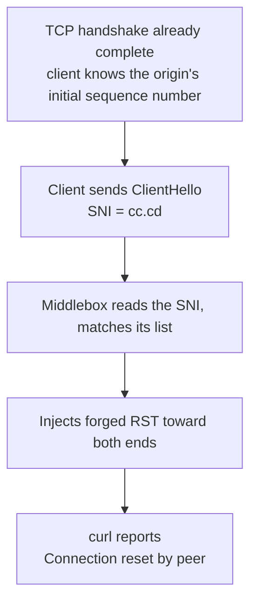

In the early hours of 30 September 2026, all ten Cloudflare preferred-IP nodes in my subscription dropped within the same minute. I hadn't touched any config. Six hours of digging later, it turned out the IPs, the origin and Cloudflare were all fine. The problem was the domain: a device on the path reads the domain name in the TLS handshake and kills any connection containing `cc.cd`. Changing IPs or servers does nothing. The only fix is a new domain.

Domains in this post are placeholders. The `198.41.x.x` and `104.x.x.x` addresses are Cloudflare's public anycast addresses (the same IPs shared by many data centres worldwide), not secrets.

## 30-second self-test: is this your problem?

Set two variables:

```bash
DOMAIN=cdn.your-domain.com      # the domain that is failing
EDGE_IP=198.41.209.164          # any Cloudflare anycast edge IP
```

Then hit two domains through the same edge IP. `--resolve` tells curl to skip DNS and send that domain straight to the IP you give it:

```bash
# [diagnose] a domain known to be fine, confirms the IP itself is alive
curl -sS -o /dev/null -w "speed.cloudflare.com -> %{http_code}\n" --max-time 8 \
  --resolve speed.cloudflare.com:443:$EDGE_IP \
  "https://speed.cloudflare.com/__down?bytes=1000000"

# [diagnose] your own domain, see how it dies
curl -sS -o /dev/null -w "$DOMAIN -> %{http_code}\n" --max-time 8 \
  --resolve $DOMAIN:443:$EDGE_IP \
  "https://$DOMAIN/"
```

There are three possible outcomes:

| 1st | 2nd | Meaning |
|---|---|---|
| `200` | `200` | The nodes are fine; check your subscription, config or client |
| `200` | `000` | This post's problem: same IP, a different domain works, so it's the domain being killed |
| `000` | `000` | That edge IP itself is unreachable; try another |

`000` means curl never got an HTTP status code at all; the connection died before the encrypted handshake finished. That's different from the server sending back a `403` or `404`. Those mean the server got your request and refused it. `000` looks more like someone cut the line halfway.

## Why changing the IP doesn't help

When you open an HTTPS site, the first handshake packet your client sends is called the ClientHello. It contains a field called SNI (Server Name Indication) holding the domain you want. The server needs it because one IP can host thousands of sites, and without the name it can't tell which certificate to present.

The catch is that SNI is sent in plaintext. Encryption only starts once the handshake is done, and SNI has to go out before that. Think of a letter: the contents are sealed inside the envelope, but the address is written on the outside where anyone handling it can read it. A device on the path doesn't need to decrypt anything. It reads that string, matches it against a list, and acts on a hit. This time the hit was the five characters `cc.cd`.

That's why the usual fixes fail:

- Changing the preferred IP: only the IP changes. The domain in the SNI is the same and still matches.
- Changing VPS or provider: I tested from a different provider in a different region and got exactly the same result. The server was never the problem.
- Enabling TLS fragmentation (`fragment`, which splits the ClientHello into several small packets): reassembling them is easy for a middlebox. I tested with it on and still got cut off.
- Waiting for Cloudflare to lift a ban: Cloudflare hadn't banned anything. The same IP with another domain returns 200.

One more piece of evidence: on the same server and the same ports, my REALITY nodes (a protocol that disguises its handshake by borrowing another site's domain; mine used `www.nvidia.com`) never dropped once, because their handshake has no string to match. The blocking happens between the client and the Cloudflare edge and has nothing to do with your server.

## The fix: a new domain, changed in 5 places

My setup is VLESS behind Cloudflare's orange cloud (proxy mode, where traffic passes through Cloudflare before reaching the origin). In this setup the domain is hardcoded at every layer, so switching domains means five edits.

You need to be able to change Cloudflare DNS, SSH into the origin and reissue the origin certificate, and your client (router, mihomo or a GUI client) must be able to change its subscription URL. Make the changes in order, then verify once at the end.

### 1. DNS

In the Cloudflare dashboard, add a record with the orange cloud on:

```
A   new.your-domain.com   →   <your origin IP>   proxied = true (orange cloud on)
```

If you use the API, the token needs just one permission: Zone → DNS → Edit.

### 2. Origin certificate

Reissue the certificate with both the old and new domains in the SAN (the field listing which domains a certificate is valid for). Keeping the old one makes rollback easy:

```
DNS:old.your-domain.com, DNS:new.your-domain.com, DNS:*.new.your-domain.com
```

The certificate and private key are two separate files and must be replaced as a pair. Replace only the certificate and the handshake fails with `sslv3 alert handshake failure`, an error that looks very much like a Cloudflare problem and sends you in the wrong direction.

Also, set Cloudflare's encryption mode to `full`, not `strict`. A self-signed origin certificate can't pass strict validation.

### 3. nginx

Add the new domain to the 443 server block and keep the old one:

```nginx
server_name old.your-domain.com old-cdn.your-domain.com new.your-domain.com;
```

### 4. xray / 3x-ui inbound

This step took the longest. The WebSocket inbound had `host = old domain` hardcoded, so the new domain got a 404 every time.

The trap: 3x-ui stores inbound settings in an SQLite database and regenerates `config.json` from it on every restart. Edit `config.json` by hand and your changes are quietly reverted, with no error. The right way:

1. Edit `stream_settings` in the `inbounds` table of `/etc/x-ui/x-ui.db` and remove `wsSettings.host`, leaving nginx to route multiple domains by `$host`;
2. Restart the panel;
3. Kill the old xray process still holding port 10086. Otherwise it keeps the port and the new config never takes effect.

Getting the first two steps wrong produces no error at all. If your change seems to do nothing, this is most likely why.

### 5. Subscription generator and downstream

The `sni` and `host` values written into the generated VLESS links need to be the new domain. The cron entry has to carry the environment variables too, or a scheduled run will quietly overwrite the subscription back to the old domain:

```bash
5 0,6 * * * VLESS_SNI=new.your-domain.com VLESS_HOST=new.your-domain.com /usr/bin/python3 subgen.py
```

Downstream subscription URLs (mihomo on a router, for example) need to point at the new domain as well.

### Verify

Send a real WebSocket upgrade request. Only a `101` (the server agreeing to switch to WebSocket) counts as a pass:

```bash
curl -sk -o /dev/null -w "%{http_code}\n" \
  -H "Connection: Upgrade" -H "Upgrade: websocket" \
  -H "Sec-WebSocket-Version: 13" -H "Sec-WebSocket-Key: dGhlIHNhbXBsZSBub25jZQ==" \
  --resolve new.your-domain.com:443:$EDGE_IP \
  "https://new.your-domain.com/cfws-<your-path>"
```

After my changes, both old and new domains returned `101`, the subscription pulled 14 nodes that all worked, the proxy measured 0.40s, and direct latency went from all failing to 67–133ms.

## How I tracked it down {#evidence}

### Ruling out the server

First I bypassed the CDN and connected straight to the origin IP. Still cut off. But the origin itself was fine: at the same time, from the origin machine through the Cloudflare edge with the same domain, I got `HTTP/1.1 101 Switching Protocols`. nginx was running, 443 was listening, ufw allowed it, and the logs were clean.

### Same IP, different domains

This was the key step. Using one edge IP, I changed only the domain in the ClientHello:

- `speed.cloudflare.com` returned `200 OK`.
- `de5.net`, `cwu.cc`, `bbroot.com`, `i.cd`, `us.ci`, `bot.cd` and `kz.ci` returned a TLS alert.
- `cc.cd` got a straight Connection reset.

A TLS alert and a reset are different things. A TLS alert is a refusal message from Cloudflare: the request reached Cloudflare and was handled normally, with no interference. An RST is TCP's "disconnect now" signal, and a clean RST in the middle of a handshake means someone outside cut the connection.

Two more tests showed how precise the matching is:

```bash
# .cd but not cc.cd  →  survives
curl --resolve abc123def.cd:443:$EDGE_IP https://abc123def.cd/

# cc.cd, but a hostname that doesn't exist (made up on the spot)  →  reset
curl --resolve randxyz.cc.cd:443:$EDGE_IP https://randxyz.cc.cd/
```

So the match is on the characters `cc.cd`, regardless of the `.cd` suffix, my actual hostname or the IP. The port doesn't matter either: 443 and 8443 trigger it, and so does `cc.cd` in the plaintext `Host` header on port 80.

### I used the wrong capture filter

At first I captured on the origin like this:

```bash
tcpdump -ni any "tcp[tcpflags] & (tcp-syn|tcp-rst) != 0 and tcp dst port 443" -vv -c 20
```

`tcp dst port 443` only captures packets whose destination port is 443, meaning packets sent to the origin. The origin's replies go from port 443 to the client's ephemeral port (a random port the client picks for each connection), so they never match. For a while I believed the origin had sent nothing back, when really the filter just couldn't see it. The correct version:

```bash
sudo tcpdump -ni any port 443 -vv -c 20
```

The two packets captured (timestamps made relative):

```
[S]   ← client → origin SYN, arrives normally
[R.]  ← 283ms later, source address shows the client itself
```

### What actually happened



A TCP connection is set up with a three-way handshake: the client sends SYN, the server replies SYN-ACK, and the client confirms. The RST carried `ack = 486385868`, a sequence number that could only have come from the origin's SYN-ACK, so the handshake really did complete. That fits: to read the SNI, the connection has to be up and the ClientHello sent. The blocking works by letting you connect, reading the domain and then cutting you off, not by dropping the SYN at the start.

283ms is about one RTT (the time for a packet to make a round trip), far too fast to be a timeout. The RST that appears to come from the client was most likely forged by the middlebox; injecting RSTs toward both ends is common practice for this kind of device. I can't fully prove it, since a forged packet's source address looks exactly like the client's, but it's the only explanation that fits everything I saw. If you can reproduce it, run `sudo tcpdump -ni any port 443 -vv` on both ends at once and you'll see which side the RST comes in from, and when.

### A measurement trap I found along the way

While investigating I took 5 samples in a row. The third was 1.26s; the rest were around 0.23s. This has nothing to do with SNI: Linux waits `TCP_TIMEOUT_INIT` = 1.0 second before retransmitting the first SYN, so if that first packet is lost you sit there for a full second. 1.0s plus a real RTT of 0.23s is exactly 1.26s. A speed test that averages only the successful attempts will report a node with 25% packet loss as a healthy 230ms. The details are in a separate post: [One sample lied by 5x: the Linux 1-second SYN retransmission trap](/en/2026/10/01/syn-rto-measurement-trap/).

## Mistakes I made

1. I spent an hour looking for firewall rules on the origin. `Connection reset by peer` sounds like the server refusing me, but it wasn't. What helped was asking a different question: ten nodes died at once, so what do they have in common? Their IPs, providers, ports and config files all differed. The only shared thing was the domain in the handshake. When a batch of similar things breaks at the same time, the cause is usually in the part they share.
2. I edited `config.json` and nothing changed. 3x-ui regenerates it from SQLite, and editing the wrong file gives no warning.
3. I replaced the certificate but not the private key, got `sslv3 alert handshake failure`, and it looked like Cloudflare was down.
4. I compared two numbers that weren't comparable and wrongly blamed the speed-test tool. The two measurements were 4 minutes apart and used different methods (a multi-run average versus a single run), so they never belonged side by side.
5. I drew a conclusion from a single measurement. See the measurement trap above.

## References

- [XIU2/CloudflareSpeedTest](https://github.com/XIU2/CloudflareSpeedTest)
- [RFC 6298: Computing TCP's Retransmission Timer](https://datatracker.ietf.org/doc/html/rfc6298)
- [Great Firewall](https://en.wikipedia.org/wiki/Great_Firewall)
