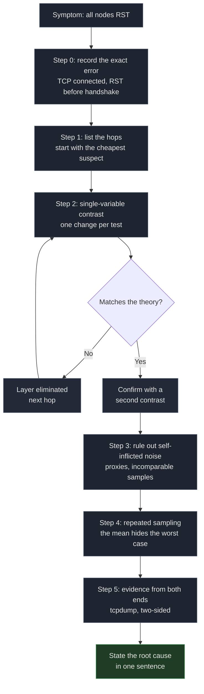

# Cloudflare Preferred-IP Nodes All Dead: Locating SNI String Filtering and Recovering via Domain Migration

- **Client egress**: residential broadband (primary measurement at `198.51.100.77`; dual-stack mobile IPv4 plus carrier IPv6)
- **Origin**: `203.0.113.10` (nginx + xray + 3x-ui, VLESS+WS+TLS behind Cloudflare's orange cloud)
- **Date**: 2026-09-30 23:20 to 2026-10-01 02:35 (Beijing time)
- **Components**: Cloudflare orange-cloud proxy / xray (3x-ui) / nginx / CloudflareSpeedTest v2.3.5
- **Verdict**: fixed. All ten preferred-IP nodes returned RST. Root cause is a middlebox performing **string matching on the SNI field of the TLS ClientHello**; a match on `cc.cd` causes the SYN to be dropped silently. **Swapping IPs, swapping servers, and enabling TLS fragmentation all fail.** The only working fix is a new domain.

> Domains and IPs are desensitized per RFC 2606 (`.example`) and RFC 5737 (`192.0.2.0/24`, `198.51.100.0/24`, `203.0.113.0/24`). The Cloudflare addresses shown (`198.41.x.x`, `104.x.x.x`) are official public anycast ranges and involve no privacy concerns.

---

## 1. Symptom

Ten preferred-IP nodes in the subscription (`优选IP-CMCC-1..5` / `优选IP-CUCC-1..5`, drawn from four public sources) all failed at the same moment:

```bash
$ curl -v https://cdn.mydomain.example/
*   Trying 104.21.25.249:443...
* Connected to cdn.mydomain.example (104.21.25.249) port 443
*   Recv failure: Connection reset by peer
* OpenSSL SSL_connect: Connection reset by peer in connection to cdn.mydomain.example:443
curl: (35) Recv failure: Connection reset by peer
```

- **TCP connected** (three-way handshake completed), and **the RST arrived before the TLS handshake finished**;
- The same IPs tested against `speed.cloudflare.com` behaved **normally** (200, 3 to 4 MB/s);
- The origin was healthy: nginx running, 443 listening, ufw allowing, access log clean.

---

## 2. Investigation and key evidence

Proceeded as: locate the fault domain, single-variable contrasts, rule out self-inflicted noise, repeated sampling, evidence from both ends.

### 2.1 Step 1: locate the fault domain

Write the path out on one line and mark which hop could explain an RST that arrives after TCP has connected:

```
client → [ ISP edge ] → [ CF edge ] → [ origin ] → back
```

- Origin: can explain it (refusing connections), but TCP already connected and the origin log has no record, so **unlikely**;
- CF edge: can explain it (interrupted before TLS completes), so **likely**;
- ISP edge / middle path: can explain it (silent drop), so **likely**.

Start with the **cheapest suspect**: the origin, one SSH away.

### 2.2 Step 2: single-variable contrasts, three theories refuted

Each experiment changes **exactly one variable** (target IP, SNI, or target server) and holds the rest constant.

**Experiment A: is the origin down?** (fixed IP, bypass the CDN)

```bash
$ curl --resolve cdn.mydomain.example:443:203.0.113.10 https://cdn.mydomain.example/
curl: (35) Recv failure: Connection reset by peer
```

**Refuted.** At the same time, from the origin itself through the CF edge with the same hostname, the response was `HTTP/1.1 101 Switching Protocols`. nginx alive, port open, log clean.

**Experiment B: did Cloudflare ban preferred IPs?** (fixed IP, varying SNI)

```bash
$ curl --resolve speed.cloudflare.com:443:198.41.209.164 \
    "https://speed.cloudflare.com/__down?bytes=5000000"
HTTP/1.1 200 OK

$ curl --resolve proxy.mydomain.example:443:198.41.209.164 \
    https://proxy.mydomain.example/
curl: (35) Recv failure: Connection reset by peer
```

**Refuted.** One IP, two hostnames, opposite results. The IP is alive and Cloudflare is not blocking anything.

**Experiment C: does moving to another server fix it?** (changing the machine is the only variable)

```bash
$ curl --resolve alt-server.example.org:443:198.51.100.20 https://alt-server.example.org/
curl: (35) Recv failure: Connection reset by peer
```

**Refuted.** An unrelated machine, different provider, different region, same RST. The variable was never the server.

### 2.3 Step 3: rule out self-inflicted noise

**(a) Is a local proxy or transparent redirect eating the traffic?**

```bash
$ env | grep -iE 'http_proxy|https_proxy|all_proxy'
(empty)

$ nft list table inet mihomo | head -5
table inet mihomo {
        chain tproxy_prerouting {
                type filter hook prerouting priority mangle; policy accept;
                iifname != "eth1" return          # locally originated traffic skips tproxy
```

**Ruled out.** No proxy environment variables. The mihomo tproxy chain's first line is `iifname != "eth1" return`, so only forwarded LAN traffic is intercepted; locally originated connections never reach it. The mihomo table has no output chain.

**(b) Were the measurements comparable at all?**

I had compared a benchmark tool's 236ms against my own curl reading of 1.27s and concluded the tool was unreliable. **That conclusion was wrong.** The two were four minutes apart and measured different things (the tool averaged multiple TCPing handshakes, curl reports a single `time_connect`). Not a contradiction.

> **Lesson**: one measurement is a data point. A conclusion needs repeated measurement **by the same method, at roughly the same time, on the same target**.

### 2.4 Step 4: repeated sampling exposes a 5x outlier

Five consecutive samples of the same IP (`curl -w "%{time_connect"`):

```
connect=0.234766s
connect=0.221261s
connect=1.260345s    ← third sample
connect=0.232439s
connect=0.239106s
```

**Decisive finding**: a healthy path with a 230ms physical RTT measured 1.26s on a single attempt.

**Mechanism**: the Linux kernel's initial SYN retransmission timeout `TCP_TIMEOUT_INIT` is **1.0 second**. If the first SYN is dropped once, the client waits out the full second before retransmitting, and the retransmitted SYN gets its SYN-ACK roughly 230ms later:

```
time_connect = 1.0s (RTO wait) + 0.23s (physical RTT) = 1.26s
```

**Corollary (applies to benchmarks too)**: any metric that does several handshakes and averages only the successes will report a node with 25% loss as a healthy 230ms. **The mean hides the worst case.** Node quality must be judged on the worst sample and the loss rate.

### 2.5 Step 5: evidence from both ends, the decisive tcpdump

The client can prove a request failed. It cannot prove **where** it failed, and `Connection reset by peer` describes the client's own socket. Evidence has to come from the other end.

On the origin:

```bash
sudo timeout 30 tcpdump -ni any \
  "tcp[tcpflags] & (tcp-syn|tcp-rst) != 0 and tcp dst port 443" -vv -c 20
```

One client request inside the window. Every relevant packet captured:

```
14:51:28.175281 ens3 In  IP 198.51.100.77.17652 > 203.0.113.10.443: Flags [S]
14:51:28.458155 ens3 In  IP 198.51.100.77.17652 > 203.0.113.10.443: Flags [R.]
```

**Field by field**:

| Observation | Value | Meaning |
|---|---|---|
| First packet | `Flags [S]` from the client | the SYN reached the origin |
| Second packet | `Flags [R.]`, **source address still the client** | the RST was sent by the client itself |
| ack value | `486385868` | the origin never emitted that sequence number |
| Gap | 283 ms | client waited for SYN-ACK, then timed out |
| Packets from origin | **0** | the origin never participated |

**The origin was not refusing anything. It was never contacted.** The SYN vanished somewhere between client and origin; the client timed out and reset its own socket. I had then spent about an hour hunting firewall rules on that server, pointed there by the error message, which gave me no way to know it was lying.


> This is why the first four steps, all executed on the client side alone, took ninety minutes to reach step five: **the machine that was lying to me was the only machine I was measuring.**

### 2.6 Pinning the rule: the single-variable contrast that settled it

With the fault domain narrowed to "between client and origin, before the origin was reached," the design from Experiment B became decisive. **Fix the IP, vary only the SNI.**

One IP (`198.41.209.164`), one client, one moment:

| SNI / Host in the ClientHello | Result | Reading |
|---|---|---|
| `speed.cloudflare.com` | **200 OK** | not interfered with |
| `i.cd` | TLS alert | reached CF, CF refused normally |
| `us.ci` | TLS alert | same |
| `bot.cd` | TLS alert | same |
| `de5.net` | TLS alert | same |
| `cwu.cc` | TLS alert | same |
| `bbroot.com` | TLS alert | same |
| `kz.ci` / `xyz.ci` / `pc.ci` | TLS alert | same |
| `cc.cd` | **Connection reset** | **interfered with** |

**The two failure modes must not be confused**:

- **TLS alert** means Cloudflare sent the packet, so the request reached the edge and was handled normally, so **no interference**;
- **A clean RST** means the connection was killed mid-handshake, so **interference**.

Two more probes fixed the matching granularity:

```bash
# .cd but not cc.cd  →  survives (CF returns a normal TLS alert)
$ curl --resolve abc123def.cd:443:198.41.209.164 https://abc123def.cd/

# cc.cd but the hostname does not exist (invented)  →  reset
$ curl --resolve randxyz.cc.cd:443:198.41.209.164 https://randxyz.cc.cd/
```

**The match is the literal string `cc.cd`.** Not the `.cd` TLD (experiment C), not the specific hostname (the invented-domain probe), not the IP, not the port.

**Port-independent**: it fired on 443, on 8443, and on plain HTTP port 80 via the `Host` header.

**Fragmentation-independent**: the client already had `fragment` configured (`1,40-60,30-50,tlshello`), splitting the ClientHello across segments. The reset arrived anyway. Reassembly and cross-segment matching are cheap for a middlebox.

**Prediction check (corroboration that the rule is right)**: the REALITY nodes on the same server and same ports, which borrow `www.nvidia.com` and `www.sony.com` as SNI, **never failed**. Nothing in their ClientHello contained `cc.cd`, and the prediction held.



---

## 3. Root cause

A middlebox on the path performs **string matching on the SNI field of the TLS ClientHello** and, on a match with `cc.cd`, **drops the SYN silently** (no RST, no ICMP). The client waits out its 1-second SYN RTO, resets the connection itself, and the failure surfaces as `Connection reset by peer`.

```
client → [ ISP edge ] → [ middlebox: reads SNI, matches cc.cd, drops ] → [ CF edge ] → [ origin ]
                                                  ↑
                                     origin never reached (0 packets in tcpdump)
```

**The preferred-IP mechanism is not at fault.** The failure is on the "client to CF edge" hop, and that hop is severed by string matching, which **no IP can bypass**.

This also explains why the CF-to-origin leg was perfectly healthy the whole time: the origin's `/cfws-*` path accumulated 38,053 `101` responses (WebSocket upgrade success), all with client addresses in Cloudflare edge ranges. The origin was never the bottleneck. It was simply **never reached**.

---

## 4. Fix

The domain name is hardcoded in every layer of a CF-proxied VLESS node, so "change the domain" means changing it in five places.

### 4.1 DNS (Cloudflare)

```
A   new.mydomain.example   →   203.0.113.10   proxied=true (orange cloud)
```

Required API token permission: **Zone → DNS → Edit** (nothing else).

### 4.2 Origin certificate

The original cert was `subject=issuer=CN=old-proxy.mydomain.example` (self-signed, valid to 2036). Reissue with additional SANs:

```
DNS:old-proxy.mydomain.example, DNS:old-cdn.mydomain.example,
DNS:new.mydomain.example, DNS:*.new.mydomain.example
```

**Cloudflare's encryption mode must be `full`, not `strict`**, because a self-signed origin certificate cannot pass strict validation.

> Warning: **the certificate and the key are two separate files.** Replacing only the certificate yields `sslv3 alert handshake failure`, and that error looks exactly like a Cloudflare-side problem, which makes it very easy to misdiagnose.

### 4.3 nginx

Add the new hostname to the 443 server block:

```nginx
server_name old-proxy.mydomain.example old-cdn.mydomain.example new.mydomain.example;
```

### 4.4 xray / 3x-ui inbound (the most expensive step)

The WS inbound hard-checked `host=old-proxy.mydomain.example`, so the new hostname returned 404 every time.

**3x-ui persists inbound settings in SQLite and regenerates `config.json` from that database on every restart**, so editing `config.json` directly is **silently reverted**. The correct procedure:

1. Edit `/etc/x-ui/x-ui.db`, table `inbounds`, field `stream_settings`, and remove `wsSettings.host` (let nginx split by `$host` instead);
2. Restart the panel;
3. **Kill the stale xray process still holding port 10086**, otherwise the change does not take effect (the old process keeps the port and never reloads config).

> All three steps are required. Editing the wrong location reverts silently; skipping the stale process means the change never lands. Neither failure produces any error message.

### 4.5 Subscription generator

The `sni` and `host` parameters in the generated VLESS links, plus **the scheduled job that regenerates the subscription**:

```bash
# the cron entry must carry the env vars, or some run will overwrite the
# subscription back to the old domain, silently
5 0,6 * * * VLESS_SNI=new.mydomain.example VLESS_HOST=new.mydomain.example /usr/bin/python3 subgen.py
```

### 4.6 Client side (the downstream consumer)

- The box's mihomo pulls the subscription from the new domain, and the pull must **pin a measured-reachable CF edge IP and carry the SNI** (the edge IP that DNS returned timed out after 8s, and `http.client` does not send SNI by default, which triggers a handshake failure);
- Client subscription URL updated to the new domain.

---

## 5. Verification

### 5.1 Node handshake (real WebSocket upgrade)

```bash
# new domain, direct to origin
$ curl -sk -H "Connection: Upgrade" -H "Upgrade: websocket" \
       -H "Sec-WebSocket-Version: 13" -H "Sec-WebSocket-Key: dGhlIHNhbXBsZSBub25jZQ==" \
       --resolve new.mydomain.example:443:203.0.113.10 \
       https://new.mydomain.example/cfws-*
HTTP/1.1 101 Switching Protocols

# new domain, through the CF edge
$ curl ... --resolve new.mydomain.example:443:198.41.209.164 ...
HTTP/1.1 101 Switching Protocols

# old domain, regression check (not broken)
$ curl ... --resolve old-proxy.mydomain.example:443:198.41.209.164 ...
HTTP/1.1 101 Switching Protocols
```

### 5.2 Subscription pull and live proxy

```
subscription pull   : 200, 3100 bytes
node count          : 14 (4 self-measured + 10 public), all passing the 101 handshake check
live proxy test     : HTTP/204, t=0.40s
```

### 5.3 Latency before and after

| Stage | Average connect | Note |
|---|---|---|
| Before (`cc.cd`) | all failed | SNI matched, handshake could not complete |
| After (new domain) | 67 to 133 ms | all 14 nodes usable |

---

## 6. Deployment and operations

### 6.1 File inventory

| Path | Role |
|---|---|
| `/etc/nginx/sites-enabled/9router` | 443 server block `server_name` |
| `/etc/nginx/cf-origin.crt` / `.key` | origin certificate + key (**must be replaced as a pair**) |
| `/etc/x-ui/x-ui.db` | 3x-ui inbound config (**the real source, not config.json**) |
| `/usr/local/x-ui/bin/config.json` | generated at runtime, do not hand-edit |
| `subgen.py` | subscription generator (`VLESS_SNI` / `VLESS_HOST` env vars) |
| `mihomo/add_cfbest_dl.py` | box-side subscription consumer |

### 6.2 Backups

```
/etc/nginx/cf-origin.crt.bak-<date>      /etc/nginx/cf-origin.key.bak-<date>
/etc/nginx/sites-enabled/9router.bak-<date>
/usr/local/x-ui/bin/config.json.bak-<date>
/etc/x-ui/x-ui.db.bak-<date>
subgen.py.bak-<date>          sub.txt.bak-<date>
```

### 6.3 Routine operations

```bash
# pull the subscription (must be updated after a domain change)
curl -k https://new.mydomain.example/cfbest

# node handshake self-check
curl -sk -H "Connection: Upgrade" -H "Upgrade: websocket" \
     -H "Sec-WebSocket-Version: 13" -H "Sec-WebSocket-Key: dGhlIHNhbXBsZSBub25jZQ==" \
     https://new.mydomain.example/cfws-* -o /dev/null -w "%{http_code}\n"
```

---

## 7. Pitfall list (old conclusions, since refuted)

| Old conclusion | What is actually true |
|---|---|
| "The origin firewall blocked it" | tcpdump shows the origin sent 0 packets and was never reached |
| "Cloudflare banned preferred IPs" | Same IP with a different SNI returns 200 |
| "Move to another VPS or provider" | Different provider, different region, same RST |
| "Enable TLS fragmentation to get around it" | Already enabled, reset arrived anyway; a middlebox can reassemble |
| "REALITY nodes are affected too" | REALITY borrows an SNI without `cc.cd`, so it never failed |
| "The certificate error means Cloudflare has a problem" | Actually the certificate and key were not replaced as a pair |
| "Edit `config.json` to change the xray inbound" | 3x-ui regenerates it from SQLite, so the edit is silently reverted |
| "Tool says 236ms, curl says 1.27s, so the tool is unreliable" | Different methods four minutes apart, not comparable; the real cause is loss triggering the 1s RTO |
| A single measurement settles node quality | One sample will eventually hit the 1s RTO outlier; sample repeatedly and look at the worst case |

---

## 8. Appendix: minimal reusable diagnosis

```bash
# Same IP, two SNI values. If the first returns 200 and the second resets,
# the IP is innocent and the domain is the problem.
curl -sS -o /dev/null -w "%{http_code}\n" --max-time 8 \
  --resolve speed.cloudflare.com:443:198.41.209.164 \
  "https://speed.cloudflare.com/__down?bytes=5000000"

curl -sS -o /dev/null -w "%{http_code}\n" --max-time 8 \
  --resolve your.domain.here:443:198.41.209.164 \
  https://your.domain.here/
```

```bash
# On the wire: an RST whose source address is the client, with no reply from
# your server, is the signature of a silent drop.
sudo timeout 30 tcpdump -ni any \
  "tcp[tcpflags] & (tcp-syn|tcp-rst) != 0 and tcp dst port 443" -vv -c 20
```

---

## References

- [XIU2/CloudflareSpeedTest](https://github.com/XIU2/CloudflareSpeedTest)
- [RFC 6298: Computing TCP's Retransmission Timer](https://datatracker.ietf.org/doc/html/rfc6298)
- [Great Firewall](https://en.wikipedia.org/wiki/Great_Firewall)
