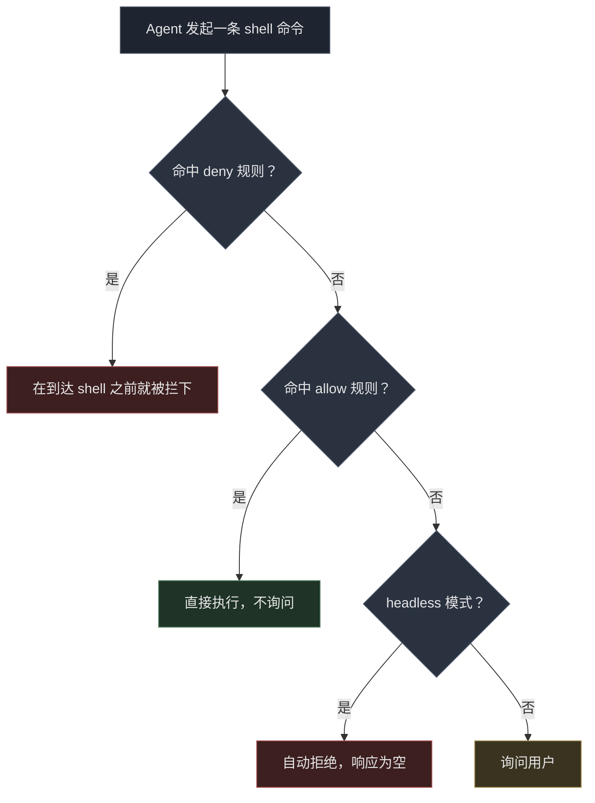

# Antigravity CLI 权限配置：全部放行，只拦 rm

Antigravity CLI（`agy`）默认每跑一条命令都要问一次权限，用脚本驱动它时就得有人一直在旁边按回车。我想要的是：所有命令直接放行，只拦 `rm`。一个配置文件就能做到，但有一个坑要注意：命令被拒时，它照样报告“成功”。

## 配置

改 `~/.gemini/antigravity-cli/settings.json`：

```json
{
  "toolPermission": "always-proceed",
  "permissions": {
    "allow": ["command(*)"],
    "deny": ["command(rm)"]
  },
  "trustedWorkspaces": ["/home/xiaoniba"]
}
```

- `toolPermission: "always-proceed"`：关掉默认的 `request-review`（逐条审核）模式，不再每条命令都停下来问。
- `allow: ["command(*)"]`：`*` 是通配符，表示任何命令都允许。
- `deny: ["command(rm)"]`：单独把 `rm` 拦下来。

别的都不用改。也可以不用通配符、改成逐条列出允许的命令（白名单），但 agent 每想出一种新命令就得授权一次，正是我想去掉的麻烦。

## command(*) 能用，虽然有说明写着别用

agy 程序里内嵌了一段写给 AI 看的指引，教它怎么生成 `sidecar.json` 配置，里面写着：

> Never use overly generic wildcards (`command(*)`, `read_file(*)`, `write_file(*)`, `mcp(*)`, `read_url(*)`).

这是在提醒 AI 别给出过宽的授权，并不是程序运行时的校验规则。我做了两次对照，只改一个变量：有没有 `command(*)`。

- 配 `allow: ["command(*)"]`，执行 `echo wildcard-test-ok`：成功，输出 `wildcard-test-ok`。
- 不配 allow 规则，执行 `echo control-test-ok`：被拒，响应是 `""`。

两次都显示 `"status":"SUCCESS"`，都跑了大约 150 秒。第二次 agent 读进去约 1.38 万个 token（token 是模型计费和计量的文字单位），最后一个字都没输出。

这个测试要在 `request-review` 模式下做。`always-proceed` 下所有命令本来就会放行，allow 规则写没写都看不出区别。

## deny 比 always-proceed 优先

再看两者冲突时听谁的。同一个会话里，开着 `always-proceed`、配着 `command(*)`，连发两条命令：

```
1. echo allow-but-deny-rm          → 成功（退出码 0）
2. rm -f .../probe.txt             → 失败
```

第 2 条的报错原文：

```
permission check failed for unsandboxed "rm -f /home/xiaoniba/agy-perm-test/probe.txt":
Permission denied for unsandboxed(rm -f /home/xiaoniba/agy-perm-test/probe.txt).
Matches user-configured deny rule.
```

跑完文件还在。判断顺序就是：先看 deny，再看 allow。



图里的 headless 指无人值守运行，没有人在终端前回答询问，所以没被允许的命令会直接被拒。

## 坑：被拒了还显示 SUCCESS

这是我花时间最多的地方。一次命令被拒的 headless 运行返回的是：

```json
{
  "status": "SUCCESS",
  "response": "",
  "usage": { "input_tokens": 13794, "output_tokens": 198, "total_tokens": 13792 },
  "denied_actions": [{ "action": "command", "display_name": "RunCommand" }]
}
```

`status` 是 `SUCCESS`，退出码是 0，哪里都没报错。如果你的脚本只看 `status`，会以为任务完成了。要同时检查 `response` 不为空，或者 `denied_actions` 不存在：

```python
if result.get("status") != "SUCCESS" or not result.get("response", "").strip():
    raise RuntimeError(f"agent produced nothing: {result.get('denied_actions')}")
```

空响应一律当失败处理。

## 它能防什么，不能防什么

这些规则匹配的是命令的文字，不是命令的效果。`command(rm)` 能拦住 `rm -f ...`，是因为按开头匹配（前缀匹配），文档里也是这么写的。它防的是 agent 随手敲一个 `rm`，不是沙箱（把程序关在隔离环境里、碰不到外面的文件）。

下面几种同样能删文件的写法，我没测是否会被拦：

- `find /some/path -delete`
- `unlink /some/file`
- `sh -c 'rm ...'`

我本来开始测了，后来停了，因为测试要让 agent 真的去删文件。请把它们当作没测过，不要当作已经拦住。

所以这份配置适合的场景是：自己的机器、自己选的 agent、有一条命令绝对不想被执行。如果要防不可信的提示词或者共享机器，加长 deny 列表没用，应该用 `--sandbox` 配一个受限的工作区，并且别把重要的东西放在它够得着的地方。

## 用日志确认配置生效

每次运行都会在日志里记下实际加载的配置：

```bash
grep "CLI settings initialized" "$(ls -t ~/.gemini/antigravity-cli/log/*.log | head -1)"
```

```
CLI settings initialized: permissions=&{Allow:[command(*)] Deny:[command(rm)] Ask:[]}, toolPermission=always-proceed
```

这一行和你写的不一样，就说明改动没写进去。我第一次就是这样，命令还没跑就从这行发现了。

## 延伸阅读

- [Antigravity CLI 官方文档](https://antigravity.google/docs/cli/reference)：配置项的权威说明
- [Antigravity GitHub 仓库](https://github.com/GoogleCloudPlatform/antigravity)
- [另一篇排查记录：报错指向服务端，真正原因在下游](https://i125pro.github.io/zh/2026/09/30/cloudflare-sni-blocking-preferred-ip-dead/)：同样是靠每次只改一个变量的对照实验找到原因
