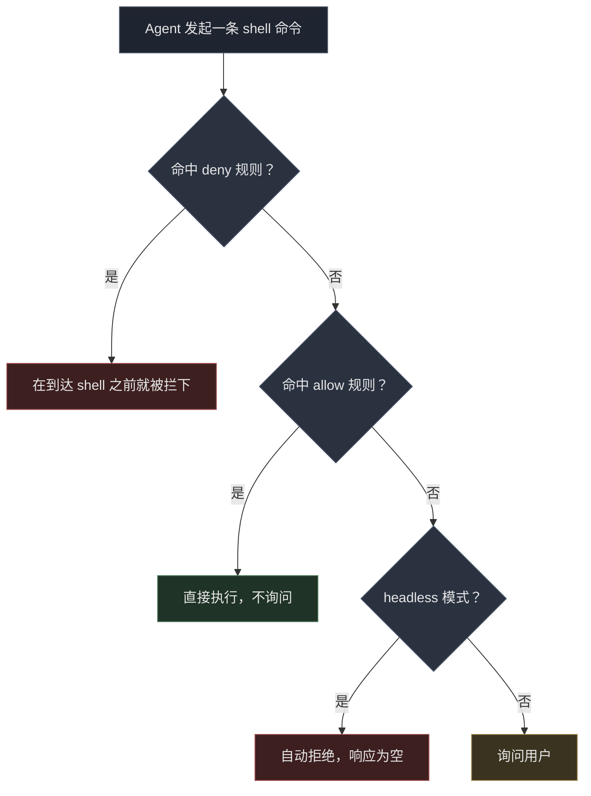

# Antigravity CLI 权限配置：全部放行，只拦 rm

Antigravity CLI（`agy`）每条命令前都要问一次权限。人在终端前手动跑，这个设计完全合理；但脚本驱动它的时候就是灾难——每条 `echo` 都得有人在旁边按回车。

我想要的就是一个行为：全都放行，除了 `rm`。

有意思的部分在验证的过程中。文档说有一条规则是被禁止的。它不是。

## 改了什么

一个文件，`~/.gemini/antigravity-cli/settings.json`：

```json
{
  "toolPermission": "always-proceed",
  "permissions": {
    "allow": ["command(*)"],
    "deny": ["command(rm)"]
  },
  "trustedWorkspaces": ["/home/xiaoniba"]
}
```

三个字段搞定。`always-proceed` 让默认的 `request-review` 模式不再每条命令都停。`allow` 加通配符让其余全部通过。`deny` 把一条命令重新砌回墙上。

这就是全部配置面。别的什么都不用动。

## 文档说 `command(*)` 是禁止的

agy 二进制里嵌了一份给 AI 写 sidecar 配置用的指引，里面白纸黑字写着：

> Never use overly generic wildcards (`command(*)`, `read_file(*)`, `write_file(*)`, `mcp(*)`, `read_url(*)`).

那段话是给 AI 生成 `sidecar.json` 用的——在那个场景里，过于宽泛的授权确实不是好主意。但它不是运行时的校验规则，而在运行时 `command(*)` 就是能用的。

我没有采信文档，也没有采信自己的乐观。我做了对照实验，跑了两遍，每遍只改一个变量。

| 配置 | 命令 | 结果 |
|---|---|---|
| `allow: ["command(*)"]` | `echo wildcard-test-ok` | 成功，输出 `wildcard-test-ok` |
| 无 allow 规则 | `echo control-test-ok` | 被拒，响应 `""` |

两次运行都是 `"status":"SUCCESS"`，都花了大约 150 秒。第二次里 agent 消耗了 **13,792 个输入 token，输出一片空白**。它思考、尝试执行、被拒，然后没话可说了。

两份配置之间唯一的差别，就是有没有 `command(*)`。

这里藏着一个方法论上的点。通配符测试我是在 `request-review` 模式下跑的，不是 `always-proceed`。因为在 `always-proceed` 下所有命令都通过，allow 规则测不测都一样，那种模式下的实验等于什么也没验证。**只有会暴露拒绝的那个模式，才测得出 allow 规则的真假。**

## deny 赢过 always-proceed

下一次运行确认了优先级。同一个会话，`always-proceed` 开着，`command(*)` 放行，连发两条命令：

```
1. echo allow-but-deny-rm          → 成功（退出码 0）
2. rm -f .../probe.txt             → 失败
```

第 2 条的报错原文：

```
permission check failed for unsandboxed "rm -f /home/xiaoniba/agy-perm-test/probe.txt":
Permission denied for unsandboxed(rm -f /home/xiaoniba/agy-perm-test/probe.txt).
Matches user-configured deny rule.
```

事后那个探针文件还在盘上。所以 `deny` 不是一种会被 `always-proceed` 覆盖的建议。它赢。

整个设计就浓缩在这一条行为里：宽泛放行、一条窄 deny，deny 先判。



## 最坑的坑：SUCCESS 配一个空响应

下面的细节花掉了我最多时间，而且它跟权限本身毫无关系。

一次命令被拒绝的 headless 运行，返回了这段：

```json
{
  "status": "SUCCESS",
  "response": "",
  "usage": { "input_tokens": 13794, "output_tokens": 198, "total_tokens": 13792 },
  "denied_actions": [{ "action": "command", "display_name": "RunCommand" }]
}
```

`status` 是 `SUCCESS`。退出码是 0。没有任何地方报错。agent 跑完了，烧掉 13.8k token，撞了墙，干净利落地退出了。

**如果你的包装脚本判断 `status == "SUCCESS"`，这就读成"任务已完成"。** 它不是。它是一次拒绝穿着成功的戏服在演。

要么检查 `response` 是否为空，要么检查 `denied_actions` 是否不存在。哪种都行，一行搞定：

```python
if result.get("status") != "SUCCESS" or not result.get("response", "").strip():
    raise RuntimeError(f"agent produced nothing: {result.get('denied_actions')}")
```

空响应永远不算成功。这条规则在所有 headless agent 包装层里都会出现，这个工具也不例外。

## 这是什么，以及它不是什么

把天花板说清楚，因为"全部放行"很容易让人得出错误的结论。

这些规则匹配的是**命令文本，不是意图**。`deny: ["command(rm)"]` 之所以能匹配上 `rm -f ...`，是按前缀匹配的，这一点文档写明了。所以它能防住的是：agent 顺手就跑了 `rm`。它不是一个沙箱。

具体来说，下面这几条路径我**没有验证**是否同样被拦：

- `find /some/path -delete`
- `unlink /some/file`
- `sh -c 'rm ...'`

我本来开始测了，中途停下了——那个测试会让 agent 真的去删文件，为了一篇博客文章制造那种烂摊子不值得。请把这几条当成**未测**，而不是"已拦"。如果你的威胁模型是"一个被攻陷或粗心的 agent 拿到了文件系统访问权"，那 `deny: command(rm)` 是一道减速带，不是墙。

这份配置真正适用的场景是它诚实对应的那个：**你自己拥有的机器、你亲手选的 agent、以及一条你绝对不想被执行的命令。** 这是一个非常真实也非常常见的组合，对它来说上面那份配置就是标准答案。

如果你要防的是不可信的 prompt 或者共享机器，答案不是写更长的 deny 列表。请用 `--sandbox` 配一个受限工作区，并且不要把任何你在意的东西放在伸手可及的地方。

## 看日志验证，别靠感觉

每次运行都会写下它加载到的配置。先确认，再信任：

```bash
grep "CLI settings initialized" "$(ls -t ~/.gemini/antigravity-cli/log/*.log | head -1)"
```

```
CLI settings initialized: permissions=&{Allow:[command(*)] Deny:[command(rm)] Ask:[]}, toolPermission=always-proceed
```

如果这一行跟你写的对不上，说明改动没落盘。我第一次就撞上了写盘没生效，命令都还没跑就已经被这行挡住了。

## FAQ

**`command(*)` 会不会被判为非法规则而拒绝加载？**
不会。它在运行时被正常加载并生效。内置指引警告不要用它去生成 sidecar 配置，但运行时并不强制校验。

**`always-proceed` 和白名单哪个更好？**
自己信任的机器上，用 `always-proceed` 加一条 `deny`。白名单会强迫你为 agent 临时发明的每种命令形状单独授权一次，那正是你想消除的摩擦。

**开了 `always-proceed`，`deny` 还管用吗？**
管用，已验证。deny 先判，`rm` 被挡，其余命令自由执行。

**为什么我的运行显示 SUCCESS 却没有任何输出？**
命令在 headless 模式下被拒了。检查 `response` 非空、`denied_actions` 不存在，只看 `status` 抓不到。

## 延伸阅读

- [Antigravity CLI 官方文档](https://antigravity.google/docs/cli/reference)——权威的配置参考，可以对照看看它和二进制里嵌的 AI 指引在哪里出现了分歧
- [Antigravity GitHub 仓库](https://github.com/GoogleCloudPlatform/antigravity)
- [我写的另一篇：如何在 wire 上实测定位另一次故障](https://i125pro.github.io/zh/2026/09/30/cloudflare-sni-blocking-preferred-ip-dead/)——同一个方法论、同一个结论：报错信息指错了嫌疑人，只有单变量对照实验才能找到真的那个