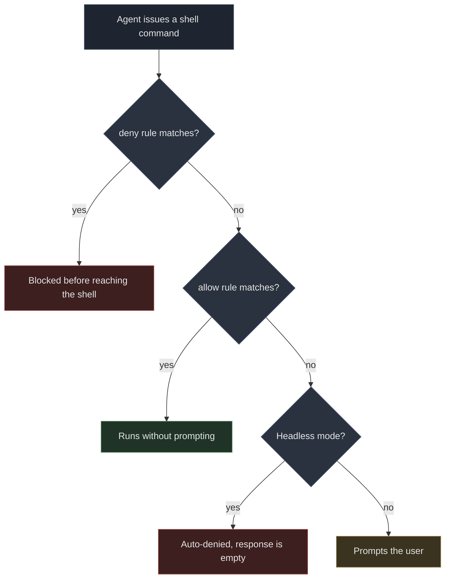

# Antigravity CLI Permissions: Allow All, Deny One

The Antigravity CLI (`agy`) asks permission before every command, which is fine for a human at a terminal and useless when you drive it from a script. I wanted one behavior: everything runs, except `rm`.

The interesting part is what I found while verifying it. The docs say a certain rule is forbidden. It isn't.

## What I changed

One file, `~/.gemini/antigravity-cli/settings.json`:

```json
{
  "toolPermission": "always-proceed",
  "permissions": {
    "allow": ["command(*)"],
    "deny": ["command(rm)"]
  },
  "trustedWorkspaces": ["/home/xiaoniba"]
}
```

Three fields do the work. `always-proceed` stops the default `request-review` mode from stopping at every command. `allow` with a wildcard lets everything through. `deny` puts one command back on the wall.

That file is the whole configuration surface. Nothing else needed to change.

## The docs say `command(*)` is forbidden

The Antigravity binary ships with embedded guidance for agents writing sidecar configs, and it says this plainly:

> Never use overly generic wildcards (`command(*)`, `read_file(*)`, `write_file(*)`, `mcp(*)`, `read_url(*)`).

That text is aimed at an agent generating `sidecar.json` files, where broad grants are a bad idea. It is not a runtime validation rule, and at runtime `command(*)` works.

I did not take the docs' word for it, or my own optimism. I ran a control experiment, twice, changing exactly one variable.

| Config | Command | Result |
|---|---|---|
| `allow: ["command(*)"]` | `echo wildcard-test-ok` | Succeeded, output `wildcard-test-ok` |
| no allow rule | `echo control-test-ok` | Denied, response `""` |

Both runs finished with `"status":"SUCCESS"` and both spent about 150 seconds. In the second run the agent produced **13,792 input tokens and no output at all**. It thought, tried to run a command, was refused, and had nothing left to say.

The only difference between the two configs was the presence of `command(*)`.

There is a methodological point buried here. I ran the wildcard test under `request-review`, not under `always-proceed`. Under `always-proceed` every command passes, allowed or not, and the experiment would have told me nothing. The mode that makes denials visible is the only mode where you can test an allow rule.

## deny wins, even against always-proceed

The next run confirmed the ordering. Same session, `always-proceed` active, `command(*)` allowed, two commands issued:

```
1. echo allow-but-deny-rm          → Succeeded (exit code 0)
2. rm -f .../probe.txt             → Failed
```

Command 2's error, verbatim:

```
permission check failed for unsandboxed "rm -f /home/xiaoniba/agy-perm-test/probe.txt":
Permission denied for unsandboxed(rm -f /home/xiaoniba/agy-perm-test/probe.txt).
Matches user-configured deny rule.
```

The probe file was still on disk afterward. So `deny` is not a suggestion that `always-proceed` overrides. It wins.

That is the whole design in one behavior: broad allow, one narrow deny, deny evaluated first.



## The trap: SUCCESS with an empty response

Here is the detail that cost me the most time, and it has nothing to do with permissions.

A headless run whose command was denied returned this:

```json
{
  "status": "SUCCESS",
  "response": "",
  "usage": { "input_tokens": 13794, "output_tokens": 198, "total_tokens": 13792 },
  "denied_actions": [{ "action": "command", "display_name": "RunCommand" }]
}
```

`status` is `SUCCESS`. Exit code was 0. Nothing errored. The agent ran, burned 13.8k tokens, hit a wall, and exited cleanly.

**If your wrapper checks `status == "SUCCESS"`, this reads as a completed task.** It is not a completed task. It is a refusal wearing a success costume.

Check for an empty `response`, or check `denied_actions` is absent. One line, either way:

```python
if result.get("status") != "SUCCESS" or not result.get("response", "").strip():
    raise RuntimeError(f"agent produced nothing: {result.get('denied_actions')}")
```

An empty final response is never a success. This is the same rule that shows up in every headless agent wrapper, and this tool is no exception.

## What this is, and what it is not

Let me be precise about the ceiling, because "allow everything" invites the wrong conclusion.

These rules match **command text**, not intent. `deny: ["command(rm)"]` matched `rm -f ...` by prefix, exactly as documented. What that buys you is protection against an agent casually running `rm` while it thinks. It is not a sandbox.

Specifically, I did not verify whether these paths are also blocked:

- `find /some/path -delete`
- `unlink /some/file`
- `sh -c 'rm ...'`

I started to test them, then stopped, because the test would have the agent actually delete files and a blog post is not worth creating that mess for. Treat those routes as **untested**, not as "blocked." If your threat model is a compromised or careless agent with a filesystem, `deny: command(rm)` is one speed bump, not a wall.

What this configuration is actually good for is the honest version: **a trusted machine you own, an agent you chose, and a specific command you never want executed.** That is a real and very common setup, and for it the config above is exactly right.

If instead you are protecting against an untrusted prompt or a shared machine, the answer is not a longer deny list. Use `--sandbox` with a restricted workspace, and do not put anything you care about within reach.

## Verify from the log, not from vibes

Every run writes the settings it loaded. Check them before you trust a config change:

```bash
grep "CLI settings initialized" "$(ls -t ~/.gemini/antigravity-cli/log/*.log | head -1)"
```

```
CLI settings initialized: permissions=&{Allow:[command(*)] Deny:[command(rm)] Ask:[]}, toolPermission=always-proceed
```

If that line disagrees with what you wrote, your change did not land. This caught a stale write on my first attempt, before any command ran.

## FAQ

**Does `command(*)` get rejected as an invalid rule?**
No. It loaded and applied at runtime. The embedded guidance warns against it for generated sidecar configs; it is not enforced.

**Which is better, `always-proceed` or an allowlist?**
For a trusted personal machine, `always-proceed` plus one `deny`. An allowlist forces you to approve each new command shape the agent invents, which is the friction you were trying to remove.

**Does `deny` work if `always-proceed` is set?**
Yes, verified. Deny is evaluated first and blocks `rm` while other commands run freely.

**Why did my run say SUCCESS with no output?**
The command was denied in headless mode. Check `response` is non-empty and `denied_actions` is absent; `status` alone will not catch it.

## Reading

- [Antigravity CLI documentation](https://antigravity.google/docs/cli/reference) — the authoritative settings reference; note where it and the embedded agent guidance diverge
- [Antigravity on GitHub](https://github.com/GoogleCloudPlatform/antigravity)
- [My notes on debugging a different failure by measuring at the wire](https://i125pro.github.io/en/2026/09/30/cloudflare-sni-blocking-preferred-ip-dead/) — same discipline, same conclusion: the error message names the wrong suspect, and only single-variable control runs find the real one