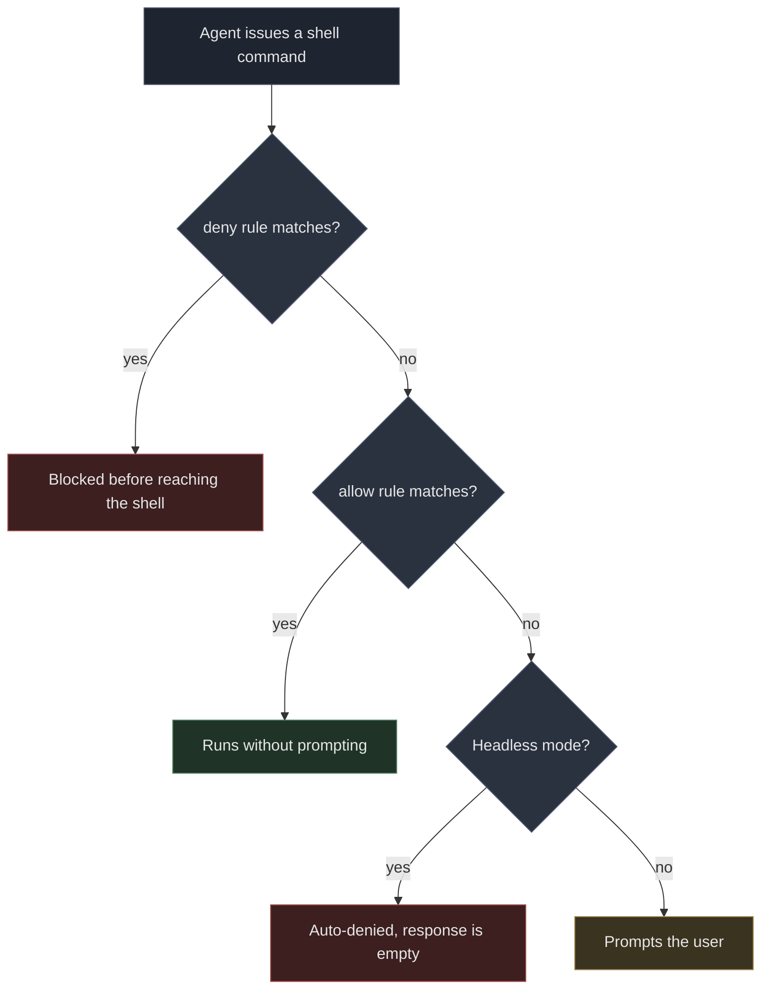

# Antigravity CLI Permissions: Allow All, Deny Only rm

By default the Antigravity CLI (`agy`) asks for permission before every command, so driving it from a script means someone has to sit there pressing Enter. What I wanted: every command runs without asking, except `rm`. One config file does it, with one trap to watch for: when a command is denied, it still reports success.

## The config

Edit `~/.gemini/antigravity-cli/settings.json`:

```json
{
  "toolPermission": "always-proceed",
  "permissions": {
    "allow": ["command(*)"],
    "deny": ["command(rm)"]
  },
  "trustedWorkspaces": ["/home/xiaoniba"]
}
```

- `toolPermission: "always-proceed"`: turns off the default `request-review` mode, so it stops pausing to ask before each command.
- `allow: ["command(*)"]`: `*` is a wildcard, meaning any command is allowed.
- `deny: ["command(rm)"]`: blocks `rm` specifically.

Nothing else needs to change. You could skip the wildcard and list allowed commands one by one (an allowlist), but then every new command shape the agent comes up with needs its own approval, which is exactly the friction I wanted gone.

## command(*) works, even though a note says not to use it

The agy program contains built-in guidance written for an AI, telling it how to generate `sidecar.json` configs. It says:

> Never use overly generic wildcards (`command(*)`, `read_file(*)`, `write_file(*)`, `mcp(*)`, `read_url(*)`).

That is advice to the AI not to hand out overly broad permissions. It is not a rule the program checks at runtime. I ran two control runs, changing one variable: whether `command(*)` was there.

- With `allow: ["command(*)"]`, running `echo wildcard-test-ok`: succeeded, output `wildcard-test-ok`.
- With no allow rule, running `echo control-test-ok`: denied, response `""`.

Both runs showed `"status":"SUCCESS"` and both took about 150 seconds. In the second run the agent read in about 13.8k tokens (tokens are the text units models are metered in) and produced no output at all.

This test has to be done in `request-review` mode. Under `always-proceed` every command is allowed anyway, so you can't tell whether the allow rule did anything.

## deny takes priority over always-proceed

Next question: when they conflict, which wins? In one session, with `always-proceed` on and `command(*)` allowed, I sent two commands:

```
1. echo allow-but-deny-rm          → Succeeded (exit code 0)
2. rm -f .../probe.txt             → Failed
```

Command 2's error, verbatim:

```
permission check failed for unsandboxed "rm -f /home/xiaoniba/agy-perm-test/probe.txt":
Permission denied for unsandboxed(rm -f /home/xiaoniba/agy-perm-test/probe.txt).
Matches user-configured deny rule.
```

The file was still there afterward. The order is: deny is checked first, then allow.



Headless in the chart means unattended: nobody is at the terminal to answer a prompt, so any command that isn't allowed is simply denied.

## The trap: denied, but it says SUCCESS

This is where I lost the most time. A headless run whose command was denied returned:

```json
{
  "status": "SUCCESS",
  "response": "",
  "usage": { "input_tokens": 13794, "output_tokens": 198, "total_tokens": 13792 },
  "denied_actions": [{ "action": "command", "display_name": "RunCommand" }]
}
```

`status` is `SUCCESS`, the exit code is 0, and nothing reports an error. If your script only checks `status`, it will think the task finished. Also check that `response` is not empty, or that `denied_actions` is absent:

```python
if result.get("status") != "SUCCESS" or not result.get("response", "").strip():
    raise RuntimeError(f"agent produced nothing: {result.get('denied_actions')}")
```

Treat an empty response as a failure, always.

## What it protects against, and what it doesn't

These rules match the text of a command, not what the command does. `command(rm)` catches `rm -f ...` because it matches on how the command starts (prefix matching), as the docs describe. It stops an agent from casually typing `rm`. It is not a sandbox (an isolated environment where a program can't touch files outside it).

I did not test whether these other ways of deleting files are blocked:

- `find /some/path -delete`
- `unlink /some/file`
- `sh -c 'rm ...'`

I started to, then stopped, because the test meant letting the agent actually delete files. Treat them as untested, not as blocked.

So this config fits one situation: your own machine, an agent you chose, and one command you never want run. If you need to guard against untrusted prompts or a shared machine, a longer deny list won't help. Use `--sandbox` with a restricted workspace, and keep anything important out of its reach.

## Confirm in the log that the config loaded

Every run logs the settings it actually loaded:

```bash
grep "CLI settings initialized" "$(ls -t ~/.gemini/antigravity-cli/log/*.log | head -1)"
```

```
CLI settings initialized: permissions=&{Allow:[command(*)] Deny:[command(rm)] Ask:[]}, toolPermission=always-proceed
```

If that line doesn't match what you wrote, your change didn't get saved. That happened to me the first time, and I caught it from this line before running any command.

## Further reading

- [Antigravity CLI documentation](https://antigravity.google/docs/cli/reference): the authoritative settings reference
- [Antigravity on GitHub](https://github.com/GoogleCloudPlatform/antigravity)
- [Another debugging write-up: the error pointed at the server, the real cause was downstream](https://i125pro.github.io/en/2026/09/30/cloudflare-sni-blocking-preferred-ip-dead/): also solved by control runs that change one variable at a time
