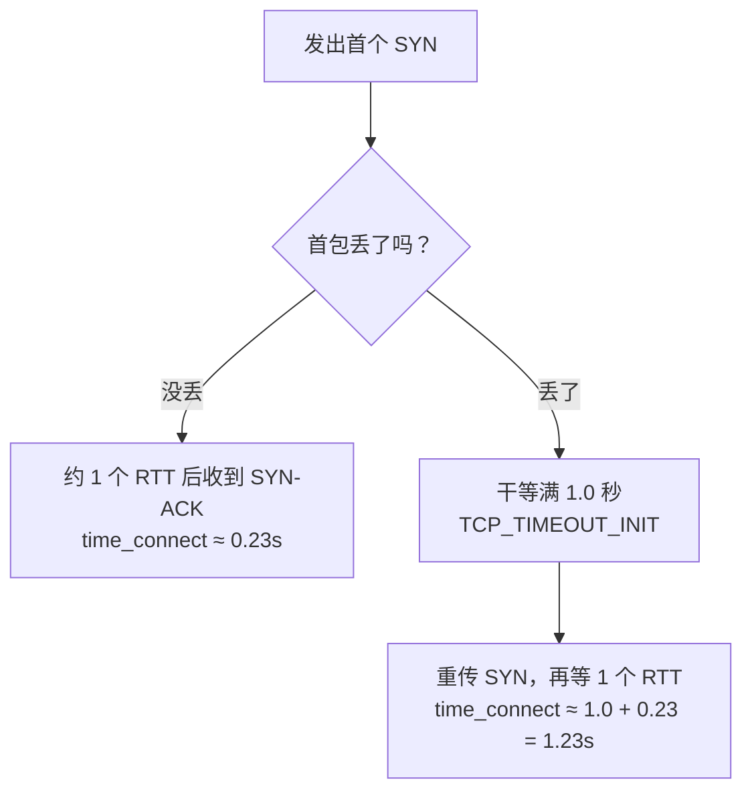

我对同一个 IP 连测了五次建连耗时，四次是 0.23 秒，一次是 1.26 秒。IP 和网络都没问题，那多出来的整整 1 秒，是第一个握手包丢了、内核按规定等满 1 秒才重发。所以测节点不能只测一次，也不能只看平均值，要多测几次，看最坏值和丢包率。

## 现象

```
connect=0.234766s
connect=0.221261s
connect=1.260345s    ← 第 3 次
connect=0.232439s
connect=0.239106s
```

这条线路的 RTT（往返时间，一个包发过去再收到回复所需的时间）是 230ms，而 `1.26 = 1.00 + 0.23`。这不是随机噪音，是一个能算出来的数。

## 那 1 秒从哪来

TCP 建连接时，客户端先发一个 SYN 包，相当于敲门说"我要连你"；服务器回一个 SYN-ACK，相当于应门。如果 SYN 在路上丢了，客户端听不到回应，只能等一会儿再敲。这段等待叫 RTO（重传超时）。

第一次敲门时，客户端还不知道对方离多远，所以 Linux 不去测，直接用一个固定值：

```c
/* include/net/tcp.h */
#define TCP_TIMEOUT_INIT ((unsigned)(1*HZ))   /* 1 秒 */
```

RFC 6298 也规定初始 RTO 取 1 秒。于是：



丢一次包不是慢一点，而是直接多 1 秒。网页偶尔第一下要愣一秒、SSH 偶尔卡在连接阶段，多半也是这个原因。

## 为什么平均值会骗人

这个 1 秒的离群值会把统计带偏，而且两个方向都有可能。

取平均会让结果虚高。五次里混进一次 1.26 秒：

```
(0.23 × 4 + 1.26) / 5 = 2.18 / 5 ≈ 0.44s
```

真实 RTT 是 0.23 秒，平均值报成 0.44 秒，差不多翻倍，看起来像节点变差了。

只取最快值，或者把慢的样本当异常丢掉，又会让结果虚假健康。一个首包丢包率 25% 的节点，会被报成漂亮的 230ms，问题恰好被过滤掉了。

所以判断节点好坏，要看最坏值和丢包率，不要看平均值。

## 怎么测

测十次，按从小到大排序：

```bash
DOMAIN=your.domain.com

for i in $(seq 10); do
  curl -sS -o /dev/null -w "%{time_connect}s\n" --max-time 5 "https://$DOMAIN/"
done | sort -n
```

`time_connect` 是 curl 记录的"从开始到 TCP 连上"的耗时。结果这样读：

1. 第一行是最小值，代表线路正常时的真实 RTT。
2. 最后一行是最大值，代表用户最坏会碰到的情况。
3. 数一数超过 1.0 秒的行，每一行就是一次首包丢包。10 次里有 2 次，首包丢包率大约就是 20%。

开头那组数据里五次有一次超过 1 秒，大约 20%，和这条线路的实际表现吻合。那个 1.26 秒其实是唯一说了实话的样本。

## 能不能调

那 1 秒是内核常量，没有现成的 sysctl 开关能改。能改的只有重传次数，也就是彻底放弃前要试几次：

```bash
sysctl net.ipv4.tcp_syn_retries      # 默认 6
```

它只影响连接失败要等多久，不影响第一次重传前的那 1 秒。真正有用的是别让首包丢，或者少建新连接：

- 换一条丢包更少的线路（换 IP、换线路、换运营商）。
- 复用已有连接，比如 HTTP keep-alive（一次连接里发多个请求）、HTTP/2 多路复用、连接池，这样就不用每次都重新握手。
- 对实时性要求高的场景，用基于 UDP、自己管理重传的协议，就不用等这 1 秒。

## 我是怎么踩到的

这是我在排查[另一个问题]({{ '/zh/2026/09/30/cloudflare-sni-blocking-preferred-ip-dead/' | relative_url }})时碰到的。当时工具报 236ms，我自己测出 1.27 秒，差点认定工具不可信。后来发现两次测量隔了 4 分钟、方法也不同，本来就不该直接比较。

## 参考

- [RFC 6298: Computing TCP's Retransmission Timer](https://datatracker.ietf.org/doc/html/rfc6298)
- Linux `include/net/tcp.h`：`TCP_TIMEOUT_INIT`
- `sysctl net.ipv4.tcp_syn_retries`
