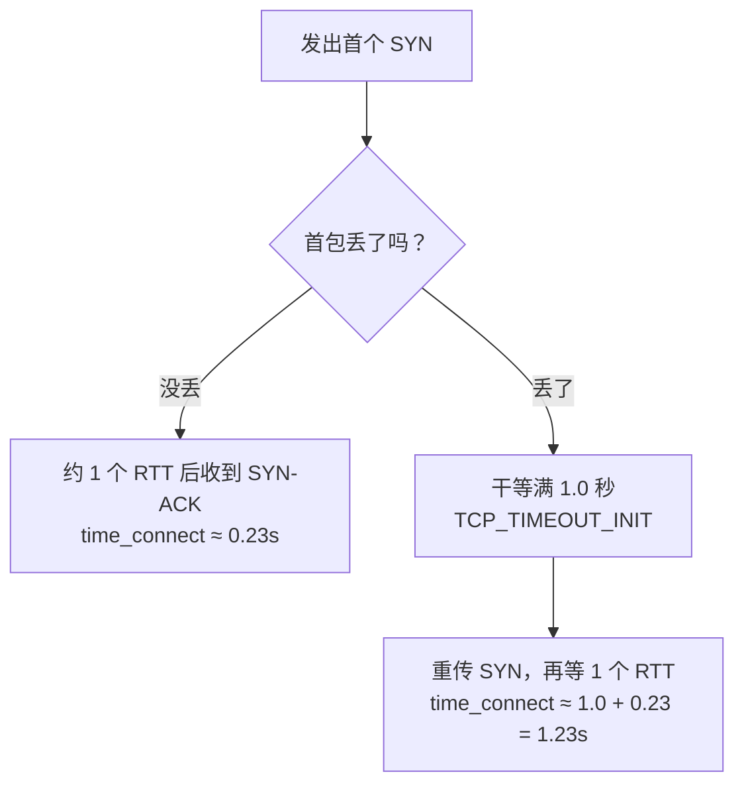

同一个 IP，连着测五次，结果是这样：

```
connect=0.234766s
connect=0.221261s
connect=1.260345s    ← 第 3 次
connect=0.232439s
connect=0.239106s
```

四条 0.23 秒，一条 1.26 秒。

**IP 没坏，网络没坏，是我测错了。**

而且那个 1.26 不是随机的噪音，它是个能被精确算出来的数。这条链路的物理 RTT 是 230ms，`1.26 = 1.00 + 0.23`。多出来的那整整 1.00 秒，是 Linux 内核里一个写死的常量。

## 那 1 秒从哪来

TCP 建连接要发一个 SYN。如果这个 SYN 在路上丢了，客户端得等一段时间才重传。这个等待时间叫 RTO（Retransmission Timeout）。

Linux 内核里，首个 SYN 的 RTO 不是"测"出来的，而是一个固定初值：

```c
/* include/net/tcp.h */
#define TCP_TIMEOUT_INIT ((unsigned)(1*HZ))   /* 1 秒 */
```

RFC 6298 也是这么规定的：初始 RTO 取 1 秒。

所以一次丢包会变成这样：



**关键点：丢一次包不是多花一点点时间，而是直接多出整整 1 秒。** 这是 1 秒级的台阶，不是渐变。

顺带解释了两个日常现象：

- 为什么"有时候网页第一下要等一秒才动"，首包丢了一次。
- 为什么"SSH 偶尔卡在连接阶段"，同上。

只要场景涉及"新建连接的第一个包"，出现 1 秒量级的卡顿，基本就是它。

## 为什么这件事比"测出来慢"严重得多

一次测慢本身无所谓，问题在于这个离群值会把统计污染掉，而且是**往两个相反的方向**：

方向一：取平均，结果虚高。

5 次采样里混进 1 次 1.26s，平均值变成

```
(0.23 × 4 + 1.26) / 5 = 2.18 / 5 ≈ 0.44s
```

真实 RTT 是 0.23s，均值报出来 0.44s，接近两倍。你以为节点在退化，其实它只是偶尔丢一个包。

方向二：取最快，或者丢掉慢样本，结果虚假健康。

反过来，如果工具"只保留最快的一次"或者"超过阈值就丢掉不算"，那么一个首包丢包率 25% 的节点会被报成"完美的 230ms"。**你看到的漂亮数字，恰恰是问题被滤掉的结果。**

这两种错误方向都存在，而且都很常见。所以：

> **不要用平均值判断节点质量。看最坏值，看丢包率。**

## 怎么测才对

重复采样，然后排序，最坏值一眼就能看见：

```bash
DOMAIN=your.domain.com

for i in $(seq 10); do
  curl -sS -o /dev/null -w "%{time_connect}s\n" --max-time 5 "https://$DOMAIN/"
done | sort -n
```

拿到这十行之后，看三个东西：

| 看什么 | 怎么读 |
|---|---|
| **第一行（最小值）** | 这是链路的真实 RTT，也就是"一切正常时"的样子 |
| **最后一行（最大值）** | 这是你最坏情况的体验，用户感知到的就是它 |
| **超过 1.0s 的行数** | 每一行都代表一次首包丢包 |

**顺便能反推丢包率**：10 次里有 2 次超过 1.0s，首包丢包率大约就是 20%。这个数字比任何"平均延迟"都更能说明节点好不好用。

回到开头那组数据：5 次里 1 次离群，反推丢包率约 20%，和那条链路的实际表现是吻合的。**所以那个 1.26s 不是异常，它是唯一一个说了实话的样本。**

## 这个能调吗

能调的部分有限，说清楚免得白折腾：

- **那 1 秒改不了。** 它来自内核常量，用户空间没法改初值。
- **能改的是重传次数**，也就是"彻底放弃前要等多久"：
  ```bash
  sysctl net.ipv4.tcp_syn_retries      # 默认 6
  ```
  调它只影响失败要等多久，**不影响第一次重传的 1 秒**。
- **所以治本的方向不是调内核**，而是别让首包丢：
  - 换一条丢包更少的链路（换 IP / 换线路 / 换运营商）；
  - 或者干脆避开"每次都新建连接"，用 keep-alive、HTTP/2 多路复用、连接池；
  - 实时性敏感的场景，用 UDP 类协议自己做重传，可以不用等这 1 秒。

## 一句话总结

> 单次测量没有意义。**1 秒量级的离群值 = SYN 重传超时，不是服务器慢。**

顺便说一句，这个坑是我在排查[另一个问题]({{ '/zh/2026/09/30/cloudflare-sni-blocking-preferred-ip-dead/' | relative_url }})的时候顺手踩到的。当时差点因为"工具报 236ms、我测出 1.27s"的差异，得出"工具不可信"的错误结论。其实两次测量相隔 4 分钟、方法也不同，本来就不该放在一起比。

## 参考

- [RFC 6298: Computing TCP's Retransmission Timer](https://datatracker.ietf.org/doc/html/rfc6298)
- Linux `include/net/tcp.h`：`TCP_TIMEOUT_INIT`
- `sysctl net.ipv4.tcp_syn_retries`
