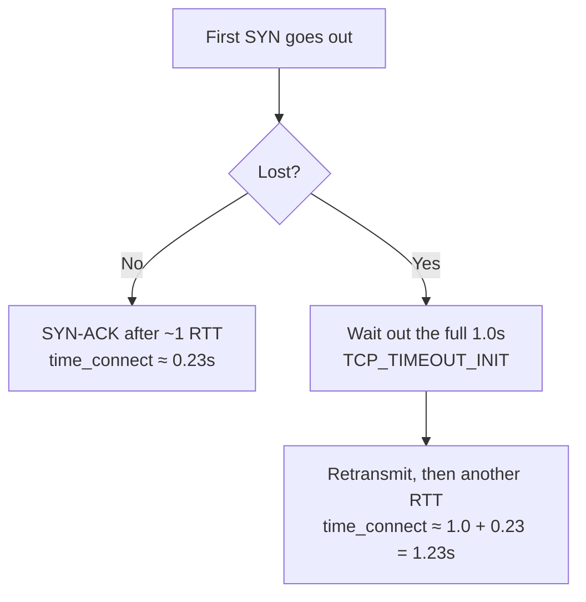

I measured connection time to the same IP five times in a row. Four results were 0.23 seconds and one was 1.26 seconds. Nothing was wrong with the IP or the network: the first handshake packet got lost, and the kernel waited a full second, as the rules say it should, before resending it. So don't test a node once, and don't trust the average. Test several times and look at the worst case and the loss rate.

## What I saw

```
connect=0.234766s
connect=0.221261s
connect=1.260345s    ← third sample
connect=0.232439s
connect=0.239106s
```

The RTT on this path (round-trip time: how long a packet takes to get there and for the reply to come back) is 230ms, and `1.26 = 1.00 + 0.23`. That isn't random noise. It's a number you can work out.

## Where the extra second comes from

To open a TCP connection, the client first sends a SYN packet, like knocking on a door to say "I want to connect". The server replies with a SYN-ACK, like opening the door. If the SYN is lost on the way, the client hears nothing and has to wait a bit before knocking again. That wait is called the RTO (retransmission timeout).

On the first knock the client has no idea how far away the server is, so Linux doesn't measure anything. It just uses a fixed value:

```c
/* include/net/tcp.h */
#define TCP_TIMEOUT_INIT ((unsigned)(1*HZ))   /* 1 second */
```

RFC 6298 also sets the initial RTO at 1 second. So:



Losing one packet doesn't make things a bit slower. It adds a whole second. When a web page occasionally freezes for a second before loading, or SSH sometimes hangs while connecting, this is usually why.

## Why the average misleads you

That one-second outlier skews the numbers, and it can push them either way.

Averaging makes things look worse than they are. Put one 1.26-second sample among five:

```
(0.23 × 4 + 1.26) / 5 = 2.18 / 5 ≈ 0.44s
```

The real RTT is 0.23 seconds, but the average says 0.44, almost double. It looks as if the node is getting worse.

Keeping only the fastest result, or throwing out slow samples as anomalies, makes things look healthier than they are. A node that loses 25% of first packets gets reported as a clean 230ms, because the problem is exactly what got filtered out.

So to judge a node, look at the worst case and the loss rate, not the average.

## How to measure

Run ten tests and sort them from smallest to largest:

```bash
DOMAIN=your.domain.com

for i in $(seq 10); do
  curl -sS -o /dev/null -w "%{time_connect}s\n" --max-time 5 "https://$DOMAIN/"
done | sort -n
```

`time_connect` is curl's measure of how long it took from the start until the TCP connection was up. Here's how to read the output:

1. The first line is the minimum: the path's real RTT when nothing goes wrong.
2. The last line is the maximum: the worst a user will run into.
3. Count the lines above 1.0 second. Each one is a lost first packet. Two out of ten means roughly 20% first-packet loss.

In my opening data, one of five samples was over a second, about 20%, which matched how that path actually behaved. The 1.26-second reading was the only sample telling the truth.

## Can you tune it?

The one second is a kernel constant, and no ready-made sysctl setting changes it. What you can change is the number of retries, meaning how many attempts are made before giving up:

```bash
sysctl net.ipv4.tcp_syn_retries      # default 6
```

That only changes how long a failed connection takes to give up. It doesn't touch the one second before the first retry. What actually helps is not losing the first packet, or opening fewer new connections:

- Use a path with less loss (a different IP, route, or ISP).
- Reuse connections you already have: HTTP keep-alive (several requests over one connection), HTTP/2 multiplexing, or connection pools, so you don't repeat the handshake every time.
- For latency-sensitive work, use a UDP-based protocol that manages its own retransmission, so you never wait for that second.

## How I ran into this

I hit this while debugging [another problem]({{ '/en/2026/09/30/cloudflare-sni-blocking-preferred-ip-dead/' | relative_url }}). A tool reported 236ms, my own test showed 1.27 seconds, and I almost decided the tool couldn't be trusted. Then I noticed the two measurements were 4 minutes apart and used different methods, so they were never comparable.

## References

- [RFC 6298: Computing TCP's Retransmission Timer](https://datatracker.ietf.org/doc/html/rfc6298)
- Linux `include/net/tcp.h`: `TCP_TIMEOUT_INIT`
- `sysctl net.ipv4.tcp_syn_retries`
