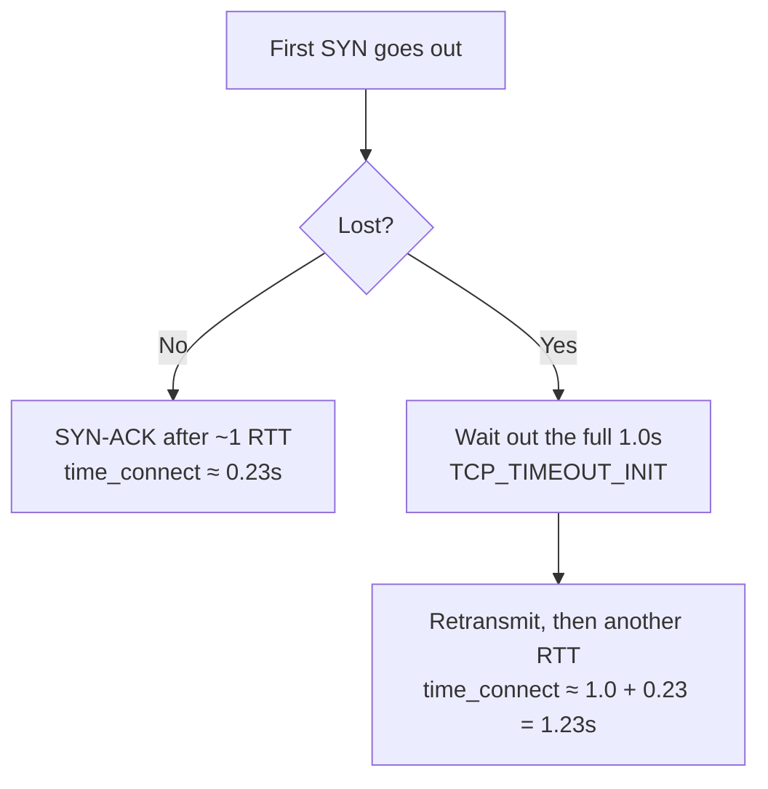

Five consecutive samples of the same IP:

```
connect=0.234766s
connect=0.221261s
connect=1.260345s    ← third sample
connect=0.232439s
connect=0.239106s
```

Four readings at 0.23s, one at 1.26s.

**The IP was fine. The network was fine. The measurement was wrong.**

And that 1.26 isn't random noise, it's a number you can compute exactly. The path's physical RTT is 230ms, and `1.26 = 1.00 + 0.23`. The extra second is a constant hardcoded in the Linux kernel.

## Where the second comes from

Opening a TCP connection means sending a SYN. If that SYN is lost in transit, the client has to wait before retransmitting, that wait is the RTO (Retransmission Timeout).

In the Linux kernel, the RTO for the first SYN isn't measured, it's a fixed initial value:

```c
/* include/net/tcp.h */
#define TCP_TIMEOUT_INIT ((unsigned)(1*HZ))   /* 1 second */
```

RFC 6298 says the same thing: the initial RTO is 1 second.

So a single lost packet plays out like this:



**Losing one packet doesn't cost a little extra time. It costs a full second.** It's a step, not a slope.

That also explains two everyday annoyances:

- Why a page sometimes hangs for a second before anything happens, the first packet was lost.
- Why SSH occasionally stalls at the connecting stage, same cause.

Anywhere a *new* connection's first packet is involved, a delay in the 1-second range is almost always this.

## Why this is worse than "the measurement was slow"

One slow reading is harmless on its own. The problem is that the outlier poisons the statistics, and it does so in **two opposite directions**.

**Direction one: averaging → inflated.**

One 1.26s sample among five:

```
(0.23 × 4 + 1.26) / 5 = 2.18 / 5 ≈ 0.44s
```

True RTT is 0.23s; the mean reports 0.44s, nearly double. You conclude the node is degrading, when in fact it just drops a packet now and then.

**Direction two: taking the minimum, or discarding slow samples → falsely healthy.**

Invert it: if a tool keeps only the fastest sample, or throws away anything past a threshold, a node with 25% first-packet loss gets reported as a flawless 230ms. **The pretty number you're looking at is precisely the evidence, filtered out.**

Both failure modes are real and both are common. So:

> **Don't judge a node by its average. Look at the worst case and the loss rate.**

## How to measure properly

Sample repeatedly, then sort, the worst case becomes impossible to miss:

```bash
DOMAIN=your.domain.com

for i in $(seq 10); do
  curl -sS -o /dev/null -w "%{time_connect}s\n" --max-time 5 "https://$DOMAIN/"
done | sort -n
```

Three things to read out of those ten lines:

| What to look at | How to read it |
|---|---|
| **First line (minimum)** | The path's true RTT, what "everything normal" looks like |
| **Last line (maximum)** | Your worst case. This is what users actually feel |
| **How many lines exceed 1.0s** | Each one is a lost first packet |

**You can also estimate the loss rate**: 2 out of 10 samples above 1.0s means roughly 20% first-packet loss. That number says more about whether a node is usable than any "average latency".

Back to the opening data: one outlier in five samples implies about 20% loss, which matches how that path actually behaved. **So the 1.26s reading wasn't an anomaly. It was the only sample telling the truth.**

## Can it be tuned?

Only partially. Knowing the limits saves you some wasted effort:

- **The 1 second can't be changed.** It comes from a kernel constant; user space cannot alter the initial value.
- **What you can change is the retransmission count**, i.e. how long it takes to give up entirely:
  ```bash
  sysctl net.ipv4.tcp_syn_retries      # default 6
  ```
  This only affects how long a total failure takes. It does not affect the 1 second before the first retransmission.
- **So the real fix is not kernel tuning**, it's not losing the first packet in the first place:
  - Use a path with less loss (different IP, different route, different ISP);
  - Or stop opening a new connection every time, keep-alive, HTTP/2 multiplexing, connection pools;
  - For latency-critical work, UDP-based protocols with their own retransmission logic don't have to wait that second.

## In one line

> A single sample means nothing. **An outlier in the 1-second range is SYN retransmission timeout, not a slow server.**

For what it's worth, I walked into this while debugging [a completely different problem]({{ '/en/2026/09/30/cloudflare-sni-blocking-preferred-ip-dead/' | relative_url }}), and nearly concluded the benchmarking tool was unreliable because it reported 236ms while my own reading said 1.27s. The two measurements were four minutes apart and used different methods; they were never comparable to begin with.

## References

- [RFC 6298: Computing TCP's Retransmission Timer](https://datatracker.ietf.org/doc/html/rfc6298)
- Linux `include/net/tcp.h`: `TCP_TIMEOUT_INIT`
- `sysctl net.ipv4.tcp_syn_retries`
