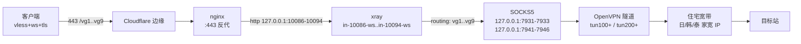

> **三句话结论**
>
> 1. CF 优选节点人人都能做，难的是让它**出网是住宅 IP**。做法：在服务器上跑 VPNGate 的 OpenVPN 隧道，每个隧道暴露一个本地 SOCKS5 端口，在 3x-ui 里用 `xrayTemplateConfig` 把入站流量路由到这些 SOCKS5 出口。
> 2. 别信"出口 IP 变了"的探针。`curl --noproxy '*' -x socks5://...` 里 `--noproxy` 会**连 SOCKS5 一起绕过**，得到一个永远"成功"的假象 —— 我因此误报过整整两轮"全通"。
> 3. 3x-ui v3.9 把用户和入站的绑定搬到了独立的 `client_inbounds` 表。直接往 `inbounds.settings` 的 JSON 里写 `clients`，面板生成 `config.json` 时会输出空的 `"clients": []`，日志只有一行 `invalid request user id`。

---

## 背景：为什么要在 CF 节点后面再套一层家宽

Cloudflare 的优选 IP 是给**入口**用的 —— 解决"哪个 IP 连你最快"。但出网永远是 Cloudflare 回源到你自己的 VPS，出口 IP 就是那台机房服务器的 IP。

很多站点（风控、支付、注册）一看机房 IP 就弹验证码。byJoey/cfnew v3.1 把这个玩法叫「**家宽链式**」，一句话描述就是：

```
你的客户端 → cfnew(CF 边缘) → 住宅宽带 → 目标站
```

不部署 cfnew 的话，VPS 上手搓这套也不难，而且能给你完整的客户端兼容性 —— cfnew 的家宽只出 Clash 订阅，需要 mihomo 1.19.25+，Stash / Surge / sing-box 都用不了。

## 架构



每一层都是现成的东西，没有一个需要新装：

| 层 | 用什么 | 备注 |
|---|---|---|
| 入口 | Cloudflare 优选 IP | 你已经有 `subgen.py` 在生成 |
| 落地 | VPNGate 志愿节点 | `api_url: https://www.vpngate.net/api/iphone/` |
| 代理 | 3x-ui v3.9 | 面板 + xray |
| 反代 | nginx | `proxy_pass http://127.0.0.1:<port>` |

## 一、VPNGate 隧道：每个实例一个 SOCKS5 端口

我用的是一个 Python 项目（`vpngate-nodes`），核心逻辑自己写之前先确认一遍：每个 systemd 实例 = 一个 OpenVPN 隧道 = 一个本地 SOCKS5 端口，节点挂了自动从池子里换一个。

配置长这样：

```json
{
  "install_dir": "/opt/vgtest-nodes",
  "unit_prefix": "vgtest",
  "instance_count": 3,
  "tun_base": 200,
  "table_base": 1201,
  "port_base": 7941,
  "country": "JP",
  "instance_countries": ["JP", "JP", "JP", "US", "US", "*"],
  "min_nodes": 3,
  "exclude_interfaces": ["tun100", "tun101", "tun102"],
  "listen_addresses": ["127.0.0.1"],
  "api_url": "https://www.vpngate.net/api/iphone/",
  "refresh_minutes": 21,
  "blacklist_ttl_seconds": 1800,
  "health_interval_seconds": 60,
  "health_fail_threshold": 3
}
```

两个字段值得单独说：

- **`instance_countries`** —— 每个实例钉哪个国家。`"*"` 表示随机（任意国家，打散后轮换）。
- **`country`** —— 全局默认，只有 `instance_countries` 短的时候才生效。

启动后你会看到：

```bash
$ systemctl list-units 'vgtest-nodes@*' --no-legend
vgtest-nodes@node1.service loaded active running vgtest node node1
vgtest-nodes@node2.service loaded active running vgtest node node2
...
$ ss -lntp | grep python3
127.0.0.1:7941  users:(("python3",pid=6296,fd=3))
127.0.0.1:7942  users:(("python3",pid=6310,fd=3))
```

路由是 oif-based 的，不污染全局：

```bash
$ ip rule show
32751:	from all oif tun201 lookup 1202
32752:	from all oif tun200 lookup 1201
...
$ ip route show table 1201
default dev tun200 scope link
```

这比 aimilivpn 那种抢 `ip rule from <容器IP> lookup 100` 的做法干净得多 —— 每个实例靠出接口区分，不存在规则冲突。

实测各端口的真实出口（**注意这里不能用 `--noproxy`**，见后面坑 2）：

```bash
$ for p in 7941 7942 7943 7944 7945 7946; do
    printf "  %s -> %s\n" "$p" "$(curl -s -m 15 -x socks5h://127.0.0.1:$p https://api.ipify.org)"
  done
  7941 -> 198.51.100.21
  7942 -> 198.51.100.22
  7943 -> 198.51.100.23
  7944 -> 198.51.100.24     # KR
  7945 -> 198.51.100.25    # KR
  7946 -> 198.51.100.26     # TH
```

## 二、3x-ui 侧：入站 + 出口 + routing

### 一条入站绑一个 SOCKS5 出口

如果你只有一个 SOCKS5 端口，整个面板的所有流量都从它出去。如果想分别用日韩泰几个出口，就开多个入站，一对一绑定。

入站（走 SQLite）：

```python
import json, sqlite3, time

port  = 10086      # 监听端口
path  = "/vg1"     # ws path
uuid  = "<your-uuid>"
email = "<your-client-email>"     # 必须复用已有 client，别新建
subid = "<your-subid>"
tag   = "in-10086-ws"

c = sqlite3.connect("/etc/x-ui/x-ui.db")
cid = c.execute("select id from clients where email=?", (email,)).fetchone()[0]
row = c.execute(
    "select created_at,expiry_time,total_gb,limit_ip,flow,reset "
    "from clients where id=?", (cid,)).fetchone()
created, exp, total_gb, limit_ip, flow, reset = row

settings = json.dumps({
    "clients": [{
        "comment": "", "created_at": created, "email": email, "enable": True,
        "expiryTime": exp, "flow": flow, "id": uuid, "limitIp": limit_ip,
        "reset": reset, "subId": subid, "tgId": 0, "totalGB": total_gb,
        "updated_at": int(time.time() * 1000),
    }],
    "decryption": "none", "encryption": "none",
}, indent=2)

stream = json.dumps({
    "network": "ws", "security": "none",
    "wsSettings": {"acceptProxyProtocol": False, "path": path, "headers": {}},
}, indent=2)

c.execute("""insert into inbounds
 (user_id,up,down,total,remark,enable,expiry_time,traffic_reset,
  last_traffic_reset_time,listen,port,protocol,settings,stream_settings,
  tag,sniffing,node_id,exclude_from_sub,sub_sort_index,traffic_reset_day,
  share_addr_strategy,share_addr,disable_flow,origin_node_guid)
 values (1,0,0,0,?,1,0,'never',0,'',?,'vless',?,?,?,?,NULL,0,?,1,'node','',0,'')""",
    ("VG-vpngate-1", port, settings, stream, tag,
     json.dumps({"enabled": True, "destOverride": ["http","tls","quic","fakedns"]}),
     i))

# 坑 3：这一步不能省
c.execute("insert or ignore into client_inbounds(client_id,inbound_id,flow_override,created_at) "
          "values(?,?,'',?)", (cid, i, int(time.time() * 1000)))
c.commit()
```

出口和 routing 走 `xrayTemplateConfig` 这一个 setting：

```json
{
  "outbounds": [
    { "tag": "vg1", "protocol": "socks",
      "settings": { "servers": [{ "address": "127.0.0.1", "port": 7931 }] } },
    { "tag": "vg2", "protocol": "socks",
      "settings": { "servers": [{ "address": "127.0.0.1", "port": 7932 }] } },
    { "tag": "direct", "protocol": "freedom", "settings": {} },
    { "tag": "blocked", "protocol": "blackhole", "settings": {} }
  ],
  "routing": {
    "domainStrategy": "AsIs",
    "rules": [
      { "type": "field", "inboundTag": ["in-10086-ws"], "outboundTag": "vg1" },
      { "type": "field", "inboundTag": ["in-10087-ws"], "outboundTag": "vg2" },
      { "type": "field", "ip": ["geoip:private"], "outboundTag": "blocked" }
    ]
  }
}
```

> ⚠️ **别在 `xrayTemplateConfig` 里写 `balancers`**。3x-ui v3.9 不会把 `balancers` 段落搬进 `config.json`，而 routing 里引用了 `balancerTag`，结果是每次 xray 启动都失败：
>
> ```
> ERROR - XRAY: Failed to start: main: failed to create server > app/router: balancer vg-pool not found
> ERROR - Failure in running xray-core: exit status 23
> ```
>
> 想要轮换就开多个入站各绑一个出口（我最后用的就是这个），或者手动改 `config.json` —— 但后者会被面板下次保存入站时静默回滚。

验证生成结果（**不要只看 JSON，要看 3x-ui 实际生成的**）：

```bash
$ python3 -c "
import json;d=json.load(open('/usr/local/x-ui/bin/config.json'))
print([(o['tag'],o['protocol']) for o in d['outbounds']])
print(d['routing']['rules'])"
[('vg1', 'socks'), ('vg2', 'socks'), ('direct', 'freedom'), ('blocked', 'blackhole')]
[{'type': 'field', 'inboundTag': ['in-10086-ws'], 'outboundTag': 'vg1'}, ...]
```

### nginx 回源

```nginx
# vpngate 出口 1 -> 127.0.0.1:10086
location /vg1 {
    proxy_pass http://127.0.0.1:10086;
    proxy_http_version 1.1;
    proxy_set_header Upgrade $http_upgrade;
    proxy_set_header Connection "upgrade";
    proxy_set_header Host $host;
    proxy_set_header X-Real-IP $remote_addr;
    proxy_set_header X-Forwarded-For $proxy_add_x_forwarded_for;
    proxy_read_timeout 3600s;
    proxy_send_timeout 3600s;
    proxy_buffering off;
}
```

**每个出口一个 path、一个 location、一个端口**。九条就是 `/vg1` 到 `/vg9` 加九个 `location`。

`proxy_http_version 1.1` 和 `Connection "upgrade"` 缺一不可，这是 WebSocket 升级的前提。

### 订阅生成

节点名字带真实出口国家。国家从各实例的运行时状态文件读，不要猜：

```bash
$ for i in 1 2 3 4 5 6; do
    printf "  node%d: " "$i"
    python3 -c "import json;d=json.load(open('/opt/vgtest-nodes/state-node$i.json'));print(d['node_id'], d.get('egress_ip'))"
  done
  node1: JP_198.51.100.21 198.51.100.21
  node4: KR_198.51.100.33 198.51.100.24
  node6: TH_198.51.100.26 198.51.100.26
```

`node_id` 的前缀就是国家。隧道没起来的实例（`egress_ip` 是 `null`）**不要写进订阅** —— 否则客户端会拿到一条必死的节点：

```bash
emit() {  # $1=序号  $2=state 文件
  [ -f "$2" ] || return 0
  read -r cc egress < <(python3 -c '
import json,sys
try: d=json.load(open(sys.argv[1]))
except Exception: sys.exit(0)
print((d.get("node_id") or "??_?").split("_")[0], d.get("egress_ip") or "")' "$2")
  [ -n "$egress" ] || return 0          # 隧道没起来，不出现在订阅里
  eval "name=\${CC_$cc:-$cc}"
  printf 'vless://%s@%s:443?security=tls&sni=%s&fp=random&type=ws&host=%s&path=%%2Fvg%s&encryption=none#vpngate-%s-%s\n' \
    "$UUID" "$ADDR" "$SNI" "$SNI" "$1" "$name" "$1" >> /tmp/vg9.links
}
```

挂个 cron 每 30 分钟重生成一次，节点换了国家名字就跟着变：

```cron
*/30 * * * * bash /root/vg9_sub.sh > /root/vg9_cron.log 2>&1
```

## 三、坑

### 坑 1：`--noproxy` 让探针变成永远成功

这是我最贵的教训，花了两轮返工。

写端到端验证时，我习惯性加了 `--noproxy '*'`（本机有全局代理环境变量，不加会走代理出去）。但它**连显式指定的 `-x socks5://` 一起绕过了**：

```bash
# 错的：根本没走 SOCKS5，直接从 VPS 出去
$ curl -s --noproxy '*' -m 12 -x socks5h://127.0.0.1:7931 https://api.ipify.org
203.0.113.10        # ← 这是 VPS 自己的 IP
```

三次都返回 200 / 204，`gstatic` 也通。我据此汇报"全部节点已接通"，实际上那一刻家宽出口一个都没生效。

正确写法，去掉 `--noproxy`：

```bash
$ curl -s -m 15 -x socks5h://127.0.0.1:7931 https://api.ipify.org
198.51.100.27        # ← 真的从隧道出去了
```

**判据**：探针报告"通"的时候，出口 IP 必须**不等于** VPS 源站 IP。不等才算数。

如果一定要在有全局代理的环境里测本地端口，正确姿势是只对目标 URL 加：

```bash
curl -s --noproxy '*' https://api.ipify.org            # 测本机直连，可以加
curl -s -x socks5h://127.0.0.1:7931 https://api.ipify.org  # 测代理，不能加
```

### 坑 2：3x-ui v3.9 的 `client_inbounds` 关联表

我第一次插入 inbound 时，把 `clients` 数组直接写进了 `inbounds.settings` 的 JSON。看起来一切正常：面板里能看到入站，`config.json` 里 inbound 也在，路由也绑好了。

但所有连接都被拒，日志是：

```
ERROR - XRAY: from 127.0.0.1:35094 rejected  proxy/vless/encoding:
    invalid request user id: <your-uuid>
```

去查 3x-ui 实际生成的配置，才发现问题：

```bash
$ python3 -c "
import json;d=json.load(open('/usr/local/x-ui/bin/config.json'))
print([i['settings'].get('clients') for i in d['inbounds'] if i.get('port')==10086])"
[[]]          # ← 空列表！
```

3x-ui v3.9 用一张独立的关联表决定哪些用户属于哪个入站，DB 里长这样：

```sql
CREATE TABLE client_inbounds (
  client_id integer, inbound_id integer, flow_override text,
  created_at integer,
  PRIMARY KEY (client_id, inbound_id)
);
```

`inbounds.settings` 里的 `clients` 只是被保留的旧字段（老版本迁移来的），**生成 config.json 时根本不读它**。

修法就是补这一行：

```python
c.execute("insert or ignore into client_inbounds(client_id,inbound_id,flow_override,created_at) "
          "values(?,?,'',?)", (cid, inbound_id, int(time.time()*1000)))
```

> **另一个相关的坑**：`clients` / `client_traffics` / `client_global_traffics` / `inbound_client_ips` 全部以 **email** 为键，不是 client id。你要复用已有 client 就复用 email（流量统计才不会分裂）；要新建就得四张表一起写，只写 `clients` 会导致面板流量归零、在线 IP 记录丢失，且**不报错**。

### 坑 3：VPNGate 的滚动窗口让国家"消失"

我想固定两个美国节点，结果发现一个都不剩。

```
$ python3 -c "
import json;p=json.load(open('/opt/vgtest-nodes/pool.json'))
import collections;print(collections.Counter(n['country'] for n in p['nodes']).most_common())"
[('JP', 48), ('KR', 36), ('TH', 3), ('RU', 2), ('VN', 2), ('RO', 1), ('BY', 1), ('AU', 1)]
```

直接查 API 才明白：

```
$ curl -sS https://www.vpngate.net/api/iphone/ | grep -c ',US,'
0
```

**VPNGate 的 API 每次只返回约 100 行的滚动窗口**，节点会滑出窗口几小时甚至几天，再滑回来时 `.ovpn` 配置本身可能已经死了。

而 refresher 只认当次窗口 —— 一个国家掉出窗口，就彻底没有候选了。

修法：保留窗口外、但配置文件还在磁盘上的节点。

```python
    # configs/ 是权威记录（本 refresher 从不删 .ovpn），pool.json 的历史
    # 会被任何一次坏运行裁掉，所以从 configs/ 恢复。
    RETAIN_PER_CC = 5
    prev = []
    for cfg in sorted(CONFIG_DIR.glob("*.ovpn")):
        rid = cfg.stem
        cc = rid.split("_", 1)[0].upper()
        prev.append({"id": rid, "ip": rid.split("_", 1)[-1], "country": cc,
                     "ping": "", "speed": "", "operator": "retained"})
    have = {n["id"] for n in nodes}
    kept_cc: dict[str, int] = {}
    retained = []
    for r in prev:
        rid = r["id"]
        if rid in have or rid in black or rid in used:
            continue
        cc = r["country"]
        if WANTED is not None and cc not in WANTED:
            continue
        if kept_cc.get(cc, 0) >= RETAIN_PER_CC:
            continue
        kept_cc[cc] = kept_cc.get(cc, 0) + 1
        have.add(rid)
        retained.append({**r, "retained": True})
    if retained:
        log(f"retained {len(retained)} off-window nodes on disk {dict(sorted(kept_cc.items()))}")
        nodes.extend(retained)
```

效果：

```
retained 28 off-window nodes on disk {'CO': 1, 'JP': 5, 'KR': 5, 'NL': 1,
                                      'PE': 1, 'PL': 1, 'RU': 5, 'TH': 5,
                                      'US': 2, 'VN': 2}
pool refreshed: 122 any nodes {...} (of 97 from API)
```

死节点不会因此堆积 —— `node.py` 的健康检查（连续 3 次失败）和黑名单照样处理它们，保留只是多占一点磁盘。

**注意 US 保留下来不等于 US 可用**。我那两个保住了，但端口不通：

```
$ timeout 8 bash -c 'cat < /dev/null > /dev/tcp/198.51.100.31/995'
CLOSED/FILTERED
$ timeout 8 bash -c 'cat < /dev/null > /dev/tcp/198.51.100.32/1376'
CLOSED/FILTERED
$ openvpn --config .../US_198.51.100.32.ovpn ...
TCP: connect to [AF_INET]198.51.100.32:1376 failed: No route to host
```

所以美国节点能不能用取决于 VPNGate 那一刻有没有活的美国志愿机。配置钉死国家，节点来了自动接上，这是能做到的极限。

### 坑 4：`control-*.json` 会盖过配置文件

改完 `instance_countries` 重启，实例还是不听指挥：

```
Oct 11 00:26:44 [node] instance=node5 tun=tun204 table=1205 mode=KR pool_size=41
Oct 11 00:26:44 [node] instance=node5 tun=tun204 table=1205 mode=US pool_size=2   # 重启后
Oct 11 00:27:14 [node] all 2 candidates are held by a peer or blacklisted, waiting 30s
```

`config.json` 明明是 `"US"`，`node.py` 读出来是 `KR`。原因在优先级链：

```
client_inbounds 优先级： path 参数 > KV/环境变量全局配置 > 自动检测
控制文件优先级：       control-node5.json 里的 mode  >  config.json 的 instance_countries
```

`control-node5.json` 是 `vpngate switch` 写的手动覆盖，**sticky**（粘住）—— 只有 `vpngate switch <inst> default` 才清。文件里长这样：

```json
{"seq": 2, "at": 1791637000.000, "mode": "KR"}
```

排查这类"改了配置没生效"时，先把控制文件看一眼：

```bash
$ cat /opt/vgtest-nodes/control-node*.json
{"seq": 2, "at": 1791637000.000}
{"seq": 4, "at": 1791637001.000, "mode": "KR"}
{"seq": 2, "at": 1791637002.000, "mode": "TH"}
```

删掉就回到配置文件说了算。

## 四、最终验证

九条逐条跑，每条都要确认出口 IP **不等于**源站：

```
/vg1  socks=7931  egress=—                gstatic=204
/vg2  socks=7932  egress=198.51.100.28    gstatic=000
/vg3  socks=7933  egress=198.51.100.29    gstatic=204
/vg4  socks=7941  egress=198.51.100.21    gstatic=000
/vg5  socks=7942  egress=198.51.100.22   gstatic=204
/vg6  socks=7943  egress=198.51.100.23   gstatic=204
/vg7  socks=7944  egress=198.51.100.24    gstatic=204   # KR
/vg8  socks=7945  egress=198.51.100.25   gstatic=204   # KR
/vg9  socks=7946  egress=198.51.100.26    gstatic=204   # TH
```

逐条验证脚本（**注意没有 `--noproxy`**，这是坑 1 的教训）：

```bash
#!/bin/bash
XR=/usr/local/x-ui/bin/xray-linux-amd64
CFG=/tmp/vgcheck.json
i=0
for socks in 7931 7932 7933 7941 7942 7943 7944 7945 7946; do
  i=$((i+1)); path="/vg$i"
  cat > "$CFG" <<EOF
{"inbounds":[{"port":11$((100+i)),"listen":"127.0.0.1","protocol":"socks",
  "settings":{"auth":"noauth","udp":false}}],
 "outbounds":[{"protocol":"vless",
  "settings":{"vnext":[{"address":"hk2.example.com","port":443,
    "users":[{"id":"<your-uuid>","encryption":"none"}]}]},
  "streamSettings":{"network":"ws","security":"tls",
    "tlsSettings":{"serverName":"hk2.example.com","fingerprint":"chrome"},
    "wsSettings":{"path":"$path","headers":{"Host":"hk2.example.com"}}}}]}
EOF
  $XR run -c "$CFG" >/dev/null 2>&1 &
  XPID=$!; sleep 1.5
  printf "  %-5s egress=%-16s gstatic=%s\n" "$path" \
    "$(curl -s -m 25 -x socks5h://127.0.0.1:11$((100+i)) https://api.ipify.org)" \
    "$(curl -s -m 25 -o /dev/null -w '%{http_code}' \
       -x socks5h://127.0.0.1:11$((100+i)) https://www.gstatic.com/generate_204)"
  kill $XPID 2>/dev/null; wait $XPID 2>/dev/null
done
rm -f "$CFG"
```

订阅里隧道没起来的实例自动跳过：

```
vpngate-日本-1
vpngate-日本-2
vpngate-日本-3
vpngate-日本-4
vpngate-日本-5
vpngate-日本-6
vpngate-韩国-8
vpngate-澳大利亚-9
```

## 五、我最后悔的判断失误

**不是坑 3 的滚动窗口，是坑 1。**

坑 3 是外部条件（VPNGate 那天没美国节点），我无法控制，只能改代码让机会来临时能接上。

坑 1 是我自己造的假证据，而且**我连续两次都报了"全部通过"**：

- 第一轮：所有 10 个节点 `egress=203.0.113.10`（VPS 自己）+ `gstatic=204`，我理解为"通了，出口没变是因为 vpngate 恰好转回了日本"
- 第二轮：加了 routing 之后测，`egress` 还是 `203.0.113.10`，我又理解为"routing 没生效"

两次都是同一个 bug：`--noproxy` 干掉了 `-x socks5`。两次我都拿到了"证据"却没去质疑它 —— 因为那个数字看起来完全合理（是个合法 IPv4，`curl` 退出码是 0）。

**教训**：当探针的输出"合理但不符合预期"时，先质疑探针。特别是当它**每次都成功**的时候 —— 真实网络里永远有失败的角落。

判据可以写死：**出口 IP 必须等于我期望的那个值，不等于就是失败**，而不是"没报错就算过"。

## 参考

- [byJoey/cfnew](https://github.com/byJoey/cfnew) —— v3.1 加了「家宽链式」，链路设计和本文一致，但它只出 Clash 订阅且需要 mihomo 1.19.25+
- [VPNGate Academic Experimental Sharing Project](https://www.vpngate.net/) —— 志愿节点的来源，也解释了为什么节点会来来去去
- 相关的 CF 优选 IP 文章：[CF 优选 IP 全部失效 + 换域名迁移](/zh/2026/09/30/cloudflare-sni-blocking-preferred-ip-dead/)
