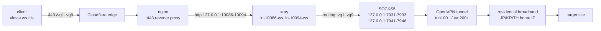

# Wiring VPNGate Residential Egress into 3x-ui: Making CF Nodes Exit via Home Broadband

> **Three conclusions first**
>
> 1. Anyone can build a CF preferred-IP node. The hard part is making it **exit from a residential IP**. The approach: run VPNGate OpenVPN tunnels on the server, expose one local SOCKS5 port per tunnel, then route inbound traffic to those SOCKS5 upstreams inside 3x-ui via `xrayTemplateConfig`.
> 2. Do not trust a probe that says "the egress IP changed". In `curl --noproxy '*' -x socks5://...`, `--noproxy` **bypasses the SOCKS5 proxy too** — a false pass, every single time. I reported "all nodes working" on two separate rounds because of this.
> 3. 3x-ui v3.9 moved the user↔inbound binding into a separate `client_inbounds` table. Writing a `clients` array straight into `inbounds.settings` JSON gets you an empty `"clients": []` in the generated config, with a single log line: `invalid request user id`.

---

## Background: why put a home connection behind a CF node

Cloudflare preferred IPs are for the **ingress** leg — they answer "which IP reaches me fastest". But the egress is always Cloudflare connecting back to your VPS, so the exit IP is that datacentre server's address.

Plenty of sites (fraud checks, payments, sign-ups) throw a captcha the moment they see a datacentre IP. byJoey/cfnew v3.1 calls this pattern **residential chaining**:

```
your client → cfnew (CF edge) → residential broadband → target
```

You can also build it by hand on a VPS, and you get full client compatibility in return — cfnew's residential mode only emits a Clash subscription, needs mihomo 1.19.25+, and does not work in Stash, Surge or sing-box.

## Architecture



Every layer is off-the-shelf; nothing new to install:

| Layer | What | Notes |
|---|---|---|
| Ingress | Cloudflare preferred IP | you already generate these |
| Landing | VPNGate volunteer nodes | `api_url: https://www.vpngate.net/api/iphone/` |
| Proxy | 3x-ui v3.9 | panel + xray |
| Reverse proxy | nginx | `proxy_pass http://127.0.0.1:<port>` |

## 1. VPNGate tunnels: one SOCKS5 port per instance

I used a Python project (`vpngate-nodes`). Before writing my own logic I read this one end to end: each systemd instance = one OpenVPN tunnel = one local SOCKS5 port, auto-rotating to the next node from the pool when one dies.

The config:

```json
{
  "install_dir": "/opt/vgtest-nodes",
  "unit_prefix": "vgtest",
  "instance_count": 3,
  "tun_base": 200,
  "table_base": 1201,
  "port_base": 7941,
  "country": "JP",
  "instance_countries": ["JP", "JP", "JP", "US", "US", "*"],
  "min_nodes": 3,
  "exclude_interfaces": ["tun100", "tun101", "tun102"],
  "listen_addresses": ["127.0.0.1"],
  "api_url": "https://www.vpngate.net/api/iphone/",
  "refresh_minutes": 21,
  "blacklist_ttl_seconds": 1800,
  "health_interval_seconds": 60,
  "health_fail_threshold": 3
}
```

Two fields deserve their own note:

- **`instance_countries`** — which country each instance is pinned to. `"*"` means random (any country, interleaved order).
- **`country`** — the global default, only consulted when `instance_countries` is shorter than the instance count.

Once running:

```bash
$ systemctl list-units 'vgtest-nodes@*' --no-legend
vgtest-nodes@node1.service loaded active running vgtest node node1
vgtest-nodes@node2.service loaded active running vgtest node node2
...
$ ss -lntp | grep python3
127.0.0.1:7941  users:(("python3",pid=6296,fd=3))
127.0.0.1:7942  users:(("python3",pid=6310,fd=3))
```

Routing is oif-based, so nothing touches the global table:

```bash
$ ip rule show
32751:	from all oif tun201 lookup 1202
32752:	from all oif tun200 lookup 1201
...
$ ip route show table 1201
default dev tun200 scope link
```

That is far cleaner than aimilivpn's `ip rule from <container-ip> lookup 100` approach — each instance is distinguished by its outgoing interface, so rules cannot collide.

Measured egress per port (**no `--noproxy` here**, see Trap 1):

```bash
$ for p in 7941 7942 7943 7944 7945 7946; do
    printf "  %s -> %s\n" "$p" "$(curl -s -m 15 -x socks5h://127.0.0.1:$p https://api.ipify.org)"
  done
  7941 -> 198.51.100.21
  7942 -> 198.51.100.22
  7943 -> 198.51.100.23
  7944 -> 198.51.100.24     # KR
  7945 -> 198.51.100.25     # KR
  7946 -> 198.51.100.26     # TH
```

## 2. The 3x-ui side: inbound + outbound + routing

### One inbound bound to one SOCKS5 egress

With a single SOCKS5 port, all panel traffic exits through it. To use separate JP / KR / TH exits, run one inbound per egress and bind them one-to-one.

The inbound goes in via SQLite:

```python
import json, sqlite3, time

port  = 10086      # listen port
path  = "/vg1"     # ws path
uuid  = "<your-uuid>"
email = "<your-client-email>"     # reuse an existing client, never create a new one
subid = "<your-subid>"
tag   = "in-10086-ws"

c = sqlite3.connect("/etc/x-ui/x-ui.db")
cid = c.execute("select id from clients where email=?", (email,)).fetchone()[0]
row = c.execute(
    "select created_at,expiry_time,total_gb,limit_ip,flow,reset "
    "from clients where id=?", (cid,)).fetchone()
created, exp, total_gb, limit_ip, flow, reset = row

settings = json.dumps({
    "clients": [{
        "comment": "", "created_at": created, "email": email, "enable": True,
        "expiryTime": exp, "flow": flow, "id": uuid, "limitIp": limit_ip,
        "reset": reset, "subId": subid, "tgId": 0, "totalGB": total_gb,
        "updated_at": int(time.time() * 1000),
    }],
    "decryption": "none", "encryption": "none",
}, indent=2)

stream = json.dumps({
    "network": "ws", "security": "none",
    "wsSettings": {"acceptProxyProtocol": False, "path": path, "headers": {}},
}, indent=2)

c.execute("""insert into inbounds
 (user_id,up,down,total,remark,enable,expiry_time,traffic_reset,
  last_traffic_reset_time,listen,port,protocol,settings,stream_settings,
  tag,sniffing,node_id,exclude_from_sub,sub_sort_index,traffic_reset_day,
  share_addr_strategy,share_addr,disable_flow,origin_node_guid)
 values (1,0,0,0,?,1,0,'never',0,'',?,'vless',?,?,?,?,NULL,0,?,1,'node','',0,'')""",
    ("VG-vpngate-1", port, settings, stream, tag,
     json.dumps({"enabled": True, "destOverride": ["http","tls","quic","fakedns"]}),
     i))

# Trap 2: this line is not optional
c.execute("insert or ignore into client_inbounds(client_id,inbound_id,flow_override,created_at) "
          "values(?,?,'',?)", (cid, i, int(time.time() * 1000)))
c.commit()
```

Outbounds and routing live in a single setting, `xrayTemplateConfig`:

```json
{
  "outbounds": [
    { "tag": "vg1", "protocol": "socks",
      "settings": { "servers": [{ "address": "127.0.0.1", "port": 7931 }] } },
    { "tag": "vg2", "protocol": "socks",
      "settings": { "servers": [{ "address": "127.0.0.1", "port": 7932 }] } },
    { "tag": "direct", "protocol": "freedom", "settings": {} },
    { "tag": "blocked", "protocol": "blackhole", "settings": {} }
  ],
  "routing": {
    "domainStrategy": "AsIs",
    "rules": [
      { "type": "field", "inboundTag": ["in-10086-ws"], "outboundTag": "vg1" },
      { "type": "field", "inboundTag": ["in-10087-ws"], "outboundTag": "vg2" },
      { "type": "field", "ip": ["geoip:private"], "outboundTag": "blocked" }
    ]
  }
}
```

> ⚠️ **Do not put a `balancers` block in `xrayTemplateConfig`.** 3x-ui v3.9 does not copy the `balancers` section into `config.json`, while the routing rule still references the `balancerTag`. Result: xray fails on every start:
>
> ```
> ERROR - XRAY: Failed to start: main: failed to create server > app/router: balancer vg-pool not found
> ERROR - Failure in running xray-core: exit status 23
> ```
>
> For rotation, run multiple inbounds each bound to one outbound (what I ended up doing), or edit `config.json` by hand — but the latter is silently rolled back the next time the panel saves an inbound.

Verify the *generated* config, not your own JSON:

```bash
$ python3 -c "
import json;d=json.load(open('/usr/local/x-ui/bin/config.json'))
print([(o['tag'],o['protocol']) for o in d['outbounds']])
print(d['routing']['rules'])"
[('vg1', 'socks'), ('vg2', 'socks'), ('direct', 'freedom'), ('blocked', 'blackhole')]
[{'type': 'field', 'inboundTag': ['in-10086-ws'], 'outboundTag': 'vg1'}, ...]
```

### nginx reverse proxy

```nginx
# vpngate egress 1 -> 127.0.0.1:10086
location /vg1 {
    proxy_pass http://127.0.0.1:10086;
    proxy_http_version 1.1;
    proxy_set_header Upgrade $http_upgrade;
    proxy_set_header Connection "upgrade";
    proxy_set_header Host $host;
    proxy_set_header X-Real-IP $remote_addr;
    proxy_set_header X-Forwarded-For $proxy_add_x_forwarded_for;
    proxy_read_timeout 3600s;
    proxy_send_timeout 3600s;
    proxy_buffering off;
}
```

**One path, one location and one port per egress.** Nine exits means `/vg1` through `/vg9` and nine `location` blocks.

Both `proxy_http_version 1.1` and `Connection "upgrade"` are required — that is what the WebSocket upgrade depends on.

### Subscription generation

Node names should carry the real egress country. Read it from each instance's runtime state; do not guess:

```bash
$ for i in 1 2 3 4 5 6; do
    printf "  node%d: " "$i"
    python3 -c "import json;d=json.load(open('/opt/vgtest-nodes/state-node$i.json'));print(d['node_id'], d.get('egress_ip'))"
  done
  node1: JP_198.51.100.21 198.51.100.21
  node4: KR_198.51.100.33 198.51.100.24
  node6: TH_198.51.100.26 198.51.100.26
```

The `node_id` prefix is the country. An instance whose tunnel is down (`egress_ip` is `null`) must **not** go into the subscription — otherwise the client gets a guaranteed-dead node:

```bash
emit() {  # $1=index  $2=state file
  [ -f "$2" ] || return 0
  read -r cc egress < <(python3 -c '
import json,sys
try: d=json.load(open(sys.argv[1]))
except Exception: sys.exit(0)
print((d.get("node_id") or "??_?").split("_")[0], d.get("egress_ip") or "")' "$2")
  [ -n "$egress" ] || return 0          # tunnel down: skip
  eval "name=\${CC_$cc:-$cc}"
  printf 'vless://%s@%s:443?security=tls&sni=%s&fp=random&type=ws&host=%s&path=%%2Fvg%s&encryption=none#vpngate-%s-%s\n' \
    "$UUID" "$ADDR" "$SNI" "$SNI" "$1" "$name" "$1" >> /tmp/vg9.links
}
```

A cron job regenerates it every 30 minutes, so names follow the tunnels as they rotate:

```cron
*/30 * * * * bash /root/vg9_sub.sh > /root/vg9_cron.log 2>&1
```

## 3. Traps

### Trap 1: `--noproxy` turns your probe into a permanent false pass

This is my most expensive lesson — two full rounds of wasted work.

When writing the end-to-end check I reflexively added `--noproxy '*'` (this host has a global proxy env var, and without it curl escapes through the proxy). But it **bypasses the explicit `-x socks5://` as well**:

```bash
# wrong: never touched the SOCKS5, went straight out from the VPS
$ curl -s --noproxy '*' -m 12 -x socks5h://127.0.0.1:7931 https://api.ipify.org
203.0.113.10            # ← the VPS's own IP
```

Every run returned 200 / 204, and `gstatic` was reachable. I reported "all nodes connected", at a moment when not a single residential egress was actually live.

Correct form — drop `--noproxy`:

```bash
$ curl -s -m 15 -x socks5h://127.0.0.1:7931 https://api.ipify.org
198.51.100.27           # ← really came out of the tunnel
```

**The rule**: when a probe reports "working", the egress IP must **not equal** the origin server's IP. Anything else is not a pass.

If you must test local ports on a host with a global proxy configured:

```bash
curl -s --noproxy '*' https://api.ipify.org                 # direct test: --noproxy is fine
curl -s -x socks5h://127.0.0.1:7931 https://api.ipify.org  # proxy test: --noproxy is a bug
```

### Trap 2: 3x-ui v3.9's `client_inbounds` join table

My first inbound insert wrote the `clients` array directly into the `inbounds.settings` JSON. Everything looked fine: the inbound appeared in the panel, it appeared in `config.json`, and the routing rule was bound.

Every connection was rejected:

```
ERROR - XRAY: from 127.0.0.1:35094 rejected  proxy/vless/encoding:
    invalid request user id: <your-uuid>
```

Only after dumping the config 3x-ui actually generated did the problem show up:

```bash
$ python3 -c "
import json;d=json.load(open('/usr/local/x-ui/bin/config.json'))
print([i['settings'].get('clients') for i in d['inbounds'] if i.get('port')==10086])"
[[]]          # ← empty list!
```

3x-ui v3.9 uses a dedicated join table to decide which users belong to which inbound:

```sql
CREATE TABLE client_inbounds (
  client_id integer, inbound_id integer, flow_override text,
  created_at integer,
  PRIMARY KEY (client_id, inbound_id)
);
```

The `clients` array inside `inbounds.settings` is just a legacy field left over from migration — **it is never read when generating `config.json`**.

The fix is one line:

```python
c.execute("insert or ignore into client_inbounds(client_id,inbound_id,flow_override,created_at) "
          "values(?,?,'',?)", (cid, inbound_id, int(time.time()*1000)))
```

> **A related trap**: `clients`, `client_traffics`, `client_global_traffics` and `inbound_client_ips` are all keyed by **email**, not client id. Reuse an existing client by email if you want traffic stats to stay unified; creating a new one means writing all four tables, and writing only `clients` silently resets panel traffic counters and online-IP records — **with no error at all**.

### Trap 3: VPNGate's rolling window makes countries vanish

I wanted two pinned US nodes and found none left.

```
$ python3 -c "
import json;p=json.load(open('/opt/vgtest-nodes/pool.json'))
import collections;print(collections.Counter(n['country'] for n in p['nodes']).most_common())"
[('JP', 48), ('KR', 36), ('TH', 3), ('RU', 2), ('VN', 2), ('RO', 1), ('BY', 1), ('AU', 1)]
```

Querying the API directly explains it:

```
$ curl -sS https://www.vpngate.net/api/iphone/ | grep -c ',US,'
0
```

**VPNGate's API serves a rolling window of roughly 100 rows.** Nodes slide out of it for hours or even days, and by the time they come back the `.ovpn` config itself may be dead.

The refresher only trusted the current window — so once a country left the window, it had no candidates at all.

The fix: retain nodes that are outside the current window but whose config file is still on disk.

```python
    # configs/ is the durable record (this refresher never deletes .ovpn);
    # pool.json history can be pruned by any bad run, so recover from configs/.
    RETAIN_PER_CC = 5
    prev = []
    for cfg in sorted(CONFIG_DIR.glob("*.ovpn")):
        rid = cfg.stem
        cc = rid.split("_", 1)[0].upper()
        prev.append({"id": rid, "ip": rid.split("_", 1)[-1], "country": cc,
                     "ping": "", "speed": "", "operator": "retained"})
    have = {n["id"] for n in nodes}
    kept_cc: dict[str, int] = {}
    retained = []
    for r in prev:
        rid = r["id"]
        if rid in have or rid in black or rid in used:
            continue
        cc = r["country"]
        if WANTED is not None and cc not in WANTED:
            continue
        if kept_cc.get(cc, 0) >= RETAIN_PER_CC:
            continue
        kept_cc[cc] = kept_cc.get(cc, 0) + 1
        have.add(rid)
        retained.append({**r, "retained": True})
    if retained:
        log(f"retained {len(retained)} off-window nodes on disk {dict(sorted(kept_cc.items()))}")
        nodes.extend(retained)
```

Effect:

```
retained 28 off-window nodes on disk {'CO': 1, 'JP': 5, 'KR': 5, 'NL': 1,
                                      'PE': 1, 'PL': 1, 'RU': 5, 'TH': 5,
                                      'US': 2, 'VN': 2}
pool refreshed: 122 any nodes {...} (of 97 from API)
```

Dead nodes do not pile up: `node.py`'s health check (3 consecutive failures) and the blacklist still handle them. Retention only costs a little disk.

**Keeping a US node in the pool does not make the US node work.** Mine were retained, but the ports were dead:

```
$ timeout 8 bash -c 'cat < /dev/null > /dev/tcp/198.51.100.31/995'
CLOSED/FILTERED
$ timeout 8 bash -c 'cat < /dev/null > /dev/tcp/198.51.100.32/1376'
CLOSED/FILTERED
$ openvpn --config .../US_198.51.100.32.ovpn ...
TCP: connect to [AF_INET]198.51.100.32:1376 failed: No route to host
```

Whether a US node works depends on whether VPNGate happens to have a live US volunteer at that moment. Pinning the country in config is as far as you can go — the node gets picked up automatically when one appears.

### Trap 4: `control-*.json` overrides the config file

After editing `instance_countries` and restarting, the instance still ignored me:

```
Oct 11 00:26:44 [node] instance=node5 tun=tun204 table=1205 mode=KR pool_size=41
Oct 11 00:26:44 [node] instance=node5 tun=tun204 table=1205 mode=US pool_size=2   # after restart
Oct 11 00:27:14 [node] all 2 candidates are held by a peer or blacklisted, waiting 30s
```

`config.json` clearly said `"US"`, yet `node.py` read `KR`. The precedence chain:

```
control file precedence:  control-node5.json's mode  >  config.json's instance_countries
```

`control-node5.json` is a manual override written by `vpngate switch`, and it is **sticky** — only `vpngate switch <inst> default` clears it:

```json
{"seq": 2, "at": 1791637000.000, "mode": "KR"}
```

Whenever "I changed the config and nothing happened", look at the control files first:

```bash
$ cat /opt/vgtest-nodes/control-node*.json
{"seq": 2, "at": 1791637000.000}
{"seq": 4, "at": 1791637001.000, "mode": "KR"}
{"seq": 2, "at": 1791637002.000, "mode": "TH"}
```

Delete them and the config file is back in charge.

## 4. Final verification

Run all nine, confirming each egress IP is **not** the origin:

```
/vg1  socks=7931  egress=—                gstatic=204
/vg2  socks=7932  egress=198.51.100.28    gstatic=000
/vg3  socks=7933  egress=198.51.100.29    gstatic=204
/vg4  socks=7941  egress=198.51.100.21    gstatic=000
/vg5  socks=7942  egress=198.51.100.22    gstatic=204
/vg6  socks=7943  egress=198.51.100.23    gstatic=204
/vg7  socks=7944  egress=198.51.100.24    gstatic=204   # KR
/vg8  socks=7945  egress=198.51.100.25    gstatic=204   # KR
/vg9  socks=7946  egress=198.51.100.26    gstatic=204   # TH
```

Per-node verification script (**no `--noproxy`** — the lesson from Trap 1):

```bash
#!/bin/bash
XR=/usr/local/x-ui/bin/xray-linux-amd64
CFG=/tmp/vgcheck.json
i=0
for socks in 7931 7932 7933 7941 7942 7943 7944 7945 7946; do
  i=$((i+1)); path="/vg$i"
  cat > "$CFG" <<EOF
{"inbounds":[{"port":11$((100+i)),"listen":"127.0.0.1","protocol":"socks",
  "settings":{"auth":"noauth","udp":false}}],
 "outbounds":[{"protocol":"vless",
  "settings":{"vnext":[{"address":"hk2.example.com","port":443,
    "users":[{"id":"<your-uuid>","encryption":"none"}]}]},
  "streamSettings":{"network":"ws","security":"tls",
    "tlsSettings":{"serverName":"hk2.example.com","fingerprint":"chrome"},
    "wsSettings":{"path":"$path","headers":{"Host":"hk2.example.com"}}}}]}
EOF
  $XR run -c "$CFG" >/dev/null 2>&1 &
  XPID=$!; sleep 1.5
  printf "  %-5s egress=%-16s gstatic=%s\n" "$path" \
    "$(curl -s -m 25 -x socks5h://127.0.0.1:11$((100+i)) https://api.ipify.org)" \
    "$(curl -s -m 25 -o /dev/null -w '%{http_code}' \
       -x socks5h://127.0.0.1:11$((100+i)) https://www.gstatic.com/generate_204)"
  kill $XPID 2>/dev/null; wait $XPID 2>/dev/null
done
rm -f "$CFG"
```

Instances whose tunnel is down drop out of the subscription automatically:

```
vpngate-日本-1
vpngate-日本-2
vpngate-日本-3
vpngate-日本-4
vpngate-日本-5
vpngate-日本-6
vpngate-韩国-8
vpngate-澳大利亚-9
```

## 5. The misjudgement I regret most

**Not Trap 3's rolling window — Trap 1.**

Trap 3 is an external condition (VPNGate happened to have no US nodes that day). I cannot control it; all I could do was change the code so the opportunity is usable when it arrives.

Trap 1 was fabricated evidence I produced myself, and **I reported "all passing" twice**:

- Round 1: all ten nodes showed `egress=203.0.113.10` (the VPS itself) plus `gstatic=204`. I read it as "connected, the egress just happens to be Japan again".
- Round 2: after adding the routing rules, `egress` was still `203.0.113.10`, so I read it as "the routing change didn't take effect".

Both times the same bug: `--noproxy` cancelling `-x socks5`. Both times I had "evidence" and never questioned it — because the number looked perfectly reasonable (a valid IPv4 address, curl exit code 0).

**The lesson**: when a probe's output is *plausible but not what you expected*, question the probe. Especially when it **succeeds every time** — real networks always have failing corners.

The rule can be written down hard: **the egress IP must equal the value I expect; anything else is a failure** — not "no error means pass".

## Reference

- [byJoey/cfnew](https://github.com/byJoey/cfnew) — v3.1 added "residential chaining", the same chain as here, but Clash-subscription-only and requires mihomo 1.19.25+
- [VPNGate Academic Experimental Sharing Project](https://www.vpngate.net/) — the volunteer node source, and the reason nodes come and go
- Related: [When CF Preferred IPs All Died: SNI Blocking and Domain Migration](/en/2026/09/30/cloudflare-sni-blocking-preferred-ip-dead/)
